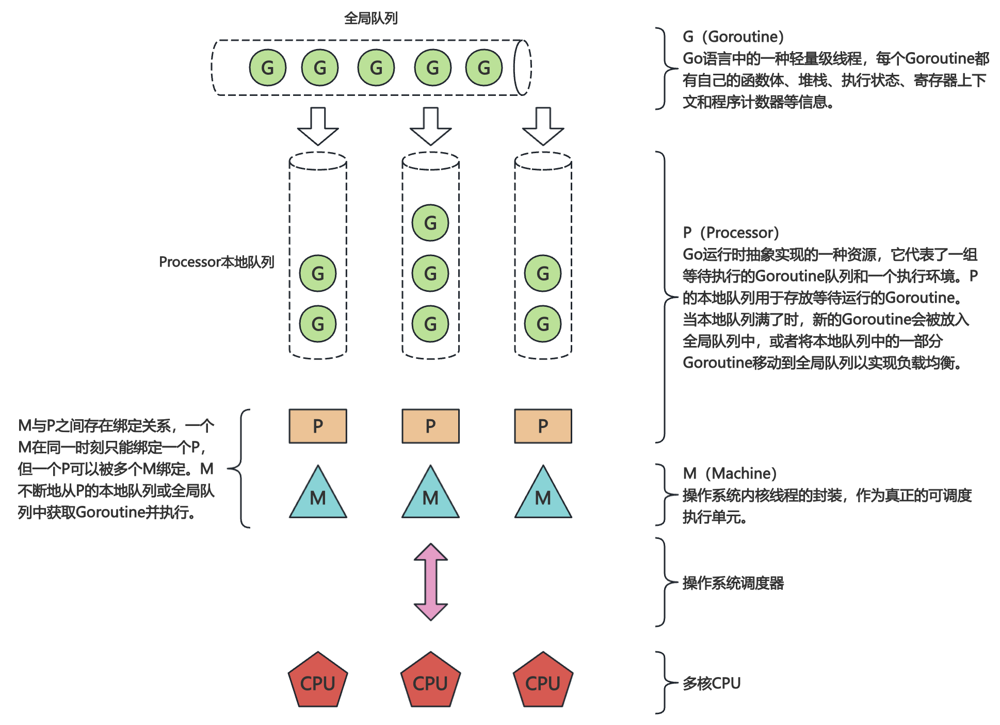
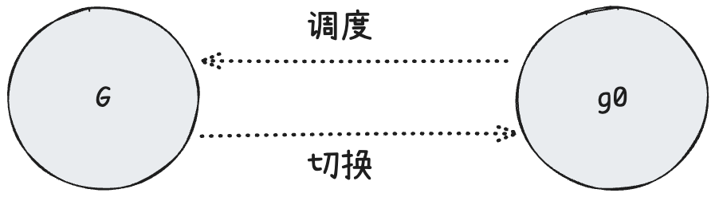
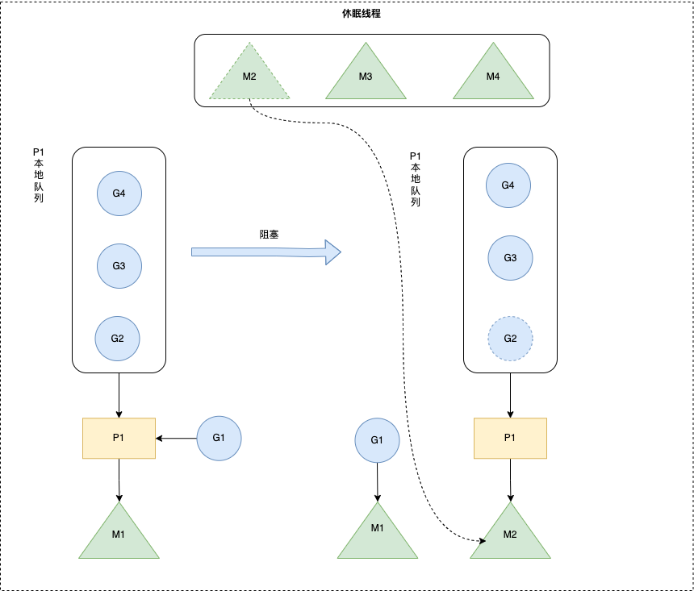

# GPM

## goroutine 由来

> 阅读前需要有一定操作系统知识。

### 线程模型

> 在操作系统中线程的实现方式分为 **用户级线程（ULT, User-Level Thread）**&#x548C; **内核级线程（KLT, Kernel-Level Thread）**。CPU 对 ULT 是无感的，仅仅会管理 KLT 的生命周期。

* **1:1** 模型：一个用户线程（ULT）绑定到一个内核线程（KLT）。可以充分利用多核并且阻塞系统调用不会影响其他线程，但创建/销毁开销大，占用内核资源多。
* **N:1** 模型：多个用户线程（ULT）绑定到一个内核线程（KLT），所有 ULT 在用户空间调度。线程切换快，内存和资源消耗少，但无法利用多核，且当一个线程阻塞会导致整个进程阻塞。
* **M:N** 模型：多个用户线程（ULT）映射到多个内核线程（KLT）。可以利用多核，用户态切换快，内核态仍并行，但实现复杂，需要设计专用的 scheduler。

于是 Go 引入了 goroutine。本质是 **大量用户态线程（ULT）+ 少量内核态线程（KLT）由 Go scheduler (GPM 模型) 管理**，并使用 **M:N 调度模型**。每个 goroutine 只需要 **2KB 栈空间起步**，随着需要会自动扩展，可以大量开辟。由于 goroutine 是由 Go Runtime 在用户级管理，对内核级的 Thread 是无感的，因此创建和销毁的消耗非常小，切换的成本低。

## 什么是 scheduler

### scheduler 由来

**M:N** 模型的思想是 **N 个 goroutine** 映射到 **M 个内核线程**，这避免 1:1 模型的高开销，也避免 N:1 模型的阻塞问题。这就需要一个强大的运行时（runtime）级别的调度器来实现。

### runtime

Go 程序由 Go Program 和 Runtime 组成，即用户程序和运行时。


Runtime 维护所有 goroutines，并通过 scheduler 来进行调度。Goroutines 和 threads 是独立的，但是 goroutines 要依赖 threads 才能执行。

## scheduler

**早期 Go 调度器**

早期的 Go Scheduler 是 GM 模型，并没有 P 这个结构，所有的 G 都放在全局队列中。这产生的问题：

* 创建、销毁、调度 G 都需要 M 从全局队列中获取锁，这就导致了强烈的锁竞争。
* M 转移 G 会造成**延迟和额外的系统负载**。比如当 G 中包含创建新协程的时候，M 创建了 G’，为了继续执行 G，需要把 G’ 交给 M’ 执行，也造成了**很差的局部性**，因为 G’ 和 G 是相关的，最好放在 M 上执行，而不是其他 M'。
* 系统调⽤用（CPU在M之间的切换）导致频繁的线程阻塞和取消阻塞操作增加了了系统开销。

### GPM 调度模型



Go 的调度器中有三个核心对象：

* **G (Goroutine)**：协程，执行的用户代码，是调度单元，处于用户态。
* **P (Processor)**：调度上下文，管理可运行的 G 队列，和 M 绑定后才能执行 G。
  * P 的数量由启动时环境变量 `$GOMAXPROCS` 或者是由程序中 `runtime.GOMAXPROCS()` 决定。runtime 会根据此数量创建对应的 P。
*   **M (Machine)**：Go 的调度器中的 **内核线程（KLT）**，实际执行 goroutine 执行单元，最大数量为 10000 个。

    > \*\*M 不一一对应 CPU 核心。\*\*只是一般为了避免线程切换，将 M 个数设置为 CPU 逻辑核心数，保持可执行的 $P:M:CPU\approx1:1:1$。

    * 可使用 `runtime.SetMaxThreads()` 设置最大数量。如果所有的 M 都阻塞住，但 P 中还有许多就绪的任务，就会寻找休眠的 M，如果没有空闲的 M，就会去创建新的 M。

其他对象：

* **全局队列**（Global Queue）：存放等待运行的 G。
* **P 的本地队列**：LRQ/runq，同全局队列类似，存放 **可运行的用户 Goroutine**，存的数量有限，不超过 256 个。新建 G' 时，G' 优先加入到 P 的本地队列，如果队列满了，则会把本地队列中一半的 G 移动到全局队列。

当有新的 G 被创建时，会发生以下两种调度：

1. **由正在运行的 G 调用 `go func()` 创建新的 G**
   *   新建的 G **优先放到当前 P 的本地队列**（work-stealing 本地队列，大小固定 256）。

       这样可以保持 **局部性**（新创建的任务和创建它的任务倾向在同一个 P 上执行，减少调度开销）。

       ⚠️ 但是如果当前 P 的本地队列已满，就会：

       1. 将本地队列中 **一半的 G** 移到 **全局队列**（global run queue）。
       2. 把新创建的 G 放进本地队列。
2. **如果是 runtime 系统自身创建的 G**
   * 比如垃圾回收 (GC)、sysmon（监控线程）创建的 Goroutine，有时会直接放入 **全局队列**，以保证所有 P 都能抢到。

全局队列使用时机：

* 本地队列空了，P 会去全局队列偷取一批 G，数量为 `len(GRQ)/GOMAXPROCS + 1`。
*   周期性检测，正在执行 G 的 P **每当其 `schedtick` 的值达到 61 的倍数时**，就触发一次对全局队列的检查，获取一个 GRQ 中的 G。

    > 为什么是 61？这是一个质数，可以避免与某些固定周期的事件发生共振，让检查在时间上分布得更均匀。
* 一个 P 的队列太满时，会把 G “溢出”到全局队列。
* 系统关键 G（runtime 创建）可能直接放全局队列。

### 生命周期

**G**：

1. **创建（\_Gidle → \_Grunnable）** `go func()` 会从 gfree 拿一个 g 或分配新的 g。
2. **运行（\_Grunnable → \_Grunning）** 调度器绑定 P/M 后执行。
3. **挂起（\_Grunning → \_Gwaiting）** I/O、channel、syscall 等阻塞时进入等待状态。
4. **结束（\_Grunning → \_Gdead）** goroutine 返回后，g 放回 free list，栈回收。

### 缓冲池

**G**：新建 goroutine 时先尝试从 P 的本地 free list 拿 G，如果没有，再尝试从全局 gfree 拿，还没有，就新分配一个新的 G。

* **P 的本地 `free list`**：已经执行完的 goroutine 结构体（G 对象），但 G 对象本身还没有被释放（复用以减少内存分配，减少频繁访问全局锁）。
* **`sched.gfree`**：**全局空闲 G 列表**，存放执行完毕、可以复用的 `G`。

**P**：其他 M 可以从 `pidle` 拿一个 P 来继续执行，P 是固定的，不会像 G 和 M 那样频繁创建和销毁。

* **`sched.pidle`**：**全局池**，P 的数量等于 `GOMAXPROCS`，初始化时一次性分配，不会动态增加（除非显式调用 `runtime.GOMAXPROCS()` 改变）。

**M**：如果 P 需要执行 G，但没有 M，可以从 `midle` 获取一个，或者新建一个 M。当 M 没活干时，会进入休眠，挂到 `midle`，等待唤醒。

* **`sched.midle`**：**全局 idle M 列表**，保存空闲但未退出的 M。

### 特殊的 M, G

GPM 模型中特殊的角色 `m0`, `g0`, `gsignal`。

#### m0

`m0` 是 Go 运行时在**主线程**上创建的第一个 M（编号为 0 的主线程），即**第一条 OS 线程**。它是由 Go 运行时系统直接从操作系统线程创建的，不是从线程池中获取的。

* **作用**：m0 在程序早期**引导运行时**，解析参数、内存分配器初始化、初始化垃圾回收器、Go 栈初始化、初始化调度器、创建并分配第一个 P（`p0`）、启动 sysmon、创建 main goroutine 等。
* **特点**：在程序的整个生命周期中，`m0` 会持续存在，不会被销毁。当初始化完成后 m0 就会退化为普通的 M，执行 main goroutine（init -> main.main）。**m0 作为全局变量** 定义在 `runtime/proc.go` 中。

#### g0

`g0` 是每个 M 的 **“系统栈 goroutine”**，也叫 **system G** 或 **scheduler G**，**每个 M 拥有一个自己的 `g0`**，`g0` 不是用户 goroutine，不会进就绪队列，不参与普通调度。栈固定 8 KB。

* **作用**：`g0` 的栈用于调度器、垃圾回收、栈增长/收缩、信号、系统调用切换等 **运行时内部** 工作。当 M 需要执行这些非用户代码时，会切换到 `g0` 的自己栈上运行，避免污染 goroutine 的栈空间。
* **特点**：`g0` 拥有自己的栈，这个栈用于存放调度器函数和系统调用的数据。这意味着当执行这些操作时，不会影响当前运行的用户 Goroutine 的栈。`g0` 不会进入 runq，**不运行用户函数**，通常在状态上标识为运行时内部使用。**g0 作为全局变量** 定义在 `runtime/proc.go` 中。

#### gsignal

`gsignal` 是每个 M 的 **“信号栈 goroutine”**，专门用来处理操作系统信号（如 `SIGURG`、`SIGSEGV`、`SIGINT` 等）。栈固定 8 KB。

* **作用**：当一个线程（即 Go runtime 里的 M）收到异步信号（比如内核通过 `tgkill` 发来的 `SIGURG`），内核需要切换到 **一个安全的栈** 来运行信号处理函数。如果使用用户 G 的栈运行，这个栈可能爆满，如果用 M 的 `g0` 栈，也不合适，因为 g0 正在跑调度器逻辑。
* **特点**：`gsignal` 拥有自己的栈，每个 M 初始化时分配一次，固定大小（通常是 32KB），只用于处理信号，**不会执行普通 goroutine 的代码**。`gsignal` 不在 P 的 runq 里出现，也不会被用户调度。

#### 协程栈切换

g0 是 M 中负责调度其他 g 的协程，所以一个 M 中的协程调度其实就是在 g 和 g0 之间不断切换。



## 调度策略

### goroutine 调度优先级

#### 1. P 的 `runnext` 槽 (最高优先级)

每个 P 都有一个名为 `runnext` 的特殊“插槽”，可以存放一个 goroutine。

* **来源**：
  * 刚从一个未缓冲 channel 接收数据而被唤醒的 goroutine。
  * 刚被 `unlock` 的 `Mutex` 唤醒的 goroutine。
  * 某些情况下，从系统调用返回的 goroutine。
* **目的**：这是为了**降低延迟**。这些 goroutine 刚刚被解除阻塞，很可能位于程序的关键路径上。让它们“插队”并立即运行，可以显著提高性能，这种机制被称为“切换交接”（handoff）。
* **行为**：`findrunnable` 首先检查 `p.runnext` 是否有 G。如果有，就直接拿来运行。

#### 2. P 的本地运行队列 (Local Run Queue, LRQ)

如果 `runnext` 为空，调度器会查看自己的本地运行队列。

* **结构**：这是一个定长的环形缓冲区（大小为 256），存放着准备在该 P 上运行的 goroutine。
* **目的**：
  * **无锁访问**：对于 P 的所有者 M 来说，操作本地队列是无锁的，速度极快。
  * **缓存亲和性**：goroutine 在同一个 P (也就是同一个 CPU 核心) 上运行，可以更好地利用 CPU 缓存。
* **行为**：从本地队列的头部（`runqhead`）取出一个 goroutine 来执行。

#### 3. 全局运行队列 (Global Run Queue, GRQ)

如果本地队列也为空，调度器会开始“向外看”。

* **来源**：
  * 当一个 P 的本地队列满了之后，会有一半的 goroutine 被批量转移到全局队列。
  * 通过 go 关键字新建的、但没有合适本地队列的 goroutine。
* **目的**：在 P 之间进行宏观的负载均衡。
* **行为**：
  * 调度器会**加锁**（`sched.lock`）后检查全局队列。
  * 为了避免所有 P 都频繁争抢全局锁，调度器并**不是每次**都会检查全局队列。它有一个 `schedtick` 计数器，**每 61 次**调度循环才会检查一次全局队列。这确保了本地优先，同时避免了全局饥饿。

#### 4. 网络轮询器 (Netpoller)

如果上述来源都没有找到工作，调度器会尝试从网络轮询器中获取工作。

* **来源**：因网络 I/O（如 `socket` 读写）而阻塞的 goroutine。
* **目的**：处理 I/O 就绪事件，唤醒等待的 goroutine。这是 Go 实现高效非阻塞 I/O 的关键。
* **行为**：调用 `netpoll` 检查是否有任何网络文件描述符已准备就绪。如果有，它会将对应的 goroutine 列表取回，放入本地运行队列，然后选择一个开始运行。如果没有就绪的，`netpoll` 会立即返回。

#### 5. 工作窃取 (Work Stealing)

如果连网络轮询器都没有带来任何工作，P 就会变成一个“小偷”。

* **来源**：其他 P 的本地运行队列。
* **目的**：实现动态的、细粒度的负载均衡。当一个 P 空闲而另一个 P 很忙时，空闲的 P 可以主动分担工作。
* **行为**：
  1. 调度器会**随机**选择另一个 P 作为目标。
  2. 它会尝试从目标 P 的本地队列的**尾部**“偷”走**一半**的 goroutine。
  3. 偷来的 goroutine 会被放入自己的本地队列，然后开始执行其中一个。
  4. 如果一次窃取失败，它会继续尝试其他 P，直到成功或尝试完所有 P。
  5. 窃取 `runnext` 的优先级非常低，只在 `stealWork` 的最后尝试阶段才会进行，以保护其低延迟特性。

#### 6. 空闲与休眠 (Idle / Park)

如果以上所有努力都失败了，说明整个系统目前可能真的没有可运行的 goroutine 了。

* **行为**：
  1. P 会将自己置为 `_Pidle` 状态，并放回全局空闲 P 列表。
  2. 与之关联的 M（系统线程）会释放这个 P，然后尝试去获取一个“自旋”（spinning）的 M。
  3. 如果找不到，这个 M 最终会**休眠**（park），直到被新的工作唤醒（例如，一个新的 goroutine 创建、一个 channel 收到数据、或一个 timer 到期）。

#### 图表总结

| 优先级   | 工作来源                     | 特点                     | 目的                     |
| ----- | ------------------------ | ---------------------- | ---------------------- |
| **1** | **`p.runnext`**          | 单个槽位，最高优，用于“切换交接”      | **最低延迟**               |
| **2** | **本地运行队列 (LRQ)**         | 无锁，定长环形数组，缓存亲和性好       | **最高吞吐量**              |
| **3** | **全局运行队列 (GRQ)**         | 加锁，链表结构，每 61 tick 检查一次 | **宏观负载均衡**             |
| **4** | **网络轮询器 (Netpoller)**    | 非阻塞检查 I/O 就绪事件         | **处理 I/O 密集型任务**       |
| **5** | **工作窃取 (Work Stealing)** | 从其他 P 的 LRQ 偷一半工作      | **动态负载均衡**，**提高核心利用率** |
| **6** | **无工作**                  | P 进入 idle，M 可能休眠       | **节省 CPU**             |

> 还有一种特殊的调度详见下 [Hand Off](GPM.md#hand-off)

### Work Stealing

**Work Stealing 机制** 核心思想是当 M 绑定的 P 本地队列中无可运行的 G 时，尝试从其他 M 绑定的 P 偷取 G，而不是销毁线程，来实现负载均衡。


当从本线程 M 从绑定 P 本地队列、全局 G 队列、Netpoller 都找不到可执行的 G，会从其它 P 里窃取 G 并放到当前 P上面

1. 如果全局队列有G，从全局队列窃取的G数量 `N = min(len(GRQ)/GOMAXPROCS + 1, len(GRQ/2))` （根据 GOMAXPROCS 数量负载均衡）。
2. 如果 Netpoller 有 G（网络 IO 被阻塞的 G），从Netpoller窃取的G数量 `N = 1`。
3. 如果从其它 P 里窃取 G，从其它 P 窃取的 G 数量 `N = len(LRQ)/2`（平分负载均衡）。
4. 如果尝试多次一直找不到需要运行的 goroutine 则进入睡眠状态，等待被其它工作线程唤醒。

### Hand Off

**Hand Off 机制** 也称为 **P 分离机制**，核心思想是当线程 M 因为 G 进行的系统调用阻塞时，线程释放绑定的 P，把 P 转移给其他空闲的 M 执行，如果没有就创建一个新的 M。

当 M 执行的 G 发生阻塞操作或者发生了系统调用（对应下图中 G1），M 就会阻塞，如果当前绑定的P还有要执行的 G, Go runtime 会把这个 P 从 M 摘除，M 进入阻塞（对应下图中 M1），P 分离给其它空闲 M 调度（对应下图中 M2）。

当 M 系统调用（或阻塞）结束时，这个 G1 会尝试获取一个空闲的 P 执行，并放入到这个 P 的本地队列，如果获取不到 P，那么这个 G1 加入到全局 G1 里，这个 M 会加入到空闲线程列表中，重新可以进入调度循环。



对于 G1，它的调度优先级是动态的，取决于它返回时系统的繁忙程度，分两种情况：

*   快速路径（**事实上的最高优先级**）：当 G 的系统调用完成，其所在的线程 M 从内核返回时，它会立即尝试获取一个逻辑处理器 P。

    * 触发条件：系统中有**空闲的 P**（即 `sched.pidle` 列表不为空）。
    * 调度行为：M 会尝试获取一个空闲的 P（优先尝试它之前绑定的那个 P），如果成功，M 和 P 立即绑定，G **直接开始运行**。

    此时这个 G 绕过了所有调度优先级顺序，它不需要进入 P 的 `runnext` 槽位，直接通过 hand off 方法获得了 CPU 时间。
*   慢速路径（**降级为普通优先级**）：如果 G 的系统调用完成时，系统非常繁忙，没有一个空闲的 P。

    * 触发条件：系统中**没有空闲的 P**。
    * 调度行为：M 无法为 G 找到一个 P 来运行，G 的状态被设置为 `_Grunnable`，然后被放入**全局运行队列 (GRQ)** 中，M 因为没有工作可做（G 已经被“上交”了），所以 M 会被释放到空闲线程池中，可能会休眠。

    此时 G 没有任何特权，之后会按照 GRQ 的优先级执行。

### M 自旋

**M 自旋（M spinning）**，当一个 **M 拥有 P**，但**没有 goroutine 可以运行**时，这个 M 并不会立刻阻塞，而是进入 **忙等（spin）状态**，主动在调度器中寻找 G 来执行。这个 M 可能会不断尝试 steal G（[work stealing](GPM.md#work-stealing) 机制），只有在“确定”没有任务可运行时，M 才会阻塞挂起（进入 idle 状态，释放 P）。

如果没有自旋，如果所有 M 都阻塞，runtime 就必须创建新线程或唤醒 OS 线程（成本高），会导致调度延迟增加。

有了自旋，保持一部分 M **忙等**，可以快速接管新 goroutine，避免频繁创建/销毁线程，提高响应速度（低延迟）。

**自旋规则**：

1. 最多允许 **GOMAXPROCS 个 M** 自旋，超过的 M 如果没任务，就会挂起。
2. 根据 goroutine 调度策略不断尝试获取 G。
3. 如果自旋一段时间仍然没有找到 G，就把 P 还回去，自己进入休眠（park），runtime 会在有新 G 时唤醒一个休眠的 M。

## 调度时机

### 协作式调度（Go 早期版本）

**协作式调度 (Cooperative Scheduling)**，在 **Go1.2 之前**，Go 的 goroutine 调度几乎是 **协作式调度**。

goroutine 必须在某些\*\*“安全点”\*\*主动让出 CPU，调度器才有机会切换到其他 goroutine。

**安全点 Safe Point**：主要在以下位置：

* 调用函数时（特别是函数调用进入 runtime 时）
* 阻塞操作（如 `chan recv/send`、`syscall`、`select`、`time.Sleep` 等）
* 调用 `runtime.Gosched()` 主动让出 CPU，此时会从当前 G 切换回 g0，取消 G 与 M 之间的绑定关系，把 G 放入全局队列中

缺点：

* 如果一个 goroutine 里有长时间运行的计算密集型任务（如死循环 `for {}`），没有函数调用、阻塞点或 `Gosched()`，那么调度器无法打断它。结果就是 **这个 goroutine 独占 CPU，其他 goroutine 饥饿**。

### 抢占式调度（Go1.14 引入）

**抢占式调度 (Preemptive Scheduling)**，为了解决协作式调度的问题，**Go1.14 开始引入了真正的抢占式调度**，类似于时间片轮转。

goroutine 可以在执行过程中被强制中断，让调度器切换到其他 goroutine。

**实现方式**：

1. **基于信号（async preemption）**
   * 调度器在每个 M 上有一个计时器，记录 goroutine 已经运行了多久。
   * 如果 goroutine 超过 **`10ms`** 没有被调度，就调用 `preemptone(g)` 来尝试抢占，向运行中的线程（M）发送异步信号 (`SIGURG`)。
   * 在 goroutine 执行期间，编译器会在函数调用处和循环回边等地方插入 **抢占检查点 (preemption check)**。
   * 当信号到达时，goroutine 检查是否应该被抢占，如果是，则保存上下文（寄存器、栈等），交回调度器。
2. **栈检查（stack preemption）**
   * 每次函数调用都会检查 goroutine 的栈边界。
   * runtime 可以在栈边界设置标志位（`g.preempt = true`）。
   * 当 goroutine 执行到函数调用时，发现 `g.preempt` 被置位，就会触发抢占。

优点：

* 即使某个 goroutine 写了一个死循环（`for {}`），runtime 也能强制打断它，把 CPU 分配给其他 goroutine。
* 保证系统不会因为“恶意”或“长计算” goroutine 而饿死其他任务。

### 混合调度策略

Go 目前（1.21+）是 **抢占式 + 协作式结合**：

* **协作式部分**：阻塞、系统调用、通道操作、函数调用等点仍然是 goroutine 主动让出 CPU 的机会。
* **抢占式部分**：即使 goroutine 没有主动让出 CPU，runtime 也能在合适的检查点强制打断。

***

## 源码分析

G, M, P 底层结构体实现均在 `runtime/runtime2.go`

### goroutine 创建

`runtime/proc.go` 中的 `runtime.newproc` 是 `go` 关键字的底层实现，当代码中使用 `go myFunc()` 创建 goroutine 时，go 编译器会将其转化为一个对 `runtime.newproc` 的调用。它的核心职责就是**创建一个新的 goroutine 并将其放入调度队列，使其未来能够被执行**。

```go
// go1.25.0.darwin-arm64 runtime/proc.go
// Create a new g running fn.
// Put it on the queue of g's waiting to run.
// The compiler turns a go statement into a call to this.
func newproc(fn *funcval) {
	gp := getg()
	pc := sys.GetCallerPC()
	systemstack(func() {
		newg := newproc1(fn, gp, pc, false, waitReasonZero)

		pp := getg().m.p.ptr()
		runqput(pp, newg, true)

		if mainStarted {
			wakep()
		}
	})
}
```

1. **`func newproc(fn *funcval)`**
   * **输入参数**：`fn` 是一个 `funcval` 类型的指针。`funcval` 是 Go 运行时的内部结构，代表一个函数（包括闭包）。它包含了要执行的函数的地址以及（如果是闭包的话）其捕获的变量。简单来说，`fn` 就是你 go 后面跟着的那个函数。
2. **`gp := getg()`**
   * 获取**当前正在执行的 goroutine** 的 `g` 结构体指针。这个 goroutine 是创建新 goroutine 的“父” goroutine。
3. **`pc := sys.GetCallerPC()`**
   * 获取调用 `newproc` 函数的指令的**程序计数器（PC）值**。这个 PC 值就精确地指向了你代码中 go 关键字所在的位置。它会被保存下来，用于调试、追踪和 `runtime.Caller()` 等功能。
4. **`systemstack(func() { ... })`**
   * 这是一个关键的函数调用。`systemstack` 会将当前的执行**切换到 M 的调度栈（`g0` 栈）上**，然后再执行传入的匿名函数。
   * **为什么需要切换栈？** 因为创建一个新的 goroutine 可能需要分配内存（比如为新 goroutine 分配栈空间），而当前用户 goroutine 的栈可能很小，甚至可能处于一个不适合进行内存分配的临界状态。切换到 `g0` 这个更大、更安全的系统栈上执行这些运行时操作，可以避免栈溢出和复杂的栈管理问题。
5. **`newg := newproc1(fn, gp, pc, false, waitReasonZero)`**
   * 这是实际创建新 goroutine 的核心步骤。它调用了 `newproc1` 函数（`1` 通常在 Go 运行时中表示一个更底层的实现）。
   * `newproc1`会：
     * 从一个全局的 goroutine 池（`gFree`）中获取一个可复用的 `g` 结构体，或者如果没有可用的就分配一个新的。
     * 为这个新的 `g`（`newg`）分配一个初始大小的栈（通常是 2KB）。
     * 设置 `newg` 的起始执行地址（`startpc`）为 `fn` 的入口点。
     * 初始化 `newg` 的调度信息（`sched` 字段），使其准备好在第一次被调度时能够正确地开始执行 `fn`。
     * 将 `newg` 的状态设置为 `_Grunnable`，表示它已经准备好，可以被放入运行队列了。
6. **`pp := getg().m.p.ptr()`**
   * 获取当前 M 绑定的 P 的指针。`pp` 就是本地处理器。
7. **`runqput(pp, newg, true)`**
   * 这是将新创建的 goroutine **放入调度队列**的步骤。
   * `runqput` 函数会将 `newg` 放入 `pp` 的运行队列中。
   * 第三个参数 `true` 是一个非常重要的优化。它告诉 `runqput` 应该**优先尝试将 `newg` 放入 `pp` 的 `runnext` 槽中**。
   * **`runnext` 优化**：`runnext` 是一个特殊的“插队”槽。如果一个 P 上的 goroutine 创建了一个新的 goroutine，那么这个新的 goroutine 很可能与创建者有很强的逻辑关联。将它放入 `runnext`，意味着在当前 goroutine 的时间片结束后，调度器会**立即**执行这个新的 goroutine，而不是将它放到本地队列的末尾去排队。这大大提高了程序的局部性和执行效率。
8. **`if mainStarted { wakep() }`**
   * `mainStarted` 标志位确认程序的主要部分已经开始运行（而不是在启动阶段）。
   * `wakep()` 函数会**尝试唤醒一个空闲的 P** 来执行新的工作。它的逻辑是：如果当前有空闲的 P，并且没有正在“自旋”（spinning）寻找工作的 M，那么就唤醒一个 M 来与一个空闲的 P 绑定，从而可以有更多的核心来执行 goroutine。
   * **目的**：这是为了**提高并行度**。当你创建了一个新的 goroutine 时，意味着系统中的工作量增加了。`wakep` 的调用就是试图增加一个“工人”（M+P 对）来处理这些新增的工作，从而充分利用多核 CPU。

`runtime.newproc1` 是 `runtime.newproc`的底层实现

```go
// go1.25.0.darwin-arm64 runtime/proc.go
func newproc1(fn *funcval, callergp *g, callerpc uintptr, parked bool, waitreason waitReason) *g {
    // 获取当前 M 和 P，并禁止抢占
    _g_ := getg()
    _p_ := _g_.m.p.ptr()
    // ... 禁止抢占 ...

    // 1. 获取或创建一个 G 对象
    // 尝试从 P 的本地缓存 gFree 中获取一个可复用的 G
    newg := gfget(_p_)
    if newg == nil {
        // 如果缓存为空，则分配一个新的 G 和其栈空间
        // malg 返回的 G 状态为 _Gidle，栈是未初始化的
        newg = malg(stacksize)
        // 原子地将其状态置为 _Gdead，防止 GC 扫描未初始化的栈
        casgstatus(newg, _Gidle, _Gdead)
        // 将这个全新的 G 加入到全局 allgs 列表，并标记为 _Gdead 状态
        allgadd(newg) 
    }

    // ... 检查栈大小是否足够 ...

    // 2. 初始化 G 的调度上下文和栈帧
    // 计算栈顶指针 sp
    sp := newg.stack.hi
    // ... 预留一些栈空间以备不时之需 ...
    sp -= unsafe.Sizeof(uintptr(0))
    *(*uintptr)(unsafe.Pointer(sp)) = 0 // goexit 的返回地址，设为 0
    sp -= unsafe.Sizeof(uintptr(0))
    *(*uintptr)(unsafe.Pointer(sp)) = funcPC(goexit) // 设置返回地址为 goexit
    sp -= unsafe.Sizeof(uintptr(0))
    *(*uintptr)(unsafe.Pointer(sp)) = funcPC(fn.fn) // 设置返回地址为要执行的函数 fn

    // 将 newg 的调度上下文（g.sched）初始化
    memclrNoHeapPointers(unsafe.Pointer(&newg.sched), unsafe.Sizeof(newg.sched))
    newg.sched.sp = sp         // 设置栈指针
    newg.sched.pc = funcPC(goexit) + sys.PCQuantum // 设置程序计数器，指向 goexit 的第一条指令
    newg.sched.g = guintptr(unsafe.Pointer(newg))
    gostartcallfn(&newg.sched, fn) // 准备调用 fn 的参数

    // 3. 设置 G 的状态和初始属性
    newg.gopc = callerpc // go 语句的程序计数器
    newg.ancestors = saveAncestors(callergp) // 保存祖先信息用于调试
    newg.startpc = fn.fn // G 的入口函数地址
    // ... 其他状态重置 ...
    
    // 原子地将 G 的状态从 _Gdead 切换到 _Grunnable
    casgstatus(newg, _Gdead, _Grunnable)

    // ... 处理 Goid 分配和 trace ...

    // 4. 将 G 放入运行队列
    // 将新创建的 G 放入当前 P 的本地运行队列
    runqput(_p_, newg, true)

    // 如果有空闲的 P，并且没有正在自旋的 M，则唤醒一个新的 M 来执行任务
    if mainStarted {
        wakep()
    }

    // ... 恢复抢占 ...
    return newg
}
```
