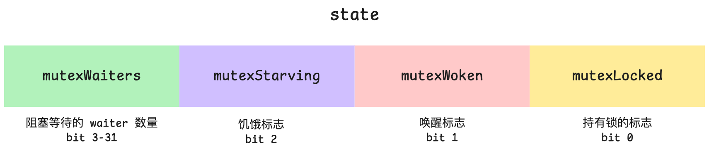

# <span id="propaedeutics">预备知识</span>

## <span id="happens-before">happens-before</span>

**happens-before** 是一个在 **并发编程** 和 **内存模型** 中使用的关系，用来描述：

***如果操作 A happens-before 操作 B，那么 A 的结果必须对 B 可见，并且 A 的执行顺序在 B 之前，即使这两个操作实际上是无序的。***

> 无序涉及到在并发系统（尤其是分布式系统）中对基于潜在 **事件对** 的排序。

它是一种 **偏序关系（partial order）**，比“物理时间先后”更严格，也比“任意先后”更宽松。

例：单线程

```c
x = 1;      // A
y = x + 1;  // B
```

- 在同一线程内，A happens-before B，所以 B 一定能看到 `x=1`。

在现代 CPU 和编译器中，为了优化性能 **指令可能会重排序**、**内存写入可能被缓存延迟可见**、**多个线程/核心看到的内存顺序可能不一致** 。因此，仅仅依赖“时间先后”是不可靠的。**happens-before** 就是语言/平台的内存模型提供的保证：它定义了哪些操作的顺序是必须被所有线程看到的。


# Channel

`Channel` 用于在 `goroutine` 之间进行通信和同步。它提供了一种安全、简洁的方式在多个 `goroutine` 之间传递数据，而无需显式的锁或其他同步机制。`Channel` 类似于管道，一个 `goroutine` 可以将数据发送到 `channel` 中，另一个 `goroutine` 可以从 `channel` 中接收数据。

- **类型化通道**: 每个 `channel` 只能传递一种特定类型的数据。
- **同步性**: `channel` 是同步的，默认情况下，发送和接收操作会阻塞，直到另一端准备好进行接收或发送为止。
- **无缓冲通道**: 默认创建的 `channel` 是无缓冲的，发送操作会一直阻塞，直到有 `goroutine` 接收数据。
- **有缓冲通道**: 可以指定缓冲区大小，这样在缓冲区未满时，发送不会阻塞。


**创建Channel：**

```go
// 创建一个无缓冲的 int 类型 channel
ch := make(chan int)

// 创建一个有缓冲的 int 类型 channel，容量为 3
bufferedCh := make(chan int, 3)
```


- **发送**: 使用 `<-` 操作符将数据发送到 `channel`。
- **接收**: 使用 `<-` 操作符从 `channel` 接收数据。
- **关闭 `channel`**: 使用 `close(ch)` 关闭 `channel`，关闭后无法再发送数据，但可以继续接收直到 `channel` 被耗尽。

```go
package main

import "fmt"

func main() {
    //创建一个无缓冲的channel
    ch := make(chan int)

    // 启动一个 goroutine 发送数据
    go func() {
        ch <- 42 // 发送数据到 channel
    }()

    // 从 channel 接收数据
    value := <-ch
    fmt.Println(value) // 输出: 42
}
```


## 无缓冲的Channel

无缓冲的 `channel`在发送和接收时是同步的，也就是说，发送操作会阻塞直到有 `goroutine` 接收数据，接收操作会阻塞直到有 `goroutine` 发送数据。这种特性使得无缓冲的 `channel` 适合用于 `goroutine` 之间的严格同步。


## 有缓冲的Channel

有缓冲的 `channel` 在缓冲区未满时不会阻塞发送，直到缓冲区满时才阻塞。接收操作会阻塞直到缓冲区非空。

```go
package main

import (
	"fmt"
	"sync"
	"time"
)

func main() {
    //创建一个三个缓冲int的channel
	ch := make(chan int, 3)
    
    //用于等待一组 goroutine 完成的一个同步原语
    var wg sync.WaitGroup
    //WaitGroup计数器加一
	wg.Add(1)
	
    fmt.Println("len(ch)=", len(ch), " cap(ch)=", cap(ch))
	fmt.Printf("\n")

	go func() {
        //通知 WaitGroup 当前的 goroutine 已经完成了它的工作
		defer wg.Done()
		defer fmt.Println("Done")

		for i := 0; i < 4; i++ {
			ch <- i
			fmt.Println("len(ch)=", len(ch), " cap(ch)=", cap(ch))
		}
	}()

	time.Sleep(2 * time.Second)
    close(ch)
	for i := 0; i < 4; i++ {
		value := <-ch
		fmt.Println(value)
	}
    //用于阻塞调用它的 goroutine，直到 WaitGroup 的计数器减为零，即等待所有被 WaitGroup 跟踪的 goroutine 都完成它们的工作
	wg.Wait()
}
```

用 `for range` 读取 channel 中的值时，会将值取出 channel，而不是像数组那样仅仅遍历。


## 信号Channel

`chan struct{}`定义了一个 `channel`，该 `channel` 的元素类型是 `struct{}`，即空结构体。空结构体是一种零值大小的类型，它在内存中不占用任何空间。

因为 `struct{}` 类型没有数据，所以这个 `channel` 通常用作信号通道，而不用于传递实际数据。

**用途**

- **同步信号**: 用于通知、信号传递，例如在 Goroutines 之间发送和接收完成信号。
- **节省内存**: 因为空结构体不占用空间，所以使用 `chan struct{}` 可以更节省内存，尤其是在只需要信号而不需要传递实际数据时。
- **标志性操作**: 通常用于需要发信号或表示事件发生，但无需传递具体数据的场景。

```go
package main

import (
	"fmt"
)

func main() {
	done := make(chan struct{}) // 创建一个无缓冲的信号通道

	go func() {
		fmt.Println("Goroutine is working...")
		// 发送信号，表示任务完成
		done <- struct{}{}	//创建一个空结构体类型的实例，并输入到channel中
	}()

	// 等待接收信号
	<-done 
	fmt.Println("Main goroutine received signal and is exiting.")
}
```


## channel 死锁

如果有两个 goroutine 同时访问两个相同的 channel，则他们必须在两个 goroutine 中一相同的顺序访问，否则会出现死锁。

```go
func main() {
	ch1 := make(chan int)
	ch2 := make(chan int)
	go func(){
		v := 1
		ch1 <- v
		v2 := <-ch2
		fmt.Println(v, v2)
	}()
	v := 2
	ch2 <- v
	v2 := <-ch1
	fmt.Println(v, v2)
}
```

死锁点：

- goroutine 在 `v2 := <-ch2` 处等待主 goroutine 向 `ch2` 发送数据。
- 主 goroutine 在 `v2 := <-ch1` 处等待 goroutine 向 `ch1` 发送数据。

**但实际上，两个 channel 的发送和接收顺序刚好错开，互相等待，导致死锁。**

导致运行结果报错：

```go
fatal error: all goroutines are asleep - deadlock!
```

可以使用 select 语句来避免死锁：

```go
func main() {
	ch1 := make(chan int)
	ch2 := make(chan int)
	go func() {
		v := 1
		ch1 <- v
		v2 := <-ch2
		fmt.Println(v, v2)
	}()
	v := 2
	var v2 int
	select {
	case ch1 <- v:
	case v2 = <-ch1:
	}
	fmt.Println(v, v2)
}
```

在启动的 goroutine 时把值 1 写进了ch1，所以在主 goroutine 中从 ch1 读到 v2 的过程能后执行成功。打印的是下面的 `Println` 语句。

至于为什么 `ch1 <- v` 这个 case 不会执行，参考下文 [select case 中无缓冲的 channel](#select-case-unbuffered-channel)。


## 关闭Channel

`channel`不像文件一样需要经常去关闭，只有当你确实没有任何发送数据了，或者你想显式的结束range循环之类的，才去关闭channel。

关闭`channel`后，无法向`channel`再发送数据（如果继续发送，则会引发panic错误后导致接收立即返回零值）。

重复关闭 `channel` 会导致 panic。

关闭`channel`后，可以继续从`channel`接收数据。

对于`nil channel`，无论收发都会被阻塞。

```go
func main() {
	ch := make(chan int)

	// 启动一个 goroutine 发送数据
	go func() {
		for i := 0; i < 5; i++ {
			ch <- i
		}
		close(ch) // 关闭 channel
	}()

	// 从 channel 接收数据
	for value := range ch {
		fmt.Println(value)
	}
}
```

**可以用Range遍历已关闭的Channel**

```go
func main() {
    ch := make(chan int)

    go func() {
        for i := 0; i < 3; i++ {
            ch <- i
        }
        close(ch) // 关闭 channel
    }()

    // 使用 range 遍历 channel
    for value := range ch {
        fmt.Println(value)
    }
    fmt.Println("Finished receiving")
}
```

但是当用 `range` 读取非关闭的 channel，`for range` 会永久阻塞在读取上。

> [!CAUTION]
>
> 不要轻易用 `for range` 读取 channel，除非保证 channel 已关闭。读取多个 channel 值时，最好用普通的 `for loop`。


## Channel 的行为

|     | 无缓冲，打开     | 无缓冲，关闭                      | 有缓冲，打开        | 有缓冲，关闭                                            | nil   |
| --- | ---------- | --------------------------- | ------------- | ------------------------------------------------- | ----- |
| 读取  | 阻塞直到有数据写入  | 返回零值（需要使用逗号和 ok 模式判断通道是否关闭） | 如果缓冲区无数据会阻塞   | 剩余的值仍然字啊缓冲区中，当缓冲区数据为空时返回零值（需要使用逗号和 ok 模式判断通道是否关闭） | 永久挂起  |
| 写入  | 阻塞直到有数据被读出 | panic                       | 如果缓冲区已满会阻塞    | panic                                             | panic |
| 关闭  | 正常工作       | panic                       | 正常工作，剩余的值仍然存在 | panic                                             | panic |


## Channel与select语句

`channel` 用于在 `goroutine` 之间传递数据，而 `select` 语句可以在多个 `channel` 操作中进行选择，提供灵活的多路复用功能。

`select` 语句用于在多个 `channel` 操作中进行选择，类似于 `switch`，但每个 `case` 都是一个 `channel` 操作。`select` 会阻塞直到其中一个 `channel` 准备好进行操作。

**Select 的特点**

1. **非阻塞**: 如果没有任何 `channel` 准备好，且没有 `default` 分支，`select` 会阻塞。
2. **多路复用**: 可以同时等待多个 `channel`，选择其中一个准备好的进行操作。
3. **随机选择**: 如果有多个 `case` 准备好，`select` 会随机选择一个执行。


### **Select 执行流程**

1. **检查各个 `case` 条件**：`select` 会检查所有 `case` 中的 `channel` 是否准备就绪（即是否有数据可读、是否可以发送数据等）。
2. **选择一个 `case` 执行**：
	- **如果只有一个 `case` 准备就绪**，则立即执行该 `case`。
	- **如果多个 `case` 同时准备就绪**，`select` 会*随机选择*其中一个 `case` 执行。
	- **如果没有 `case` 准备就绪**，则根据 `select` 结构的配置，选择是阻塞等待、执行 `default` 分支，还是直接退出。
3. **执行选定的 `case`**：一旦选择了某个 `case`，`select` 就会执行其中的代码。
4. **如果有 `default` 分支**：当没有任何 `channel` 准备好且有 `default` 分支时，立即执行 `default` 分支，`select` 不会阻塞。

> 一般select会嵌套在一个循环内，以保证channel中的内容被读取完。如果为死循环，最好写一个default然后return结束循环。

```go
func main() {
    ch1 := make(chan string)
    ch2 := make(chan string)

    // 启动两个 goroutine，向不同的 channel 发送数据
    go func() {
        time.Sleep(1 * time.Second)
        ch1 <- "message from ch1"
    }()

    go func() {
        time.Sleep(2 * time.Second)
        ch2 <- "message from ch2"
    }()

    // 使用 select 等待 channel 准备好
    for i := 0; i < 2; i++ {
        select {
        case msg1 := <-ch1:
            fmt.Println("Received:", msg1)
        case msg2 := <-ch2:
            fmt.Println("Received:", msg2)
        }
    }
}
```


### <span id="select-case-executing-logic">Select case 的执行逻辑</span>

#### <span id="select-case-unbuffered-channel">无缓冲的 channel</span>

```go
func main() {
	ch1 := make(chan int)
	ch2 := make(chan int)
	go func() {
		v := 1
		ch1 <- v
		v2 := <-ch2
		fmt.Println(v, v2)
	}()
	v := 2
	var v2 int
	select {
	case ch1 <- v:
	case v2 = <-ch1:
	}
	fmt.Println(v, v2)
}
```

在主 goroutine 中的 select 中 `case ch1 <- v`，因为 ch1 是一个无缓冲的 channel，**并且在 select 执行刚开始没有任何 goroutine 正在从 ch1 中读取**，所以 `case ch1 <- v` 不可执行，select 会执行任意一个其它准备好的 case，如果没有则执行 default 语句。


### Select 实现超时控制

`select` 结合 `time.After` 可以用来实现超时控制：

```go
package main

import (
    "fmt"
    "time"
)

func main() {
    ch := make(chan string)

    go func() {
        time.Sleep(3 * time.Second)
        ch <- "done"
    }()

    select {
    case msg := <-ch:
        fmt.Println("Received:", msg)
    case <-time.After(2 * time.Second):
        fmt.Println("Timeout!")
    }
}
```

如果从 `ch` 接收数据的操作超过 2 秒未完成，`select` 会执行超时 `case`，输出 `"Timeout!"`。


### default实现非阻塞

```go
package main

import (
    "fmt"
)

func main() {
    ch := make(chan int, 1)
    ch <- 1

    select {
    case msg := <-ch:
        fmt.Println("Received:", msg)
    default:
        fmt.Println("No data received")
    }
}
```

在这个例子中，如果没有数据可接收且没有其他 `case` 准备好，则执行 `default` 分支，避免阻塞。


### Select 等待多个 Goroutine 完成

```go
package main

import (
    "fmt"
    "time"
)

func worker(id int, done chan bool) {
    fmt.Printf("Worker %d starting\n", id)
    time.Sleep(time.Second)
    fmt.Printf("Worker %d done\n", id)
    done <- true
}

func main() {
    done := make(chan bool)

    for i := 1; i <= 3; i++ {
        go worker(i, done)
    }

    // 等待所有 worker 完成
    for i := 0; i < 3; i++ {
        select {
        case <-done:
            fmt.Println("Worker finished")
        }
    }

    fmt.Println("All workers finished")
}
```

在这个例子中，`select` 用于从 `done` `channel` 中接收数据，等待所有 `worker` 完成任务。

***


# 互斥锁 sync.Mutex

**互斥锁的本质不是把数据锁住，内存没有任何锁，而是让同时访问临界区的线程最多只有一个。锁仅仅是一个约定，就像一间房间我把它的门锁上，但是别人也可以翻窗而入，无视门上的锁。**

- `sync.Mutex` 是最简单的锁类型，用于保护共享资源，确保在同一时刻只有一个 Goroutine 能访问资源。
- 使用 `Lock` 方法获取锁，使用 `Unlock` 方法释放锁。
- 常用于需要完全互斥的场景。

```go
package main

import (
    "fmt"
    "sync"
)

var (
    counter int
    mu      sync.Mutex
)

func increment(wg *sync.WaitGroup) {
    defer wg.Done()
    mu.Lock()         // 获取锁
    counter++         // 保护的临界区
    mu.Unlock()       // 释放锁
}

func main() {
    var wg sync.WaitGroup
    for i := 0; i < 10; i++ {
        wg.Add(1)
        go increment(&wg)
    }
    wg.Wait()
    fmt.Println("Final Counter:", counter) // 输出10
}
```

在这个示例中：

- 使用 `mu.Lock()` 和 `mu.Unlock()` 来保护 `counter` 的访问。
- 确保每个 Goroutine 对 `counter` 的操作是互斥的，不会发生数据竞争。


## 源码实现

### 初始版本

类似 futex

1. 在用户空间用原子操作（CAS）尝试加锁；
2. 如果锁空闲，直接成功；
3. 如果锁被占用，调用内核的 `semacquire(*uint)` 系统调用，将当前线程挂起；
4. 当锁释放时，另一个线程调用 `semrelease(*uint)` 唤醒它。

```go
func cas(val *int32, old, new int32) bool
func semacquire(s *uint32)
func semrelease(s *uint32)

type Mutex struct {
	key int32
	sema uint32
}

func xadd(val *int32, delta int32) (new int32) {
	for {
		old := *val
		if cas(val, old, old+delta) {	// spin
			return old + delta
		}
	}
	panic("unreached")
}

func (m *Mutex) Lock() {
	if xadd(&m.key, 1) == 1 {
		return
	}
	semacquire(&m.sema)
}

func (m *Mutex) Unlock() {
	if xadd(&m.key, -1) == 0 {
		return
	}
	semrelease(&m.sema)
}
```


### 现代版本

`internal/sync/mutex.go`

Mutex 底层结构体

```go
// go1.25.0.darwin-arm64 src/internal/sync/mutex.go
type Mutex struct {
	state int32
	sema  uint32	// 信号量 semaphore
}

const (
	mutexLocked = 1 << iota // mutex is locked
	mutexWoken
	mutexStarving
    
    // mutexWaiter 的移位常量
	mutexWaiterShift = iota	//3
    // 饥饿模式启动的阈值，1ms，超过这个值 Go 就会把锁切换到“饥饿模式”
    starvationThresholdNs = 1e6
}
```

### state 字段构成



- `mutexLocked` (bit 0)
	- 表示 **锁是否已经被持有**。
	- `1` 表示已加锁，`0` 表示未加锁。
- `mutexWoken` (bit 1)
	- 表示 **是否已经有一个 goroutine 被唤醒**，且保证 **只有一个 goroutine 被唤醒**。
	- 避免惊群效应。
- `mutexStarving` (bit 2)
	- 表示锁是否处于 **饥饿模式**。
	- 饥饿模式下，新来的 goroutine 不能直接抢锁，而必须排队。
- `mutexWaiterShift = 3`
	- **等待者数量计数的起始 bit 位**。
	- `state >> 3` 的高位部分表示等待的 goroutine 数量。


### Lock()

```go
// go1.25.0.darwin-arm64 src/internal/sync/mutex.go
// Lock locks m.
//
// See package [sync.Mutex] documentation.
func (m *Mutex) Lock() {
	// 快速路径：轻松获得锁
	if atomic.CompareAndSwapInt32(&m.state, 0, mutexLocked) {
		if race.Enabled {
			race.Acquire(unsafe.Pointer(m))
		}
		return
	}
	// Slow path (outlined so that the fast path can be inlined)
	m.lockSlow()
}
```

`Mutex.Lock()` 先走 **快速路径**，原子的比较 `m.state` 是否为 `0`，如果是直接通过原子操作获得锁。原子 CAS 既保证多核并发安全，也让无竞争下只需一次原子指令即可完成加锁，速度极快。

> - `atomic.CompareAndSwapInt32` 内部依赖 **CPU 的原子指令**（例如在 x86 上是 `CMPXCHG`，在 ARM 上是 `LDXR/STXR`）。
> - 这些指令由 **硬件保证**在多核、多线程下执行时不可分割（atomic），不会被中断。
> - 因此即使多个 goroutine 或多个线程同时对 `addr` 进行 CAS 操作，也不会出现“竞争写入”的问题。
>
> 也就是说，它不是用软件的锁（mutex），而是利用 **硬件的原子性** 来保证互斥。

`if race.Enabled` 涉及竞争检测且需要在快速路径获得锁之后。

> 如果在编译时启用了 **race detector** ，编译器会自动把这个值置为 `true` 并且把很多运行时和同步原语的调用替换成带有 race 检测逻辑的版本。race detector 的功能：
>
> - **插桩（instrumentation）**：编译器会在所有内存访问、同步操作（如 `Lock`、`Unlock`、`atomic.*` 等）处插入调用 race runtime 的钩子。
> - **检测机制**：runtime 利用 **ThreadSanitizer (TSan)** 的算法维护一个 happens-before 图，发现有两个内存访问既不是顺序一致的，也没有通过同步原语建立 happens-before，就报告为 **data race**。

此时，`race.Acquire` 会调用 **[ThreadSanitizer](https://clang.llvm.org/docs/ThreadSanitizer.html)** 的 runtime，在其内部的 [happens-before](#happens-before) 图（判断不同 goroutine 的读写是否有同步关系）中增加一条边，后续 goroutine 在这个锁保护区域里的读取，与先前持锁 goroutine 在解锁前的写，通过 Unlock 的 `race.Release` / `race.ReleaseMerge` 等调用形成可见的 happens-before。

但是 **关闭 race 后的 happens-before 仍然成立**，它是 Go 内存模型规定的，由 `CAS` + 内存屏障实现。

race 相关调用 ≈ “调试用标记”，不是语义必需。没有它程序仍然有同样的同步可见性；只是 race detector 失去推断锁建立的 happens-before 的数据，因而无法报告数据竞争。

如果当前 `m.state` 不为 `0` 即锁被占用、存在饥饿、有 waiters 三种情况起码有一种存在，那么就进入 **慢路径**。


### lockslow()

```go
// go1.25.0.darwin-arm64 src/internal/sync/mutex.go
func (m *Mutex) lockSlow() {
	var waitStartTime int64	// 第一次真正阻塞（挂到信号量）时的时间戳，用于计算等待时长
	starving := false	// 是否处于饥饿状态
	awoke := false		// 是否是被唤醒过（控制 mutexWoken 标志复位）
	iter := 0			// 自旋迭代次数，用于 runtime_canSpin 决定是否继续自旋
	old := m.state		// 读取到的旧的 state 快照；循环中多次刷新
    					// 这里不保证读取的正确性，因为在 for 中还会用atomic.CompareAndSwapInt32 检查
	for {
		// Don't spin in starvation mode, ownership is handed off to waiters
		// so we won't be able to acquire the mutex anyway.
        // 只有在“锁被持有但不在饥饿模式”时才自旋；饥饿模式禁止新来者自旋（因为饥饿模式要求严格 FIFO 交接）
		if old&(mutexLocked|mutexStarving) == mutexLocked && runtime_canSpin(iter) {
            // 若当前还未标记唤醒并且存在等待者且 mutexWoken 未置位，则 CAS 设置 mutexWoken
            // 通知 Unlock 不要唤醒其它被阻塞的 goroutine，减少惊群，开始自旋
			if !awoke && old&mutexWoken == 0 && old>>mutexWaiterShift != 0 &&
				atomic.CompareAndSwapInt32(&m.state, old, old|mutexWoken) {
				awoke = true
			}
			runtime_doSpin()
			iter++
			old = m.state
			continue
		}
		new := old
		// Don't try to acquire starving mutex, new arriving goroutines must queue.
        // 在非饥饿状态下尝试获取锁
		if old&mutexStarving == 0 {
			new |= mutexLocked
		}
        // 在获取到锁或者饥饿状态下，新的 goroutine 应该被加入 waiter 队列中
		if old&(mutexLocked|mutexStarving) != 0 {
			new += 1 << mutexWaiterShift
		}
		// The current goroutine switches mutex to starvation mode.
		// But if the mutex is currently unlocked, don't do the switch.
		// Unlock expects that starving mutex has waiters, which will not
		// be true in this case.
        // 如果局部 starving == true 且旧状态仍 locked（防止把空队列设置为饥饿），就启动饥饿模式
		if starving && old&mutexLocked != 0 {
			new |= mutexStarving
		}
        // 如果之前被唤醒过，必须清除 mutexWoken
        // 否则 Unlock 逻辑会认为还有被唤醒但未处理的 waiter，导致状态不一致；如果清除失败（标志不存在）则抛出
		if awoke {
			// The goroutine has been woken from sleep,
			// so we need to reset the flag in either case.
			if new&mutexWoken == 0 {
				throw("sync: inconsistent mutex state")
			}
			new &^= mutexWoken
		}
		if atomic.CompareAndSwapInt32(&m.state, old, new) {
			if old&(mutexLocked|mutexStarving) == 0 {
                // 在非饥饿状态下获取到锁
				break // locked the mutex with CAS
			}
            
            // 以下为 CAS 成功但锁/饥饿仍然存在
            
			// If we were already waiting before, queue at the front of the queue.
            // 如果这是再次循环，则采用 LIFO 插队（把久抢不到的 waiter 放到队列前头）
            // 增加其后续被唤醒概率，降低尾部长时间饥饿
			queueLifo := waitStartTime != 0
			if waitStartTime == 0 {
				waitStartTime = runtime_nanotime()
			}
            // 阻塞等待
			runtime_SemacquireMutex(&m.sema, queueLifo, 2)
            // 唤醒后检查是否处于饥饿状态
			starving = starving || runtime_nanotime()-waitStartTime > starvationThresholdNs
			old = m.state
            // 处于全局饥饿模式
			if old&mutexStarving != 0 {
				// If this goroutine was woken and mutex is in starvation mode,
				// ownership was handed off to us but mutex is in somewhat
				// inconsistent state: mutexLocked is not set and we are still
				// accounted as waiter. Fix that.
				if old&(mutexLocked|mutexWoken) != 0 || old>>mutexWaiterShift == 0 {
					throw("sync: inconsistent mutex state")
				}
                // 设置 mutexLocked 位；将等待者计数减 1
				delta := int32(mutexLocked - 1<<mutexWaiterShift)
                // 当前 goroutine 不处于饥饿模式且只有一个等待者
				if !starving || old>>mutexWaiterShift == 1 {
					// Exit starvation mode.
					// Critical to do it here and consider wait time.
					// Starvation mode is so inefficient, that two goroutines
					// can go lock-step infinitely once they switch mutex
					// to starvation mode.
                    // 在原来 delta 基础上清除 mutexStarving 位
					delta -= mutexStarving
				}
                // 设置 mutexLocked 位；waiter 减 1；清除 mutexStarving 位
				atomic.AddInt32(&m.state, delta)
				break
			}
			awoke = true
			iter = 0
		} else {
			old = m.state
		}
	}

	if race.Enabled {
		race.Acquire(unsafe.Pointer(m))
	}
}
```

**`awoke` 和 `mutexWoken` 的区别**

**`mutexWoken`**：

- **身份**：`m.state` 中的一个**标志位**（第 1 位）。

- **可见性**：**全局共享**。所有正在尝试锁定该互斥锁的 Goroutine 都能看到并可能修改它。

- **作用**：防止惊群效应和不必要的唤醒。它是一个通信信号，含义是“已经有一个等待者被唤醒了，或者有一个正在自旋的 goroutine 准备接管锁，请不要再唤醒其他等待者了”。

- 谁设置它？
	- `unlockSlow`：在准备唤醒一个等待者之前，会先设置 `mutexWoken`。
	- `lockSlow`（自旋路径）：一个正在自旋的 Goroutine 可能会设置它，告诉 `Unlock`：“别唤醒别人，我马上就要抢到锁了”。
- 谁读取它？
	- `unlockSlow`：在决定是否要唤醒等待者时，会检查 `mutexWoken` 是否已被设置。如果已被设置，就直接返回，避免了多余的 `runtime_Semrelease` 调用和上下文切换。

**`awoke`**：

- **身份**：`lockSlow` 函数内的一个 `bool` 型**局部变量**。

- **可见性**：**局部私有**。只属于当前正在执行 `lockSlow` 的那个 Goroutine，其他 Goroutine 完全看不到它。

- **作用**：记录当前 Goroutine 的历史状态。含义是：“我（这个 Goroutine）是不是在上一轮循环中因为被唤醒才从睡眠中返回的？”

- 谁设置它？
	- `lockSlow`：当一个 Goroutine 从 `runtime_SemacquireMutex`（即从睡眠中）被唤醒并返回后，它会立即将自己的 `awoke` 变量设置为 `true`。
- 谁读取它？
	- `lockSlow`：在下一次构建新的 `state` 时，如果发现自己的 `awoke` 是 `true`，它就知道自己有责任去**清除全局的 `mutexWoken` 标志**。

**`starving`** 和 **`mutexStarving`** 关系类似。


### Unlock()

```go
// go1.25.0.darwin-arm64 src/internal/sync/mutex.go
func (m *Mutex) Unlock() {
    // 竞争检测
	if race.Enabled {
		_ = m.state
		race.Release(unsafe.Pointer(m))
	}

	// Fast path: drop lock bit.
    // 快速路径：直接清除 mutexLocked 位
	new := atomic.AddInt32(&m.state, -mutexLocked)
	if new != 0 {
		// Outlined slow path to allow inlining the fast path.
		// To hide unlockSlow during tracing we skip one extra frame when tracing GoUnblock.
        // 如果还有 waiter 或者处于饥饿状态，则调用慢路径
        // 在这种复杂情况下，当前 Goroutine 有责任去唤醒一个等待者或处理饥饿模式的交接
		m.unlockSlow(new)
	}
}

func (m *Mutex) unlockSlow(new int32) {
    // 安全检查：处理解锁前未加锁的情况
	if (new+mutexLocked)&mutexLocked == 0 {
		fatal("sync: unlock of unlocked mutex")
	}
    // 非饥饿模式
	if new&mutexStarving == 0 {
		old := new
		for {
			// If there are no waiters or a goroutine has already
			// been woken or grabbed the lock, no need to wake anyone.
			// In starvation mode ownership is directly handed off from unlocking
			// goroutine to the next waiter. We are not part of this chain,
			// since we did not observe mutexStarving when we unlocked the mutex above.
			// So get off the way.
            // 如果没有 waiter，或者锁被占用，或者有 goroutine 被唤醒，或者当前是饥饿模式，则不需要唤醒任何 goroutine
			if old>>mutexWaiterShift == 0 || old&(mutexLocked|mutexWoken|mutexStarving) != 0 {
				return
			}
			// Grab the right to wake someone.
            // 唤醒一个 goroutine，并设置唤醒标志
			new = (old - 1<<mutexWaiterShift) | mutexWoken
			if atomic.CompareAndSwapInt32(&m.state, old, new) {
                // 如果成功修改 state 就唤醒一个在信号量上等待的 goroutine
                // 参数 false 表示这不是所有权交接，被唤醒的 Goroutine 仍需竞争才能获得锁
				runtime_Semrelease(&m.sema, false, 2)
				return
			}
            // 设置 state 失败，更新 state 进入下一次循环重试
			old = m.state
		}
      // 饥饿模式的核心
	} else {
		// Starving mode: handoff mutex ownership to the next waiter, and yield
		// our time slice so that the next waiter can start to run immediately.
		// Note: mutexLocked is not set, the waiter will set it after wakeup.
		// But mutex is still considered locked if mutexStarving is set,
		// so new coming goroutines won't acquire it.
        // 将锁的所有权直接交接给等待队列中的第一个 goroutine
        // 参数 true 表示这是一个“所有权交接”（handoff）
        // 被唤醒的 Goroutine 会被立即调度执行，并且它直接获得锁的所有权，无需再次竞争
        // 在这种模式下，解锁者不会去设置 mutexLocked 位，mutexLocked=0, mutexStarving=1
        // 被唤醒的 Goroutine 在 lockSlow 中自己负责修正 state
		runtime_Semrelease(&m.sema, true, 2)
	}
}
```


### 被唤醒的 goroutine

如果有 1000 个 goroutine 在等锁 `sync.Mutex` 中 `Unlock` 只会唤醒其中一个 goroutine，所以 **`lockSlow` 等待的 goroutine，最终一次只能被唤醒一个**。但是被唤醒的 goroutine 也需要通过竞争获得锁。

在 **正常模式（非饥饿模式）**下被唤醒的 goroutine 需要与以下两类 goroutine 竞争：

1. **新到达的 goroutine（Barging Goroutines）**：
	- 这些是之前**从未等待过**的 Goroutine。它们恰好在锁被释放的瞬间运行到 `Lock()` 方法。
	- 它们有一个巨大的优势：**它们已经在 CPU 上运行了**。而被唤醒的 Goroutine 需要经历一个从睡眠状态到被调度器放到 CPU 上运行的过程，这个过程有延迟。
	- 因此，一个正在运行的、新来的 Goroutine 很有可能“插队”，在被唤醒的 Goroutine 真正开始运行之前就抢到锁。
2. **正在自旋的 goroutine（Spinning Goroutines）**
	- 这些是在不久前尝试获取锁失败，但没有立即睡眠，而是在 CPU 上执行一个短暂的、忙等待循环（自旋）的 Goroutine。
	- 它们也处于“热”状态，可以非常快地响应锁的释放，并尝试通过 CAS 操作抢占它。

为什么要这样设计？—— 为了更高的吞吐量和性能提升

- **利用 CPU 缓存局部性**：如果一个 Goroutine 刚刚释放了锁，然后马上又重新获取它（这是一个非常常见的模式），那么它需要的数据很可能还保留在它的 CPU 缓存（L1/L2 Cache）中。让它“插队”成功，可以避免昂贵的缓存未命中（Cache Miss），执行速度极快。
- **避免昂贵的上下文切换**：唤醒一个睡眠中的 Goroutine 并将其调度到 CPU 上，是一个相对昂贵的操作。如果能让一个已经在运行的 Goroutine 直接获得锁，就避免了一次不必要的上下文切换，从而提高了整个系统的吞吐量。


### Mutex 完全逻辑

`sync.Mutex` 用原子操作实现**快速无锁路径（CAS）**，在竞争时用**自旋**尽量避免阻塞；竞争更激烈或自旋失败时进入**慢路径**，通过  runtime 的信号量把当前 goroutine 挂起（park），由 `Unlock` 唤醒等待者。mutex 的 `state` 用若干位来记录 `locked/woken/starving` 和等待者数量，配合一系列原子位操作实现高效唤醒与防惊群与抗饥饿逻辑。

1. **自旋阶段 (Active Spinning)**

	这是 goroutine 在进入休眠前的最后一搏。

	- **条件**:
		1. 锁必须处于**正常模式** (`mutexStarving` 位为 0)。
		2. 锁必须已被锁定 (`mutexLocked` 位为 1)。
		3. `runtime_canSpin(iter)` 返回 `true`。这个函数会检查一些条件，比如：当前 P 上只有一个 goroutine 在运行，并且自旋次数没有超过上限（通常是 4 次）。这确保了自旋不会无意义地浪费过多 CPU 时间。

	- **目的**:
		- 自旋是为了应对一种非常常见的情况：锁的持有者即将释放锁。与其立即让当前 goroutine 上下文切换、进入休眠（这是一个很重的操作），不如让它在 CPU 上“空转”几个周期，看看能否在短暂的等待后直接拿到锁。
		- 在自旋期间，它会尝试设置 `mutexWoken` 标志位。这像一个信号，告诉 `Unlock` 方法：“我已经在这里等着了，你释放锁的时候不必再去唤醒其他休眠的 goroutine 了，锁很可能会被我拿到。”

	- **流程**:
		- 如果满足自旋条件，就调用 `runtime_doSpin()` 执行一小段空转。
		- 然后重新读取 `m.state`，进入下一次循环，再次尝试获取锁。
		- 如果自旋几次后仍然失败，或者不再满足自旋条件，就会进入下一步。

2. **准备休眠与状态更新**

	如果自旋失败，goroutine 就准备进入休眠状态。在此之前，它需要更新 `state` 来反映自己的“加入”。

	- **计算新状态 (`new`)**:
		1. **尝试加锁**: 如果当前是正常模式，就尝试设置 `mutexLocked` 位，表示“我想要这个锁”。
		2. **增加等待者计数**: 如果锁已经被锁定或处于饥饿模式，就将等待者计数器（高 29 位）加一。
		3. **进入饥饿模式**: 如果当前 goroutine 已经等待了超过 1 毫秒 (`starvationThresholdNs`)，它会将 `starving` 标志设为 `true`，并在这次更新中尝试设置 `mutexStarving` 位，将整个锁切换到饥饿模式。
		4. **清除唤醒标记**: 如果当前 goroutine 是被唤醒的 (`awoke` 为 `true`)，它需要清除 `mutexWoken` 标志，因为这个“唤醒”事件已经被它自己消耗了。

	- **原子更新**:
		- 使用 `atomic.CompareAndSwapInt32(&m.state, old, new)` 尝试将计算出的新状态写入。
		- 如果成功：
			- 如果 `old` 状态显示锁是未锁定的，说明本 goroutine 幸运地在休眠前拿到了锁，直接 `break` 循环，加锁成功。
			- 否则，说明需要休眠。调用 `runtime_SemacquireMutex`，通过信号量（`m.sema`）将自己挂起，等待被 `Unlock` 唤醒。
		- **如果失败**: 说明在计算 `new` 的过程中，有其他 goroutine 修改了 `state`。此时只需重新读取 `old = m.state`，然后回到 `for` 循环的开始，重新走一遍逻辑。

3. **被唤醒后的处理**

	当 `runtime_SemacquireMutex` 返回时，意味着当前 goroutine 被 `Unlock` 操作唤醒了。

	- 检查饥饿模式：
		- 如果锁处于饥饿模式：
			- 这意味着锁的所有权被**直接交接**给了当前 goroutine。
			- 此时 `mutexLocked` 位是 `0`，需要由当前 goroutine 自己来设置。它会原子地给 `state` 增加 `mutexLocked` 并减去一个等待者计数。
			- 同时，它会检查是否需要退出饥饿模式（比如自己是最后一个等待者，或者等待时间很短），如果需要，就清除 `mutexStarving` 标志。
			- 然后 `break` 循环，加锁成功。
		- 如果锁处于正常模式：
			- 被唤醒**不代表**拥有了锁。它只是获得了再次竞争的权利。
			- 它需要回到 `for` 循环的开始，与新来的 goroutine（以及可能也在自旋的 goroutine）一起竞争。这时它会设置 `awoke = true`，表示自己是被唤醒的。

> [!CAUTION]
>
> **以后再补充**


# 读写锁 sync.RWMutex

go `RWMutex` 遵循写操作优先。

- `sync.RWMutex` 是读写锁，允许多个 Goroutines 同时读取资源，但在 **写操作时会阻塞所有** 其他 Goroutines 的访问。
- 使用 `RLock` 获取读锁，使用读锁期间允许多个 Goroutine **同时读取**共享资源，**但在持有读锁期间，不能有写操作**；`RUnlock` 释放读锁。
- 使用 `Lock` 获取锁，`Unlock` 释放锁。
- 适合读多写少的场景，提高并发性能。

```go
package main

import (
    "fmt"
    "sync"
)

var (
    data    = make(map[int]int)
    rwMutex sync.RWMutex
)

func write(key, value int, wg *sync.WaitGroup) {
    defer wg.Done()
    rwMutex.Lock()          // 获取写锁
    data[key] = value
    rwMutex.Unlock()        // 释放写锁
}

func read(key int, wg *sync.WaitGroup) {
    defer wg.Done()
    rwMutex.RLock()         // 获取读锁
    value := data[key]
    rwMutex.RUnlock()       // 释放读锁
    fmt.Printf("Read: data[%d] = %d\n", key, value)
}

func main() {
    var wg sync.WaitGroup

    // 启动写操作
    wg.Add(1)
    go write(1, 10, &wg)

    // 启动多个读操作
    for i := 0; i < 3; i++ {
        wg.Add(1)
        go read(1, &wg)
    }

    wg.Wait()
}
```

在这个示例中：

- `RWMutex` 的读锁允许多个读操作并发执行，而写锁会独占资源。
- 使用 `rwMutex.RLock()` 和 `rwMutex.RUnlock()` 进行读操作，`rwMutex.Lock()` 和 `rwMutex.Unlock()` 进行写操作。


## 源码实现

```go
// go1.25.0.darwin-arm64 sync/rwmutex.go
type RWMutex struct {
	w           Mutex        // 由 pending writer 持有
	writerSem   uint32       // 为 writer 设置的信号量，writer 等待先前的 reader 释放锁
	readerSem   uint32       // 位 reader 设置的信号量，reader 等待先前的 writer 释放锁
	readerCount atomic.Int32 // pending reader 的数量
	readerWait  atomic.Int32 // departing reader 的数量
}
```

- `pending reader/writer`：等待（或持有）锁的 reader 或者 writer
- `departing reader`：持有锁但还没有释放的 reader。
- `readerCount`：当前 reader 的数量，包括持有读锁的 reader，以及等待读锁的 reader（因为有 writer 在请求锁，所以后面的 reader 没有办法获取到读锁）。
- `readerWait`：当前持有读锁的 reader。


### RLock()

```go
// go1.25.0.darwin-arm64 src/sync/rwmutex.go
func (rw *RWMutex) RLock() {
    // 竞争检测
	if race.Enabled {
		race.Read(unsafe.Pointer(&rw.w))
		race.Disable()
	}
	if rw.readerCount.Add(1) < 0 {
		// A writer is pending, wait for it.
		runtime_SemacquireRWMutexR(&rw.readerSem, false, 0)
	}
	if race.Enabled {
		race.Enable()
		race.Acquire(unsafe.Pointer(&rw.readerSem))
	}
}
```


### Lock()

RWMutex 写锁的实现

```go
// go1.25.0.darwin-arm64 src/sync/rwmutex.go
// Lock locks rw for writing.
// If the lock is already locked for reading or writing,
// Lock blocks until the lock is available.
func (rw *RWMutex) Lock() {
	// First, resolve competition with other writers.
	rw.w.Lock()
	// Announce to readers there is a pending writer.
    // ① 设置屏障，立即组织任何新的 goroutine 获取读锁；精确的知道在设置屏障的一瞬间，已经有多少个 goroutine 正在持有读锁
	r := rw.readerCount.Add(-rwmutexMaxReaders) + rwmutexMaxReaders
	// Wait for active readers.
	if r != 0 && rw.readerWait.Add(r) != 0 {
		runtime_SemacquireRWMutex(&rw.writerSem, false, 0)
	}
}
```

跳过竞争部分的代码。`RWMutex.Lock()` 实现上读锁。

```go
r := rw.readerCount.Add(-rwmutexMaxReaders) + rwmutexMaxReaders
```

`readerCount` 原子的减去 `rwmutexMaxReaders` 用于在瞬间设置了一道屏障（`readerCount < 0`），是后续 goroutine 是否可获得锁的判断。不需要专门维护一个值记录当时 `readerCount`，而且即使维护也可能会发生值不一致的情况。后面 `RWMutex.UnLock()` 方法中会看到又给 `readerCount` 加上了 `rwmutexMaxReaders`，回到正值。

再加上 `rwmutexMaxReaders` 用于恢复 lock 瞬间 readerCount 的数量。即使后面有新的 reader 也不会影响到这个 `r`。

之后如果 `r` 不为 0 说明还有读锁，并把这些 `reader` 加入到 `readerWait` 中，调用 `runtime_SemacquireRWMutex` 在 `writerSem` 上睡眠。


