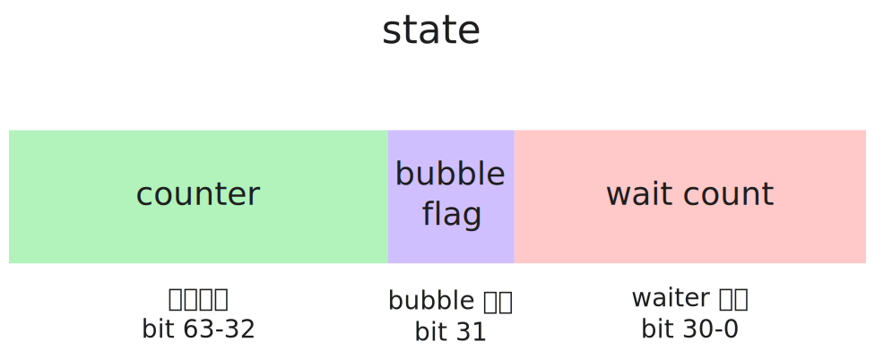

- **WaitGroup.Add**
- **WaitGroup.Done**
- **WaitGroup.Wait**
- **WaitGroup.Go**

> `WaitGroup.Go(f func())` 为 `Go1.25`，新加方法，具体实现见下 [WaitGroup.Go](#waitgroup.go)


# 源码解读

## WaitGroup

```go
// A WaitGroup must not be copied after first use.
type WaitGroup struct {
    // 用于 go vet 静态检查，noCopy 是个实现了 Lock() 和 UnLock() 方法的 interface
    // 目的在于检测这是一个不可以复制的值，
	noCopy noCopy

	// Bits (high to low):
	//   bits[0:32]  counter
	//   bits[32]    flag: synctest bubble membership
	//   bits[33:64] wait count
	state atomic.Uint64
	sema  uint32
}
```



- **counter**：WaitGroup 维护的计数器，统计总共有多少未完成的任务。
- **bubble^1^ flag**：判断是否已与某个 synctest bubble 关联。
- **wait count**：当前有多少 goroutine 在执行 `WaitGroup.Wait()` 并已经登记为 waiter。

[^1]: "bubble"，Go1.25 引入的 `testing/synctest` 并发测试框架的一个隔离单元，参考 [testing/synctest](https://pkg.go.dev/testing/synctest)


## <span id="waitgroup.go">WaitGroup.Go</span>

```go
func (wg *WaitGroup) Add(delta int) {
	// 竞争和并发测试部分代码略
    // 计数器值加 delta 值
	state := wg.state.Add(uint64(delta) << 32)
    // 获得当前计数器的值（包含之前的和刚刚加上的 delta 值）
	v := int32(state >> 32)
	w := uint32(state & 0x7fffffff)
	if v < 0 {
		panic("sync: negative WaitGroup counter")
	}
	if w != 0 && delta > 0 && v == int32(delta) {
		panic("sync: WaitGroup misuse: Add called concurrently with Wait")
	}
	if v > 0 || w == 0 {
		return
	}
	// This goroutine has set counter to 0 when waiters > 0.
	// Now there can't be concurrent mutations of state:
	// - Adds must not happen concurrently with Wait,
	// - Wait does not increment waiters if it sees counter == 0.
	// Still do a cheap sanity check to detect WaitGroup misuse.
	if wg.state.Load() != state {
		panic("sync: WaitGroup misuse: Add called concurrently with Wait")
	}
	// Reset waiters count to 0.
	wg.state.Store(0)
	for ; w != 0; w-- {
		runtime_Semrelease(&wg.sema, false, 0)
	}
}
```

