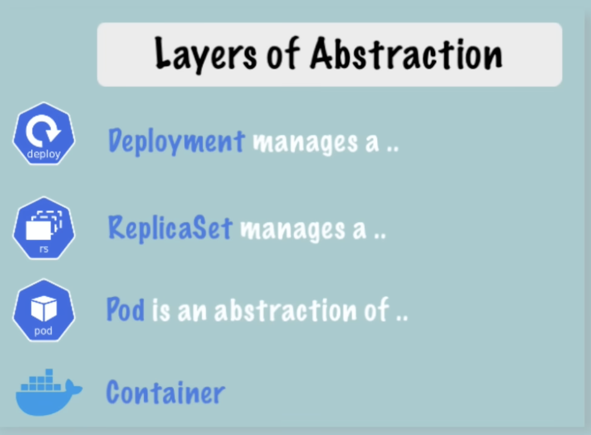
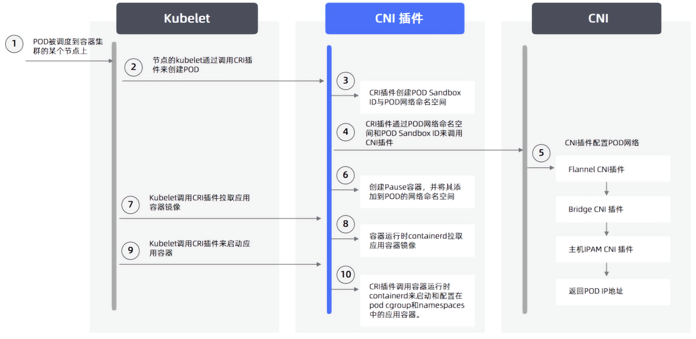
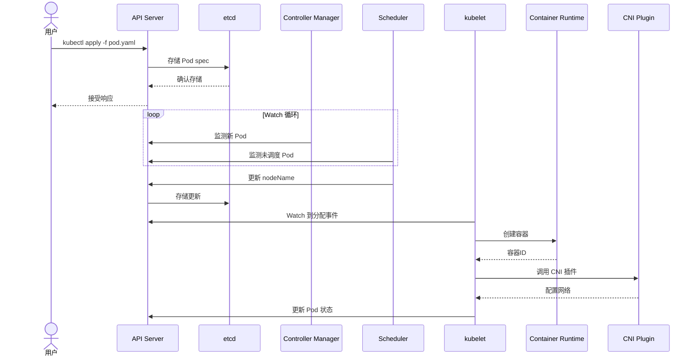
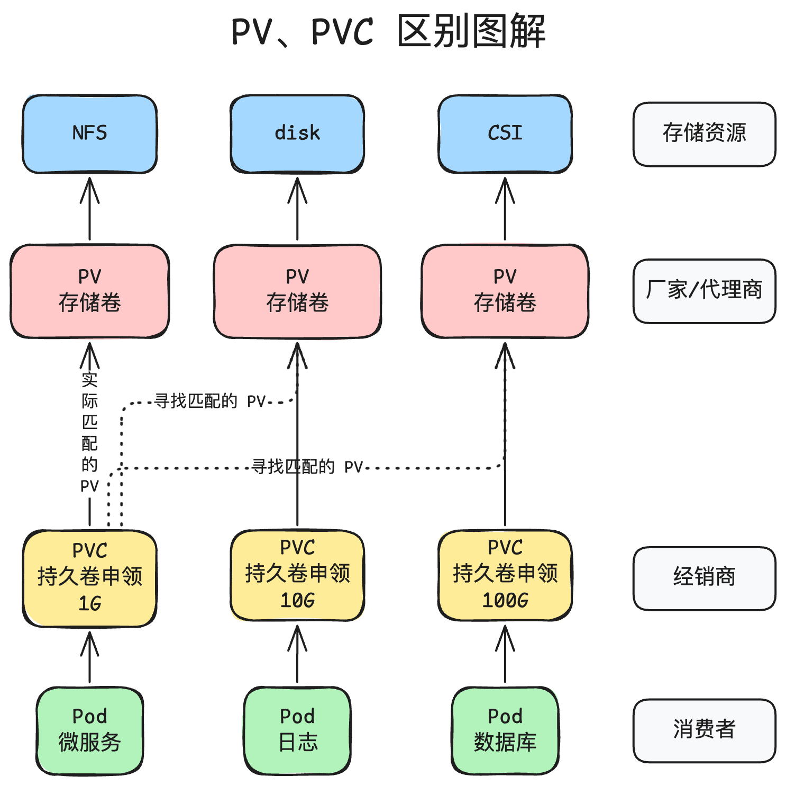

基于 Kubernetes 1.29

# 架构


## Control plane

Kubernetes控制面板（Control Plane）是整个Kubernetes集群的核心组件，负责管理和协调各个节点和资源。它包含多个关键组件，各组件协同工作来管理容器的调度、资源分配、集群状态维护、以及提供API供客户端与集群交互。


### 工作流程概览

1. 用户通过`kubectl`命令与`kube-apiserver`通信，发出API请求。
2. `kube-apiserver`接收请求，验证后将所需数据存入`etcd`。
3. `kube-scheduler`根据调度策略选择合适的Node节点运行Pod。
4. `kube-controller-manager`监控集群状态，根据定义的策略调整资源以保证期望状态。
5. `cloud-controller-manager`则用于与云环境通信，管理云上的资源。

控制平面确保了集群的自愈能力、弹性扩展以及安全访问。


### kube-apiserver

- `kube-apiserver`是控制平面的核心组件，提供Kubernetes集群的REST API接口。它是唯一允许与etcd直接交互的组件。
- 主要负责接收、验证和处理来自用户、管理员和其他组件的请求，并将这些请求存储到`etcd`。
- 客户端通过`kube-apiserver`查询集群状态、获取资源信息、发送指令等。可以通过`kubectl`命令行工具与其交互。


### etcd

- `etcd`是Kubernetes的分布式键值存储系统，用来保存所有集群的数据和状态信息。
- 它在数据一致性方面表现优异，确保在多节点环境中，所有节点的数据是同步的。
- 主要用于存储集群的配置信息、状态信息和对象定义，作为集群的“数据库”。


### <span id="kube-scheduler">kube-scheduler</span>

调度器（kube-scheduler）是集群资源分配的核心组件。它持续监听API Server，将未绑定节点的Pod加入调度队列，通过`Sort`扩展点（如优先级队列）对Pod排序，通过 **预选**（强制 ***过滤*** 不满足条件的节点） 和 **优选**（对节点 ***打分*** ） 两阶段调度算法，选择最高分节点后，通过API Server写入绑定信息，由目标节点的kubelet接管后续Pod启动。

- **预选（Predicates）**：以下的每一个条件都须要满足，如果在预选阶段没有合适的 Node，Pod 会一直在 `Pending` 状态，不断重试调度，直到有 Node 满足条件。
	- `PodFitsResources`：节点上剩余的资源是否大于 Pod 请求资源。
	- `PodFitsHost`：如果 Pod 指定了 NodeName，检查节点名称是否和 NodeName 匹配。
	- `PodFitsHostPorts`：节点上已经使用的 port 是否和 pod 申请的 port 冲突。
	- `PodToleratesNodeTaints`：查看 Pod 的容忍性和 Node 的污点是否匹配。
	- `PodSelectorMatches`：过了掉和 Pod 指定的 label 不匹配的节点。
	- `NoDiskConfict`：已经 mount 的 volume 和 pod 指定的 volume 不冲突，除非他们都是只读。
	- ...
- **优选（Priorities）**：如果有多个节点满足条件，就继续优选过程，按照优先级大小对节点排序。
	- 亲和性（`InterPodAffinityPriority`）
	- `LeastRequestPriority`：通过计算 CPU 和 Memory 的使用率来决定权重，使用率越低权重越高，即更倾向于资源使用比例更低的节点。
	- `BalanceResourceAllocation`：节点上 CPU 和 Memory 使用率越接近，权重越高，次选项应和上一个一起使用。
	- `ImageLocalityPriority`：倾向于已经有要使用镜像的节点，镜像总大小值越大，权重越高。 


### kube-controller-manager

- `kube-controller-manager`包含多个控制器（Controller），每个控制器负责不同的控制逻辑。
- 常见的控制器包括：
	- **Node Controller**：监控节点的状态，在节点失联时做出相应处理。
	- **Replication Controller**：确保指定数量的Pod副本在集群中始终处于运行状态。
	- **Endpoint Controller**：为Service对象管理Endpoints。
	- **Service Account & Token Controller**：创建默认的ServiceAccount并管理其关联的token。
- `kube-controller-manager`通过不断地“检测-校正”的过程来维持集群的所需状态。


### cloud-controller-manager

（仅在使用云提供商时需要）

- `cloud-controller-manager`是用于在Kubernetes上管理与云服务提供商相关资源的组件。
- 它提供对云资源的访问和管理功能，例如负载均衡器、存储卷和网络设置。
- 这个组件通常包含多个控制器（例如Node、Route、Service等），以适应云平台的特性和需求。


## Node

### kubelet

`kubelet` 是Kubernetes架构中负责管理和维护每个 Node 上容器生命周期的核心组件。它在每个 Node 上运行，负责与 Control plane（如`kube-apiserver`）进行通信，确保 Pod 在 Node 上正确创建、运行和报告状态。

> Kubelet 通常作为系统服务运行，由 systemd 管理。它是 **唯一一个在节点上必须以二进制方式运行的核心组件**。

1. **Pod生命周期管理**

`kubelet`的主要任务是管理节点上Pod的生命周期。具体职责包括：

   - **创建和销毁Pod**：根据控制平面的调度决定拉取容器镜像并启动Pod，同时在不需要时销毁Pod。
   - **容器健康检查**：定期检查容器的健康状况，根据定义的探针（如`Liveness Probe`和`Readiness Probe`）判断是否重启或重新启动不健康的容器。
   - **自动重启**：当容器崩溃或不健康时，根据定义的重启策略自动重启容器。

2. **节点资源管理**

`kubelet`监控节点的资源使用情况，包括CPU、内存、存储等资源。它确保节点上的容器不会超过资源限制，并在资源不足时及时通知控制平面。

3. **与容器运行时的交互**

`kubelet`通过CRI（Container Runtime Interface）与底层容器运行时（如Docker、containerd、CRI-O等）进行交互，负责启动、停止和管理容器的实际运行。

4. **日志和监控**

- **日志采集**：收集Pod和节点上的日志信息，供其他监控组件（如Prometheus、Fluentd等）使用。
- **资源监控**：`kubelet`报告节点及其上容器的资源使用情况，便于控制平面进行资源调度。

5. **卷挂载和存储管理**

`kubelet`负责管理和挂载与Pod相关的持久化存储卷。它确保Pod运行时可以访问配置的存储卷，并在Pod停止运行时正确卸载卷。

6. **报告节点状态**

`kubelet`定期向控制平面（`kube-apiserver`）报告节点状态，包括节点资源、运行的Pod状态以及健康状况。这使得Kubernetes可以实时了解每个节点的健康情况，进行调度决策。

7. **配置和密钥管理**

`kubelet`负责管理和提供Pod访问的`ConfigMap`和`Secret`等资源，将其挂载到Pod的容器中，确保应用程序可以安全访问所需的配置信息和敏感数据。


###  kube-proxy

[kube-proxy](./kube-proxy.md) 是 Kubernetes 中运行在每个节点上的网络代理组件，它负责维护网络规则，以确保 Kubernetes 服务的网络通信正常工作。它的主要任务是实现服务的负载均衡和集群内部的服务发现，使得集群中的 Pod 可以通过服务名称访问其他 Pod。

> Kube-proxy 可以作为系统服务运行，也可以作为 DaemonSet 部署在集群中。选择哪种方式取决于网络插件和集群配置。

1. **服务发现与负载均衡**：
	- `kube-proxy`为每个Service创建规则，使流量能够根据 Service 的Cluster IP和端口找到目标Pod。
	- 提供负载均衡功能，将对Service的请求分发到相应的后端Pod，确保集群中应用服务的高可用性和扩展性。

2. **维护网络规则**：
	- `kube-proxy`通过管理底层的网络规则（如 iptables、IPVS 或用户空间）来实现流量的转发和负载均衡。
	- 当服务的后端 Pod 状态发生变化时，它会动态更新规则，使得服务始终指向健康的 Pod。

3. **跨节点通信**：
	- 通过`kube-proxy`，集群内不同节点上的Pod能够通过Service IP实现跨节点的通信。即使服务的Pod实例分布在不同的节点上，`kube-proxy`也能确保流量能够正确地到达目标Pod。

**组成：**

`kube-proxy`的核心由三个运行模式组成，可以根据底层环境和集群需求来选择使用：

1. **User Space 模式**（已较少使用）：
	- 早期的实现方式。
	- 使用用户空间中的代理，将请求通过`kube-proxy`进程发送到相应的Pod。
	- 处理负载均衡时效率较低，因为流量需经过`kube-proxy`代理，逐渐被`iptables`和`IPVS`模式取代。

2. **iptables 模式**：
	- 使用Linux的`iptables`来实现服务的负载均衡。
	- `kube-proxy`为每个Service创建一组`iptables`规则，将请求转发到Pod IP地址。
	- `iptables`规则直接在内核层实现转发，性能优于User Space模式。
	- 缺点是当服务数量庞大时，规则更新速度可能较慢。

3. **IPVS 模式**（性能最优）：
	- 利用Linux内核的IPVS（IP Virtual Server）技术，提供更高效的负载均衡。
	- IPVS模式在内核层进行流量转发，比`iptables`更高效且更稳定。
	- 支持多种负载均衡算法（如轮询、最少连接、最短响应时间等），并且能够快速地对规则进行更新。
	- 适合大规模集群，尤其是服务和Pod数量庞大的场景。

**kube-proxy 的工作流程：**

1. **监听 API 服务器**：`kube-proxy`从`kube-apiserver`中获取所有Service和Pod的状态变化。
2. **创建和更新规则**：根据集群中Service和Pod的状态变化，`kube-proxy`动态创建或更新网络规则（`iptables`或`IPVS`规则）。
3. **流量转发**：当请求到达某个节点时，`kube-proxy`根据规则将请求转发到合适的Pod，从而实现负载均衡。


### Pod 控制器（controller）

**RepicaSet 用于专注管理 Pod ，Pod 内包含着 Container。可以理解为 ReplicaSet 是 Pod Controller 的一种“专用工具”。**

**Deployment 是更高级别的 Pod Controller，它通过管理 ReplicaSet 来间接管理 Pod。（如下图）**



在 Kubernetes (k8s) 中，Pod 控制器（Controller）是用于管理和控制 Pod 的高级抽象。控制器负责确保集群中的 Pod 实例符合期望的状态。常见的 Pod 控制器包括 Deployment、StatefulSet、DaemonSet、Job 和 CronJob。每种控制器都有其特定的用途和特点。


1. **Deployment**

- **功能**：用于管理**无状态**应用的副本集。
- **特点**：

	- 确保指定数量的 Pod 副本始终运行。
	- 支持滚动更新和回滚。
	- 自动扩展 Pod。

2. **StatefulSet**

- **功能**：用于管理**有状态**应用的副本集。
- **特点**：
	- 为每个 Pod 提供稳定的、唯一的标识。
	- 支持有序的部署、扩展和滚动更新。
	- 支持持久化存储。

3. **DaemonSet**

- **功能**：一种控制器，它确保在集群中每个节点上都运行特定的Pod实例。
- **特点**：

	- 适用于需要在每个节点上运行的系统级服务（如日志收集、监控代理）。
	- 新节点加入集群时，自动根据 DaemonSet 的配置文件要求创建特定的 Pod。
- 应用场景：

	- **日志收集**：如在每个节点上部署Fluentd或Filebeat以收集日志信息。
	- **监控和指标采集**：如在每个节点上部署Node Exporter或cAdvisor以采集系统性能数据。
	- **网络插件**：如在每个节点上部署CNI插件以管理网络配置。
	- **节点级系统任务**：如磁盘清理、节点资源管理等。

4. **Job**

- **功能**：用于运行一次性任务，直到完成。
- **特点**：

	- 确保任务完成指定次数。
	- 适用于批处理任务。

5. **CronJob**

- **功能**：用于定期运行任务。
- **特点**：

	- 按照预定的时间表运行任务。
	- 适用于定时任务。

**控制器的工作原理**

1. **期望状态**：控制器从 API 服务器获取期望的状态。
2. **实际状态**：控制器从节点上的 `kubelet` 获取实际的状态。
3. **协调**：控制器比较期望状态和实际状态，采取必要的行动来使实际状态符合期望状态。
4. **事件**：控制器会生成事件，记录其操作和状态变化。


### Pod

在Kubernetes中，**Pod**是最小的部署单位，包含一个或多个容器（通常是一个）以及它们运行时所需的共享资源。Pod为同一应用内的容器提供共享的网络和存储资源，使它们能够协同工作。下面是Pod的组成部分：

#### 容器（Containers）

   Pod中包含一个或多个容器，通常使用Docker、containerd等容器引擎运行。这些容器共享Pod的网络和存储空间，但相互之间是独立的。

   - **单容器Pod**：最常见的场景，包含一个单一的容器。
   - **多容器Pod**：包含多个容器，通常用于需要紧密协作的应用程序。例如，一个主应用容器和一个日志收集或代理容器。

#### 共享网络（Network）

   - **独立IP地址**：Pod拥有独立的IP地址，与节点和其他Pod隔离。
   - **网络命名空间共享**：Pod内的所有容器共享网络命名空间，包括IP地址和端口空间。它们可以通过`localhost`互相通信。

   这种共享网络模型使得Pod内的容器通信更加高效，也避免了在同一个Pod内的容器需要进行复杂的网络配置。

#### 存储卷（Volumes）

   Kubernetes中的Volume是Pod中的持久存储方式。Pod内的所有容器可以挂载共享的Volume，适合以下用途：

   - **数据共享**：多个容器可以通过Volume共享数据。
   - **持久化存储**：用于存储数据，例如通过挂载PersistentVolume（PV）实现。
   - **临时存储**：使用`emptyDir`等临时存储卷，适合短期数据需求。

#### 配置数据和密钥（ConfigMap和Secret）

   - **ConfigMap**：用于存储非敏感的配置信息，例如配置文件、环境变量。
   - **Secret**：用于存储敏感数据（如密码、API密钥）。Secrets会以加密方式存储，并且Pod可以通过环境变量或挂载的方式访问它们。

   ConfigMap和Secret的挂载方式保证了容器在启动时可以动态访问这些配置信息和敏感数据。

#### Init Containers

   Init容器是专门为Pod设计的初始化容器，在Pod中定义的主容器启动之前运行。它们通常用于准备环境，例如：

   - 等待依赖服务准备好。
   - 执行配置脚本。
   - 拉取和处理配置文件或数据文件。

   Init容器会按顺序运行，只有在它们全部完成后，主容器才会启动。

#### Pod的定义和元数据

   - **名称（Name）**：Pod的唯一标识。
   - **标签（Labels）和注释（Annotations）**：用于附加标记和额外的注释，便于在Kubernetes中进行搜索和筛选。
   - **Namespace**：Pod的命名空间，用于隔离不同应用或环境（如开发、测试、生产）。
***


# 资源分类

## 命名空间级别

- **工作负载型资源**：Pod、ReplicaSet、Deployment、StatefulSet...
- **服务发现和负载均衡型资源**：Service、Ingress...
- **配置与存储资源**：PersitVolumeClaim、CSI...
- **特殊类型的存储卷**：ConfigMap、Secret...


## 集群级别

Namespace、Node、ClusterRole、ClusterRoleBinding...


## 元数据型

要依附于其它资源。

HPA、PodTemplate、LimitRange...

***


# kubectl 基本操作

>**缩写：**
>
>`namespace` : `ns`
>
>`node`: `no`
>
>`pod` : `po`
>
>`deployment` : `deploy`
>
>`statefulset` : `sts`
>
>`replicaset` : `rs`
>
>`service` : `svc`
>
>`endpoints` : `ep`

> [!TIP]
>
> `kubectl`  自动补全工具
>
> ```bash
> $ yum -y install bash-complention
> $ echo "source <(kubectl completion bash)" >> ~/.bashrc
> $ source ~/.bashrc
> ```

## 1. 基本操作

**设置当前默认查看命名空间**

```bash
kubectl config set-context --current --namespace=<NAMESPACE>
```

**查看资源：**

- 查看所有命名空间下的资源：

	```bash
	kubectl get all --all-namespaces
	```

- 查看指定类型资源：

	```bash
	kubectl get pods        # 查看 Pod
	kubectl get deployments # 查看 Deployment
	kubectl get services    # 查看 Service
	```

**创建资源：**

- 通过 YAML 文件创建资源：

	```bash
	kubectl apply -f <file.yaml>
	```

- 直接运行容器：

	```bash
	kubectl run nginx --image=nginx
	```

**更新资源：**

- 编辑资源：

	```bash
	kubectl edit deployment <deployment-name>
	```

- 增量式更新资源：

	* 声明式命令，通过对比当前和目标状态进行增量更新，只更新与新配置中的不同部分，而不会覆盖整个资源。
	
	```bash
	kubectl apply -f <file.yaml>
	```
	
- 强制更新资源：

	* 命令式命令，完全替换资源，删除旧资源并创建新资源，会导致整个资源的替换。
	
	```bash
	kubectl replace -f <file.yaml>
	```

> [!Note]
>
> - 声明式：对终结果的陈述，表明意图而不是它实现的过程。
> - 命令式：就是命令，按部就班的实现终结果。

**删除资源：**

- 删除资源：

	```bash
	kubectl delete pod <pod-name>
	kubectl delete -f <file.yaml>
	```

**查看现有资源与配置文件区别**：

显示当前基于  `<file.yaml>` 创建的资源与现有 `<file.yaml>` 的区别。

```bash
kubectl diff -f <file.yaml>
```

**查看资源字段解释**：

```bash
kubectl explain [resource].[field].[field]...[field]
```


## 2. 调试和排查

**查看日志：**CRI 会记录输出到 `stdout` 或 `stderr` 日志

- 查看 Pod 的日志：

	```bash
	kubectl logs <pod-name>
	```

- 查看特定容器的日志：

	```bash
	kubectl logs <pod-name> -c <container-name>
	```

**进入容器：**

- 通过 `exec` 进入 Pod 中的容器：

	```bash
	kubectl exec -it <pod-name> -- /bin/bash
	```

**描述资源：**

- 查看资源的详细信息：

	```bash
	kubectl describe pod <pod-name>
	```

**查看事件：**

- 列出资源相关的事件：

	```bash
	kubectl get events
	```


## 3. 命名空间操作

**查看命名空间：**

- 列出所有命名空间：

	```bash
	kubectl get namespaces
	```

**切换命名空间：**

- 切换默认命名空间：

	```bash
	kubectl config set-context --current --namespace=<namespace-name>
	```

**创建和删除命名空间：**

- 创建命名空间：

	```bash
	kubectl create namespace <namespace-name>
	```

- 删除命名空间：

	```bash
	kubectl delete namespace <namespace-name>
	```


## 4. 滚动更新与回滚

**滚动更新：**

- 更新 Deployment 镜像：

	```bash
	kubectl set image deployment/nginx-deployment nginx=nginx:1.20
	```

**查看更新状态：**

- 查看滚动更新状态：

	```bash
	kubectl rollout status deployment/nginx-deployment
	```

**回滚到上一个版本：**

- 快速回滚 Deployment：

	```bash
	kubectl rollout undo deployment/nginx-deployment
	```

**查看历史版本：**

* 查看 Deployment 的历史版本：

	```bash
	kubectl rollout history deployment nginx-deployment
	```

**滚动更新停止与恢复**：

- 停止 Deployment 滚动更新：

	```bash
	kubectl rollout pause deploy <deploy-name>
	```

- 恢复 Deployment 滚动更新：

	```bash
	kubectl rollout resume deploy <deploy-name>
	```

	


## 5. 查看资源使用情况

**查看资源使用情况：**

- 查看 Pod 的 CPU 和内存使用：

	```bash
	kubectl top pod
	```

**查看节点的资源使用情况：**

- 列出节点资源：

	```bash
	kubectl top node
	```


## 6. 端口转发与代理

**端口转发：**

- 将本地端口转发到 Pod 的端口：

	```bash
	kubectl port-forward <pod-name> 8080:80
	```

**代理到 API Server：**

- 启动一个代理，访问 Kubernetes API：

	```bash
	kubectl proxy
	```


## 7. 调试 Pod

**获取 Pod 的 YAML 配置：**

- 导出 Pod 的 YAML 配置：

	```bash
	kubectl get pod <pod-name> -o yaml
	```

**检查 Pod 的状态：**

- 查看 Pod 的状态：

	```bash
	kubectl get pod <pod-name> -o wide
	```

**重新启动 Pod：**

- 删除 Pod，重新创建：

	```bash
	kubectl delete pod <pod-name>
	```


## 8. 字段修改

`patch` 操作，支持三种 Patch 方法：**Strategic Merge Patch**、**JSON Merge Patch** 和 **JSON Patch**。用于常见字段更新。

* **Strategic Merge Patch（常用）：**

  默认的 Patch 方法，基于字段的语义进行合并。Kubernetes 为某些资源字段定义了特殊的合并策略（如列表字段的合并）。

  **格式**：`'{"":{}}'`

  特点：

  - **字段语义合并**：根据字段的语义进行合并，而不是简单的覆盖。
  - **列表字段的特殊处理**：对于列表字段（如 `containers`），Kubernetes 会根据字段的 `patchStrategy` 决定如何合并。
  - **保留未修改字段**：未在 Patch 中指定的字段会保留原值。

  ```bash
  kubectl patch deployment my-deployment -p '{"spec":{"replicas":5}}'
  ```

* **JSON Merge Patch：**

	基于 JSON 格式的合并方法。用于简单字段更新和删除。

	特点：

	- **完全基于 JSON**：直接根据 JSON 格式进行合并。
	- **字段覆盖**：如果某个字段在 Patch 中被指定，则会覆盖原值。
	- **字段删除**：如果某个字段在 Patch 中被设置为 `null`，则该字段会被删除。
	- **不保留未修改字段**：未在 Patch 中指定的字段会被保留，但如果字段值为 `null`，则会被删除。

	```bash
	kubectl patch deployment my-deployment --type merge -p '{"spec":{"replicas":5},"metadata":{"annotations":{"old-annotation":null}}}'
	```

* **JSON Patch：**

	基于 JSON 格式的修改方法，使用 JSON 格式描述对资源的修改操作（如添加、删除、替换等）。用于复杂字段更新。

	特点：

	- **精确控制**：支持多种操作类型（如 `add`、`remove`、`replace`、`move`、`copy`、`test`）。
	- **操作列表**：通过一个操作列表描述对资源的修改。
	- **字段路径**：使用 JSON 指针（如 `/spec/replicas`）指定要修改的字段。

	```bash
	kubectl patch deployment my-deployment --type json -p '[{"op":"replace","path":"/spec/replicas","value":5},{"op":"add","path":"/metadata/annotations/new-annotation","value":"new-value"}]'
	```

	


## 9. 高级操作

**缩放资源：**

- 调整副本数量：

	```bash
	kubectl scale deployment/nginx-deployment --replicas=5
	```

**强制触发滚动更新：**

- 更新 Deployment 的注解：

	```bash
	kubectl annotate deployment/nginx-deployment kubectl.kubernetes.io/restartedAt="$(date +%Y-%m-%dT%H:%M:%S)"
	```

**获取当前上下文：**

- 查看当前上下文信息：

	```bash
	kubectl config current-context
	```


## 10. 检查配置文件

```bash
kubectl apply --dry-run=client -f
```

检查 YAML 格式，校验字段是否合法（根据本地 schema），不会真正提交到集群

------


# 部署

**Ubuntu 为例：**

## master

* 配置防火墙

* 安装 docker 和 kuberadm、kubectl、kubelet

	```bash
	# docker 安装
	sudo apt-get update
	sudo apt-get install -y apt-transport-https ca-certificates curl gnupg-agent software-properties-common
	curl -fsSL https://download.docker.com/linux/ubuntu/gpg | sudo apt-key add -
	sudo add-apt-repository "deb [arch=amd64] https://download.docker.com/linux/ubuntu $(lsb_release -cs) stable"
	sudo apt-get update
	sudo apt-get install -y docker-ce docker-ce-cli containerd.io
	
	# kubernetes 组件安装
	sudo apt-get update
	sudo apt-get install -y apt-transport-https ca-certificates curl
	curl -fsSLo /usr/share/keyrings/kubernetes-archive-keyring.gpg https://packages.cloud.google.com/apt/doc/apt-key.gpg
	echo "deb [signed-by=/usr/share/keyrings/kubernetes-archive-keyring.gpg] https://apt.kubernetes.io/ kubernetes-xenial main" | sudo tee /etc/apt/sources.list.d/kubernetes.list
	sudo apt-get update
	sudo apt-get install -y kubelet kubeadm kubectl
	sudo apt-mark hold kubelet kubeadm kubectl
	```

* 在 master 节点上初始化 kubernetes 集群

	```bash
	kubeadm init --apiserver-advertise-address=<master-node-ip> --pod-network-cidr=<pod-network-cidr>
	```

	* `<master-node-ip>`是 master 节点的 IP 地址。
	* `<pod-network-cidr>`是 Pod 网络的 CIDR 范围，例如`10.244.0.0/16`。初始化完成后，会输出一些命令，用于配置普通用户访问集群。

	此时输出一段包含加入集群的命令，其中就包括一个有效的 token 和 hash。

* 在 master 节点上安装网络组件（例如 Flannel）

	```bash
	kubectl apply -f https://raw.githubusercontent.com/coreos/flannel/master/Documentation/kube-flannel.yml
	```


## node

* 在 node 节点上加入集群

	```bash
	kubeadm join <master-node-ip>:<master-node-port> --token <token> --discovery-token-ca-cert-hash <hash>
	```

	* token、discovery-token-ca-cert-hash 均为 master 节点初始化时会输出。

	> 如果 token 过期或不可用，可以用以下命令重新生成一个新的 token：
	>
	> ```bash
	> kubeadm token create
	> ```
	>
	> hash 值可以在 master 节点上运行以下命令重新计算（这个命令会计算出 CA 证书的哈希值，用于验证加入集群的节点。）：
	>
	> ```bash
	> openssl x509 -pubkey -in /etc/kubernetes/pki/ca.crt | openssl rsa -pubin -outform der 2>/dev/null | openssl dgst -sha256 -hex | sed 's/^.* //'
	> ```

* 在 master 节点上运行以下命令检查节点状态：

	```bash
	kubectl get nodes
	```

***


# 配置文件字段概览

在 Kubernetes 中，每个配置文件创建出来的都是一个 **API 对象（API Object）**，是通过 Kubernetes API 创建、管理和操作的基本实体。每个 API 对象都代表集群中的某种资源或配置，例如 Pod、Service、Deployment 等。API 对象是 Kubernetes 的核心概念，用于描述集群的期望状态（Desired State），并由 Kubernetes 控制器确保实际状态与期望状态一致。


**以 Nginx-deployment 为例：**

```yaml
apiVersion: apps/v1
kind: Deployment
metadata:
  name: nginx-deployment
  labels:
    app: nginx
# for depolyment
spec:
  replicas: 1
  selector:
    matchLabels:
      app: nginx
  template:
    metadata:
      labels:
        app: nginx
    # for pod
    spec:
      containers:
      - name: nginx
        image: nginx:latest
        resources:
          limits:
            memory: "128Mi"
            cpu: "500m"
        ports:
        - containerPort: 80
	  nodeName: node1
```

## apiVersion

**API 组（API Group）** 是一种将相关 API 资源组织在一起的机制。API 组使得 Kubernetes 的 API 更加模块化和可扩展，同时避免了资源类型的命名冲突。每个 API 组包含多个 **API 版本（API Versions）**，而每个版本又定义了具体的资源类型（如 Pod、Deployment 等）。

`apiVersion: group/version`

* `group` 组：

	- 核心组：`v1`

	- Apps 组：`apps/v1`

	- Batch 组：`batch/v1`

	- Autoscaling 组：`autoscaling/v1`、`autoscaling/v2`

	- Networking 组：`networking.k8s.io/v1`

	- RBAC 组：`rbac.authorization.k8s.io/v1`

	- Storage 组：`storage.k8s.io/v1`

	- CRD 组：`apiextensions.k8s.io/v1`

* `version`：api 版本
  * v1
  * V1beta1
  * ... ...


## kind

指定资源对象类型。

`kind: RESOURCE-KIND`

* Deployment
* StatefulSet
* Service
* ConfigMap
* ... ...


## metadata

定义资源对象的元数据，用于描述 Pod 的数据。

* `name`：当前资源的名称
* `label`：定义当前资源的标签
	* `type`：自定义 label 标签，key 和 value 都可自定义
	* `version`：自定义的资源版本号
	* ... ...（这些命名可以自定义）

* `namespace`：命名空间


## spec (for deployment)

(Specification) 规范，定义各种资源的配置信息 。

* `replicas`：副本数目
* `selector`
* `template`

### template

template 中有他自己的 `metadata` 和 `spec`，将应用到 Pod 上。 

* `metadata`
* `spec`

#### spec (for pod)

期望 Pod 按照这里的描述进行创建。

* `containers`：( List )对于 Pod 中容器的描述
	* `name`：容器的名称（自定义）
	* ` image`：指定容器的镜像（规范格式）
	* ` imagePullPolicy`：镜像拉取策略（Always:默认、Never、IfNotPresent）
	* ` command`：( List )指定容器启动时执行的命令
	* ` workingDir`：定义进入容器后的工作目录
	* ` ports`：( List )指定容器需要用到的端口列表
		* `name`：端口名称
		* ` containerPort`：容器内暴露的端口
		* ` protocol`：协议名称
	* ` env`：指定容器运行前设置的环境变量列表
		* `name`：指定环境变量名称
		* ` value`：指定环境变量值
	* ` resources`：Pod 资源限制
		* `request`：最少需要多少资源
			* `cpu`：限制 cpu 最多使用，`1000m`为一个核心
			* `memory`：限制内存最多使用，`Mi`
		* `limits`：最多可以用多少资源
			* `cpu`
			* `memory`
* `restartPolicy`：定义 Pod 重启策略（Always:默认、OnFailure、Never）
* `nodeName`：指定部署到名为 "node-1" 的节点。

***


# <span id="control-plane">Control Plane</span>

## <span id="kube-apiserver">kube-apiserver</span>

### Kubernetes API 文档

使用 proxy 打开一个端口，此端口使用 http，不需要授权。

```bash
kubectl proxy --port=8080
```

获取当前 Kubernetes 提供的接口及其使用方法。

```bash
curl localhost:8080/openapi/v2 > k8s-swagger.json
```

> [!warning]
>
> 获取完 json 后及时关闭 proxy。

通过 `swagger-ui` 处理，将 json 翻译成可视化界面。

```bash
docker run \
	-d \
	-- rm \
	-p 80:8080 \
	-e SWAGGER_JSON=/k8s-swagger.json \
	-v $(pwd)/k8s-swagger.json:/k8s-swagger.json \
	swaggerapi/swagger-ui
```


## <span id="kube-scheduler">kube-scheduler</span>

## <span id="kube-controller-manager">kube-controller-manager</span>

**kube-controller-manager** 是 Kubernetes 的控制平面组件，负责运行各种控制器，用于维护集群的期望状态。


### <span id="endpoints-controller">Endpoints Controller</span>

负责管理 **Service** 和 **Endpoints** 资源之间的关系。它的主要任务是动态地更新每个 Service 的 Endpoints 列表，以确保 Service 始终正确指向其后端 Pod。

**自动管理 Endpoints**：

- 当 Kubernetes 中的 Service 被创建或更新时，Endpoints Controller 会根据 Service 的 `selector` 字段查找匹配的 Pod，并生成或更新对应的 Endpoints 资源。
- 如果一个 Pod 被添加、删除或其状态发生变化（如 IP 地址变更），Endpoints Controller 会自动更新关联的 Endpoints。

**确保服务发现的准确性**：

- Endpoints Controller 是服务发现的核心部分，它保证了流量总是被路由到有效的 Pod。
- 通过动态更新 Endpoints，流量可以始终指向存活的后端 Pod。

**监控 Pod 和 Node 的状态**：

- Endpoints Controller 会监控 Pod 和节点的变化，例如 Pod 的生命周期事件（创建、删除、就绪状态变化），并据此调整 Endpoints。

#### 工作原理

1. **检测 Service 的变化**：
	- Endpoints Controller 持续监听集群中的 Service 对象，如果有新的 Service 被创建或现有 Service 被更新，它会触发 Endpoints 的更新操作。
2. **查找匹配的 Pod**：
	- 根据 Service 的 `selector` 字段，Endpoints Controller 查找符合条件的 Pod。
	- 只有满足条件且处于 `Ready` 状态的 Pod 才会被添加到 Endpoints 中。
3. **更新 Endpoints 资源**：
	- 将符合条件的 Pod 的 IP 和端口添加到 Service 的 Endpoints 中。
	- 如果后端 Pod 有变动，Endpoints Controller 会立即更新 Endpoints。

#### 触发条件

- **Pod 状态发生变化**：
	- Pod 的 `Ready` 状态改变（例如从未就绪变为就绪）。
	- Pod 被删除或重新调度到其他节点。
- **Service 配置更新**：
	- Service 的 `selector` 被修改时，Endpoints Controller 会重新计算并更新 Endpoints。
- **节点状态变化**：
	- 当某个节点不可用时，Endpoints Controller 会将该节点上的 Pod 从 Endpoints 中移除。

#### 查看日志

**查找 Endpoints Controller 的组件**：

- Endpoints Controller 是 Kubernetes 控制平面的一部分，通常运行在 API Server 和 Controller Manager 中。

- 如果您部署的是独立的 Controller Manager，可以通过以下命令查看日志：

	```yaml
	kubectl logs -n kube-system kube-controller-manager-<node-name>
	```

**过滤 Endpoints 相关日志**：

- 使用 `grep` 过滤器查找 Endpoints 相关的日志信息：

	```yaml
	kubectl logs -n kube-system kube-controller-manager-<node-name> | grep Endpoints
	```


# 深入 Pod

## <span id="pod-phase">Pod 阶段</span>

Pod 的 `status` 字段是一个 [PodStatus](https://kubernetes.io/docs/reference/generated/kubernetes-api/v1.32/#podstatus-v1-core) 对象，其中包含一个 `phase` 字段。确保不要将`kubectl` 中出现的 Status 与 Pod 的 `phase` 混淆。

Pod 的阶段（Phase）是 Pod 在其生命周期中所处位置的简单宏观概述。 该阶段并不是对容器或 Pod 状态的综合汇总，也不是为了成为完整的状态机。

下面是 `phase` 可能的值：

- **Pending**：Pod 已被 Kubernetes 系统接受，但有一个或者多个容器尚未创建亦未运行。此阶段包括等待 Pod 被调度的时间和通过网络下载镜像的时间。
- **Running**：Pod 已经绑定到了某个节点，Pod 中所有的容器都已被创建。至少有一个容器仍在运行，或者正处于启动或重启状态。
- **Succeeded**：Pod 中的所有容器都已成功结束，并且不会再重启。
- **Failded**：Pod 中的所有容器都已终止，并且至少有一个容器是因为失败终止。也就是说，容器以非 0 状态退出或者被系统终止，且未被设置为自动重启。
- **Unknown**：因为某些原因无法取得 Pod 的状态。这种情况通常是因为与 Pod 所在主机通信失败。


## <span id="pod-probes">Pod 探针</span>

在 Kubernetes 中，**探针（Probe）** 用于检查 Pod 内容器的健康状况，确保其能够正常运行和提供服务。

- **Liveness Probe**：检测容器是否“活着”，决定是否重启。
- **Readiness Probe**：检测容器是否“准备好”，决定是否接受流量。
- **Startup Probe**：检测容器是否“完成启动”，避免误判重启。

> **Liveness Probe** 和 **Readiness Probe** 都应该是在容器启动后才进行的检查，为了避免容器在未启动前就被 **Readiness Probe**     检测为 `dead` 或被 **Readiness Probe** 检测为 `not ready` 而重新启动容器进入死循环，则需要 **Startup Probe** 。
>
> **Startup Probe** 会在容器启动完成前把其它两个探针禁用，直到 **Startup Probe** 成功后，其它探针才会继续。


### <span id="startup-probe">Startup Probe（启动探针）</span>

**作用**：检查容器的启动是否完成。如果探针失败，Kubernetes 会重启容器。**在 Startup Probe 生效期间会禁用 Liveness Probe 和 Readiness Probe，直到 Startup Probe 检测成功。**

**用途**：适用于启动时间较长的容器，避免容器在未完成启动时被错误重启。

**存活**：只存在于主容器初始阶段。

字段说明：

- `initDelaySeconds`：容器启动后要等待多少秒后就探针开始工作，单位“秒”，默认是 0，最小值是 0。
- `periodSeconds`：执行探测的时间间隔，单位“秒”，默认为 10 秒，最小值是 1。
- `timeoutSeconds`：探针执行检测请求后，单位“秒”，等待响应的超时时间，默认为1 秒 ，最小值是 1。
- `successThreshold`：探针检测失败后认为成功的最小连接成功次数，默认值为 1 秒。必须为 1 才能激活和启动。最小值为1。
- `failureThreshold`：探测失败的重试次数，重试一定次数后将认为失败，默认值为 3 次，最小值为 1。

**状态操作**：

- 成功：开始允许存活探测，就绪探测开始执行。
- 失败：容器重启。
- 未知：静默

**示例：**

```yaml
startupProbe:
  tcpSocket:
    port: 3306
  initialDelaySeconds: 10
  periodSeconds: 5
  failureThreshold: 20
```


### <span id="readiness-probe">Readiness Probe（就绪探针）</span>

**作用**：检查容器是否准备好接收请求。如果探针失败，Kubernetes 会将 Pod 从 Service 端点中移除，Pod 的 IP 会立即从所属 `Service` 的 `Endpoints` 列表中**剔除**。新的客户端请求**不再被转发到该 Pod**（无论请求类型：HTTP、TCP 或 gRPC）。但是失败前已建立的连接**不会中断**（例如 WebSocket 长连接），流量会持续到连接结束，仅新的的请求会被调度到其它健康的节点。当 Pod 恢复健康并通过 `readinessProbe` 检测后，IP 会自动加回 `Endpoints` 列表，重新接收流量。

如果不添加 Readiness Probe，默认就绪；如果添加，只有就绪探针通过后，才标记为就绪状态。当前 Pod 内所有容器都就绪，才标记当前 Pod 就绪。

**用途**：用于检测容器是否能够提供服务，解决尤其是在扩容

**存活**：容器就绪阶段，在整个容器的生命周期内持续执行。

字段同 Startup Probe。

**状态操作**：

- 成功：将当前的容器标记为就绪。
- 失败：不重启容器，切断失败 Pod 的流量转发。
- 未知：静默。

**示例：**

```yaml
readinessProbe:
  exec:
    command:
      - cat
      - /tmp/healthy
  initialDelaySeconds: 5
  periodSeconds: 3
```


### <span id="liveness-probe">Liveness Probe（存活探针）</span>

**作用**：检查容器是否存活。如果探针失败，Kubernetes 会根据策略重启容器。Pod 的 `RESTARTS` 计数器 **+1**。若反复重启（如应用代码崩溃），Pod 进入 **`CrashLoopBackOff`** 状态（重启间隔指数级增长）。

**用途**：用于检测容器是否进入不可恢复的状态，例如死锁。

**存活**：容器运行阶段，在整个容器的生命周期内持续执行。

字段同 Startup Probe。

**状态操作**：

- 成功：静默。
- 失败：根据重启策略进行重启动作。
- 未知：静默。

**示例：**

```yaml
livenessProbe:
  httpGet:
    path: /healthz
    port: 8080
  initialDelaySeconds: 3
  periodSeconds: 5
```


### **探针配置的关键参数**

- **`initialDelaySeconds`**：探针启动前的延迟时间（秒），冗余初始化时间。
- **`periodSeconds`**：探针检查的周期时间（秒），检测间隔时间。
- **`timeoutSeconds`**：探针超时时间（秒）。
- **`failureThreshold`**：探针失败的阈值，超过该次数后视为失败。
- **`successThreshold`**：探针成功的阈值，仅对 **Readiness Probe** 有效，表示连续成功的次数。


### **探针的检查方式**

1. **HTTP 请求（HTTPGetAction）**：

	- 向指定的 HTTP 端点发送 GET 请求，检查返回的 HTTP 状态码是否为 `[200,399]`。

	```yaml
	httpGet:
	  path: /health	# /ready
	  port: 8080
	  scheme: HTTP
	  httpheaders:
	  - name: xxx
	    value: xxx
	```

2. **TCP 连接（TCPSocketAction）**：

	- 检查是否能与指定的端口建立 TCP 连接，如果端口打开则认为成功。

	```yaml
	tcpSocket:
	  port: 3306
	```

3. **执行命令（ExecAction）**：

	- 执行指定命令，根据退出状态码判断健康状况。状态码为 `0` 代表成功，非 `0` 为失败。

	```yaml
	exec:
	  command:
	    - cat
	    - /tmp/healthy
	```


### 探测结果

每次他才都会获得以下三种结果之一：

- **成功（True）**：容器通过诊断。
- **失败（False）**：容器未通过诊断。
- **未知（Unknown）**：诊断失败，不会采取任何行动。


## <span id="pod-lifecycle">生命周期（lifecycle）</span>

`lifecycle` 是 `container` 下 List 中的元素，与 `name`、`image` 等平级。


> 主容器启动命令执行时并不能保证启动钩子（postStart）已经执行完成了。
>
> 钩子函数和探针都由 Pod 所在 Node 的 kubelet 执行。

当一个 Pod 的生命周期结束时会执行 **优雅退出（Graceful Termination）**。

- Pod 将会从服务端点移除，Endpoint 控制器监控到 Pod 终止，将其从 Service 的 Endpoint 列表中移除，Ingress 控制器停止更新配置停止转发请求，自此不再会有新的流量到达该 Pod。
- Kubernetes 向 Pod 内的所有容器发送 `SIGTERM` 15 号信号，通知应用开始关闭。
- 如果有 `preStop` 钩子，容器会先执行该钩子，最长等待时间由 `terminationGracePeriodSecond` 决定。
- 应用在收到 `SIGTERM` 信号后会停止接受新请求，完成正在处理的请求（如 HTTP 长连接），保存状态或持久化数据。

但如果容器在 `terminationGracePeriodSecond` 内未退出，Kubernetes 将发送 `SIGKILL` 9 号信号，强制终止容器。


**配置文件：**

```yaml
spec:
  terminationGracePeriodSeconds: 30	# 当 pod 被删除时宽限的最大时间，默认 30s
  container:
  - name: nginx
  	image: nginx:latest
  	command:
  	- ...
  	- ...
  	lifecycle:	# 生命周期的配置
  	  postStrat:	# 生命周期启动阶段执行的操作，不一定在容器的 command 之前运行
  	    exec:
  	      command:
  	      - sh
  	      - -c
  	      - "echo '<h1>hello</h1>' > /usr/share/nginx/html/postart.html"
  	  preStop:
  	    exec:
  	      command:
  	      - sh
  	      - -c
  	      - "sleep 50s; echo 'sleep finished...' >> /usr/share/nginx/html/postart.html"
  	      # 此处处理的时间应小于 terminationGracePeriodSeconds 的时间（默认 30s），否则 preStop 的命令未执行完 pod 就会被删除
```


## <span id="restart-policy">重启策略</span>

Pod 的 `spec` 中包含一个 `restartPolicy` 字段：

- `Always（默认）`：只要容器终止（包括手动停止）就自动重启容器。
- `OnFailure`：只有在容器错误退出（退出状态非零）时才重新启动容器。
- `Never`：不会自动重启已终止的容器。

`restartPolicy` 应用于 Pod 中的[应用容器](https://kubernetes.io/zh-cn/docs/reference/glossary/?all=true#term-app-container)和常规的 Init 容器。 Sidecar 容器忽略 Pod 级别的 `restartPolicy` 字段：在 Kubernetes 中，Sidecar 被定义为 `initContainers` 内的一个条目，其容器级别的 `restartPolicy` 被设置为 `Always`。 对于因错误而退出的 Init 容器，如果 Pod 级别 `restartPolicy` 为 `OnFailure` 或 `Always`， 则 kubelet 会重新启动 Init 容器。


## <span id="pause-container">Pause 容器</span>

Pause 容器用于管理和维护 Pod 的共享资源环境。它在 Pod 创建时自动生成，并为同一 Pod 中的其他业务容器提供共享的 Linux 命名空间（ Network、PID、IPC namespace）和网络环境。Pause 容器设计为极其轻量，仅运行一个处于“暂停”状态的进程，不占用过多系统资源。 

**作用**：

- **维护网络命名空间**：Pause 容器负责创建并维持 Pod 的网络命名空间，使同一 Pod 内的所有容器共享相同的网络栈。这意味着，Pod 内的容器可以通过 `localhost` 直接通信，而无需经过外部网络。 

- **充当 PID 1 进程**：在 Linux 系统中，PID 1 进程具有特殊地位，负责收割孤儿进程，防止僵尸进程的产生。Pause 容器作为 Pod 的第一个启动的容器，充当 PID 1 的角色，管理和收割其他业务容器产生的孤儿进程，确保系统资源的有效利用。 

- **生命周期管理**：Pause 容器的存在确保了 Pod 的生命周期管理。即使 Pod 内的其他业务容器因故停止或重启，只要 Pause 容器仍在运行，Pod 的网络和命名空间等资源就会保持不变。这为业务容器的重启或替换提供了稳定的运行环境。 


## <span id="init-container">Init 容器</span>

**Init 容器**（Initialization Containers）是一种特殊类型的容器，用于在主容器启动之前执行一些初始化任务。它们通常用于完成一些初始化操作，例如数据初始化、配置文件下载、依赖服务检查等。在所有的 **Init 容器** 完成执行后，主容器才会开始运行。

**特点：**

- **先于主容器启动**： Init 容器总是在主容器启动之前执行。

- **线性启动**：Init 容器按定义的顺序逐一执行，每个都必须在下一个启动之前成功完成（ `Exit(0)` ），如果其中有一个 Init 容器出现错误（ `Exit(!=0)` ）重头创建所有 Init 容器直到所有 Init 容器运行成功。且每个 Init 容器必须成功运行后，主容器才能启动。

- **独立的容器环境**：Init 容器与主应用容器共享资源（CPU、内存、网络），但不直接与主应用容器进行交互。 不过这些容器可以使用共享卷进行数据交换。它们可以使用不同的镜像、不同的命令、甚至不同的资源配置。

- **可以作为依赖检查**： Init 容器可以检查依赖服务的可用性，比如检查数据库是否准备好、配置文件是否已经同步等。如果某个 Init 容器失败，Kubernetes 会重新启动该容器，直到成功为止。只有所有的 Init 容器执行成功，主容器才能启动。

- **主容器与 Init 容器的生命周期独立**：
	- Init 容器一旦成功执行完毕，即便主容器一直运行，Init 容器也不会再次运行。
	
	- 如果 Init 容器失败，Kubernetes 会根据 `restartPolicy` 重试它。
	
- **资源配置独立**： 为 Pod 设置 Init 容器需要在添加 `initContainers` 字段， 该字段以 [Container](https://kubernetes.io/docs/reference/generated/kubernetes-api/v1.32/#container-v1-core) 类型对象数组的形式组织，和应用的 `containers` 数组同级相邻。但不支持 `lifecycle`、`livenessProbe`、`readinessProbe` 或 `startupProbe` 字段。
- **重启策略**：如果 Pod 的 Init 容器失败，kubelet 会不断地从头按顺序重启 Init 容器直到所有 Init 容器按顺序成功为止。 
	- 如果 Pod 对应的 `restartPolicy` 值为 "Never"，并且 Pod 的 Init 容器失败， 则 Kubernetes 会将整个 Pod 状态设置为失败。
	- 如果 Pod 的 `restartPolicy` 设置为 "Always"，Init 容器失败时会使用 `restartPolicy` 的 "OnFailure" 策略。
	- 如果 Pod 重启，所有 Init 容器必须重新执行。


**示例：**

```yaml
apiVersion: v1
kind: Pod
metadata:
  name: myapp-pod
  labels:
    app.kubernetes.io/name: MyApp
spec:
  containers:
  - name: myapp-container
    image: busybox:1.28
    command: ['sh', '-c', 'echo The app is running! && sleep 3600']
  initContainers:
  - name: init-myservice
    image: busybox:1.28
    command: ['sh', '-c', "until nslookup myservice.$(cat /var/run/secrets/kubernetes.io/serviceaccount/namespace).svc.cluster.local; do echo waiting for myservice; sleep 2; done"]
  - name: init-mydb
    image: busybox:1.28
    command: ['sh', '-c', "until nslookup mydb.$(cat /var/run/secrets/kubernetes.io/serviceaccount/namespace).svc.cluster.local; do echo waiting for mydb; sleep 2; done"]
```

定义了一个具有 2 个 Init 容器的简单 Pod：

- 第一个等待 `myservice` 启动。
- 第二个等待 `mydb` 启动。

 一旦这两个 Init 容器都启动完成，Pod 将启动 `spec` 节中的应用容器。


## <span id="sidecar-container">Sidecar 容器</span>

**边车（Sidecar） 容器**是一种与主应用容器共同运行在同一个 Pod 内的辅助容器。Kubernetes 将边车容器作为 Init 容器的一个特例来实现，Pod 启动后，边车容器仍保持运行状态。它们通过提供额外的服务或功能（如日志收集、监控、安全性或数据同步）来增强或扩展主应用容器的能力。

在 Kubernetes 1.29 及更高版本中，引入了对边车容器的原生支持（之前版本需要手动启用 `SidecarContainers` 特性门控）。 通过在 Pod 的 `initContainers` 字段中定义容器，并为其设置 `restartPolicy: Always`，可以明确指定哪些容器是边车容器。  这些可重新启动的**边车（Sidecar）** 容器独立于其他 Init 容器以及同一 Pod 内的主应用容器， 这些容器可以启动、停止和重新启动，而不会影响主应用容器和其他 Init 容器。

**特点：**

- **共享资源**：与 Init 容器一样， 边车容器与应用容器总是与应用容器共享相同的网络，并且还可以选择共享卷（文件系统），这使得它们可以轻松地进行通信和数据交换。

- **功能解耦**：通过将辅助功能从主应用中分离出来，Sidecar 容器使主应用更专注于核心业务逻辑，提升了模块化和可维护性。
- **可复用**：相同的 Sidecar 容器可以被多个主容器复用。

- **独立生命周期**：虽然 Sidecar 容器与主应用容器共同运行，但它们具有独立的生命周期，可以独立启动、停止和重启，而不会影响主应用容器的运行。


**使用场景：**

- **日志收集**：Sidecar 容器可以负责收集主应用容器生成的日志，并将其发送到集中式日志系统。

- **监控**：通过运行监控代理，Sidecar 容器可以收集主应用的性能指标，并将数据发送到监控系统。

- **代理服务**：在服务网格架构中，Sidecar 容器常被用作网络代理，处理服务间的通信、流量管理和安全控制。

- **数据同步**：Sidecar 容器可以负责将主应用的数据同步到外部存储或其他服务，确保数据的一致性和持久性。


**示例：**

下面是一个包含两个容器的 Deployment 示例，其中一个容器是边车形式。

```yaml
apiVersion: apps/v1
kind: Deployment
metadata:
  name: myapp
  labels:
    app: myapp
spec:
  replicas: 1
  selector:
    matchLabels:
      app: myapp
  template:
    metadata:
      labels:
        app: myapp
    spec:
      containers:
        - name: myapp
          image: alpine:latest
          command: ['sh', '-c', 'while true; do echo "logging" >> /opt/logs.txt; sleep 1; done']
          volumeMounts:
            - name: data
              mountPath: /opt
      initContainers:
        - name: logshipper
          image: alpine:latest
          restartPolicy: Always		# 指定为 sidecar 容器
          command: ['sh', '-c', 'tail -F /opt/logs.txt']
          volumeMounts:
            - name: data
              mountPath: /opt
      volumes:
        - name: data
          emptyDir: {}
```


**带 Sidercar 的 Job**

如果你定义 Job 时使用基于 Kubernetes 风格 Init 容器的边车容器， 各个 Pod 中的边车容器 **不会阻止**  Job 在主容器结束后进入完成状态。

`.spec.containers` 列表中的容器执行完成后，Job 会被标记为完成（`Succeeded`）。即使 Sidecar 容器仍在运行。这意味着 Sidecar 容器不会阻止 Job 的完成。在 Job 被标记为完成后，Kubernetes 会发送终止信号（`SIGTERM`）给所有仍在运行的容器，包括 Sidecar 容器，以便它们进行清理并退出。

```yaml
apiVersion: batch/v1
kind: Job
metadata:
  name: myjob
spec:
  template:
    spec:
      containers:
        - name: myjob
          image: alpine:latest
          command: ['sh', '-c', 'echo "logging" > /opt/logs.txt']
          volumeMounts:
            - name: data
              mountPath: /opt
      initContainers:
        - name: logshipper
          image: alpine:latest
          restartPolicy: Always
          command: ['sh', '-c', 'tail -F /opt/logs.txt']
          volumeMounts:
            - name: data
              mountPath: /opt
      restartPolicy: Never
      volumes:
        - name: data
          emptyDir: {}
```

***


## <span id="container-runtime-interface">CRI</span>

CRI（Container Runtime Interface），容器运行时。常见的 CRI 有 Containerd、Docker


## <span id="container-network-interface">CNI</span>

CNI（Container Network Interface），用于配置容器网络的规范和插件体系，旨在为容器运行时（如 Kubernetes、Docker、Podman 等）提供标准化的网络接口。通过 CNI，容器可以动态地连接到网络，并与其他容器或外部服务通信。

**CNI 不是具体的实现方式，是一种标准化的接口**，定义了容器运行时（CRI）与网络插件（Plugin）之间的交互方式，使得不同的容器运行时可以使用相同的网络插件，用于在容器创建和销毁时动态配置网络。

**作用**：

- 网络配置：在容器启动时，为其分配 IP 地址、配置网络接口和路由规则。
- 网络清理：在容器销毁时，释放网络资源（如 IP 地址）。
- 插件化设计：通过插件机制，支持多种网络实现（如 Bridge、VXLAN、IPVLAN 等）。


### <span id="cni-plugins">CNI 插件</span>

CNI 使用 JSON 格式配置文件来描述网络配置，当需要设置容器网络时，由容器运行时（CRI）负责执行 CNI 插件，并通过 CNI 插件的标准输入（stdin）来传递配置文件信息，通过标准输出（stdout）接收插件的执行结果。从**网络插件功能**可以分为五类：

- **main 插件**：创建集体网络设备。
	- Bridge：创建一个虚拟网桥，连接 container 和 host。
	- IPVLAN：基于宿主机的网络接口创建虚拟网络接口。
	- Loopback：为容器提供回环网络接口（`lo`）。
	- MACVLAN：为容器分配独立的 MAC 地址，直接连接到物理网络。
	- Host-Device：将宿主机的网络设备直接分配给容器。
	- PTP：创建一对 Veth Pair。
	- VLAN：分配一个 VLAN 设备。
- **IPAM 插件**：负责分配 IP 地址。
	- Host-local：基于本地文件记录 IP 地址分配。
	- DHCP：使用 DHCP 服务器分配 IP 地址，向 Pod 发放或收回 IP 地址。
	- Static：为容器分配一个静态 IPv4/IPv6 地址，主要用于 debug。
- **META 插件**：其他功能插件。
	- Tuning：通过 sysctl 调整网络设备参数。
	- Postmap：通过 iptables 配置端口映射。
	- Bandwidth：使用 Token Bucket Filter 来限流。
	- SBR：为网卡设置 source based routing。
	- Firewall：通过 iptables 规则限制容器流量的进出。
- **Windows 插件**：专门用于 Windows 平台的 CNI 插件（win-bridge 与 win-overlay 网络插件）。
- **第三方插件**：Flannel、[Calico](#calico)、Cilium、OVM 等等。


### <span id="cni-working-procedure">CNI 工作流程</span>



1. **CRI 创建网络命名空间**：当 Kubernetes 调度一个 Pod 到某个节点时，容器运行时（如 containerd 或 Docker）会为该 Pod 创建一个新的网络命名空间。
2. **CNI 插件进行网络配置**：容器运行时会调用 CNI 插件，执行网络配置操作。CNI 插件负责以下任务：
	- 为容器分配 IP 地址。
	- 设置网络接口（如虚拟网卡）。
	- 配置路由表和网络策略。
3. **IPAM 插件分配 IP 地址**：CNI 插件通常会使用 IPAM（IP Address Management）插件来为容器分配 IP 地址。IPAM 插件负责管理 IP 地址池，并为每个容器分配唯一的 IP 地址。
4. **启动容器**：网络配置完成后，容器运行时启动容器，并将其加入到已配置的网络命名空间中。

> [!TIP]
>
> [Kubernetes 网络模型官方解释](https://kubernetes.io/zh-cn/docs/concepts/services-networking/#the-kubernetes-network-model)


## <span id="pod-creation-procedure">Pod 创建流程</span>

1. **用户提交定义**

	- 用户通过 `kubectl apply/create` 或 API 客户端提交 Pod YAML/JSON 定义
	- 客户端验证资源格式后发送到 API Server

2. **API Server 处理**

	- 验证请求身份（RBAC 鉴权）

	- 执行准入控制（Admission Controllers）：

		```mermaid
		graph LR
		    A[请求] --> B[MutatingAdmissionWebhook]
		    B --> C[资源配额检查]
		    C --> D[ValidatingAdmissionWebhook]
		```

	- 转换资源对象为规范格式

3. **etcd 持久化**

	- API Server 将验证后的 Pod 规范写入 etcd
	- 成功写入后返回确认给客户端
	- *此时 Pod 状态为 `Pending`*

4. **Controller Manager 检测**

	- 各类控制器（如 ReplicaSet Controller）通过 informer 机制监测到新 Pod
	- 确认 Pod 需要调度到节点

5. **Scheduler 调度**

	- 调度器执行四阶段决策：

		```mermaid
		graph TB
		    A[过滤] -->|排除不满足条件的节点| B[打分]
		    B -->|0-10分评选最优节点| C[抢占]
		    C -->|必要时驱逐低优先级 Pod| D[绑定]
		```

		

	- 决策因素：资源需求、亲和性、污点容忍、拓扑分布等

6. **节点绑定**

	- 调度器通过 API Server 更新 Pod 的 `nodeName` 字段
	- 更新后的信息持久化到 etcd
	- *Pod 仍为 `Pending` 状态*

7. **kubelet 接管**

	- 目标节点上的 kubelet 通过 watch 机制发现分配给它的 Pod
	- 执行操作：创建 Pod 沙盒（pause 容器），挂载存储卷（Volumes），拉取容器镜像，启动应用容器

8. **Container Runtime 工作**

	- kubelet 通过 CRI（Container Runtime Interface）调用容器运行时：

		```mermaid
		graph LR
		    A[kubelet] -->|CRI API| B[containerd/CRI-O]
		    B -->|OCI 规范| C[runc]
		    C -->|Linux 内核| D[容器进程]
		```

	- 创建容器命名空间（network, PID, IPC 等）

	- 配置 cgroups 资源限制

9. **状态上报**

	- kubelet 持续监控容器状态
	- 定期向 API Server 报告 Pod Status

10. **网络配置（CNI）**

	- CNI 插件（Calico/Flannel 等）收到事件：

		```mermaid
		graph LR
		    A[CNI 插件] --> B[分配 Pod IP]
		    B --> C[配置网络规则]
		    C --> D[设置路由]
		```

	- 配置服务发现（CoreDNS 自动更新）

11. 所有容器启动完成后：

	- 执行 `readinessProbe` 检测（若配置）
	- 检测通过后 Pod 状态转为 `Running`
	- 若属于 Service，则添加到 Endpoints 列表接收流量




## <span id="pod-qos">Pod QoS类</span>

**服务质量（Quality of Service，QoS）类**用于根据 Pod 中容器的资源请求和限制，对 Pod 进行分类。Kubernetes 依赖这种分类来决定当节点（Node）上资源不足时，优先驱逐哪些 Pod 来释放资源。

> Kubernetes 对运行的 Pod 自动进行分类，并将每个 Pod 分配到特定的 **QoS 类**中。

Kubernetes 将 Pod 分为以下三种 QoS 类别：

1. **Guaranteed（保证）**
2. **Burstable（可突发）**
3. **BestEffort（尽力而为）**


### Guaranteed

- 具有最严格的资源限制，最不可能被驱逐。

- 在未超出自身限制或没有可抢占的低优先级 Pod 之前，不会被杀死。

- 无法获取超出其指定限制的资源。

- 可以使用静态 CPU 管理策略来使用独占的 CPU。

**判据**：

- Pod 中的每个容器必须同时设置**内存和 CPU** 的请求（request）和限制（limit）。

- 对于每个容器，**内存和 CPU** 的请求值（request）必须等于限制值（limit）。


### Burstable

- 具有一定基于 request 的资源下限保证，但不需要特定的 limit。

- 如果未指定 limit，默认 limit 等于 Node 容量，允许 Pod 在资源可用时灵活增加其资源使用。

- 在 Node 资源压力导致的驱逐情况下，只有在所有 `BestEffort` Pod 被驱逐后，才会驱逐这些 Pod。

- 可以包含没有资源 limit 或 request 的容器，因此可能尝试使用任意数量的节点资源。

**判据：**

- Pod 不满足针 `Guaranteed` 类的判据。
- Pod 中至少一个容器有内存或 CPU 的 request 或 limit。


### BestEffort

- 可以使用未专门分配给其他 QoS 类别的 Pod 的节点资源。
	- 例如若你有一个节点有 16 核 CPU 可供 kubelet 使用，并且你将 4 核 CPU 分配给一个 `Guaranteed` Pod， 那么 `BestEffort` QoS 类中的 Pod 可以尝试任意使用剩余的 12 核 CPU。

- 如果节点遇到资源压力，kubelet 将优先驱逐这些 Pod。

**判据：**

- Pod 中的所有容器都没有设置内存或 CPU 的请求和限制。


### 某些行为独立于 QoS 类

- 所有超过资源 limit 的容器都将被 kubelet 杀死并重启，而不会影响该 Pod 中的其他容器。
- 如果一个容器超出了自身的资源 request，且该容器运行的节点面临资源压力，则该容器所在的 Pod 就会成为被[驱逐](https://kubernetes.io/zh-cn/docs/concepts/scheduling-eviction/node-pressure-eviction/)的候选对象。 如果出现这种情况，Pod 中的所有容器都将被终止。Kubernetes 通常会在不同的节点上创建一个替代的 Pod。

- Pod 的资源 request 等于其成员容器的资源 request 之和，Pod 的资源 limit 等于其成员容器的资源 limit 之和。
- kube-scheduler 在选择要[抢占](https://kubernetes.io/zh-cn/docs/concepts/scheduling-eviction/pod-priority-preemption/#preemption)的 Pod 时不考虑 QoS 类。当集群没有足够的资源来运行你所定义的所有 Pod 时，就会发生抢占。

***


# <span id="workload-resources">资源调度</span>

## Label 和 Selector

### Label

**Label** 是一种键值对形式的标识，用于对 Kubernetes 中的资源（如 Pod、Service、Node 等）进行分类和标注。**Label 是资源的标识。**

* Label 是动态的，可以随时添加、修改或删除，而不会影响资源的运行状态。

**配置文件添加 label：**

```yaml
metadata:
  labels:
    app: nginx
    env: production
```


**kubctl 操作 label：**

1. **临时**创建 label：

	```bash
	kubectl label 资源类型 <资源名称> app=hello -n kube-public
	```

2. 修改已经存在的 label：

	```bash
	kubectl label 资源类型 <资源名称> app=hello2 -n kube-public --overwrite
	```

3. 查看 label：

	```bash
	# selector 按照 label 单值查找 pod
	kubectl get pod -A -l app=hello	# -A: all namespace, -l: use Selector to query condition1,conditon2
	
	# 查看所有 pod 的 labels
	kubectl get pod -n kube-public --show-labels	# --show-labels: show all labels as the last column
	```


### Selector

**Selector** 是用于筛选资源的机制，通常用于根据 Label 的值选择符合条件的资源。

* Selector 可根据资源的 Label 动态选择匹配的资源，而无需指定具体的资源名称。

* Selector 支持两种类型：**基于等式（Equality-Based）** 和 **基于集合（Set-Based）**，允许更灵活的查询。

	> 这里的基于集合指的是 **子集匹配**，selector 中的键值对是被筛选对象标签的子集，该被筛选对象就可以匹配上。

**配置文件添加 Selector：**

```yaml
selector:
  app: nginx
  env: production
```


**kubectl 操作 selector：**

```bash
# 匹配单个值，查找 app=hello 的 pod
kubectl get po -A -l app=hello

# 匹配多个值
kubectl get po -A -l 'test in (1.0.0, 1.0.1, 2.0.0)'	# 用 in 的时候要加 ''
# 或
kubectl get po -A -l version!=1.2.0, type=app	# -l:条件与条件间为 and
# 或
kubectl get po -A -l 'version!=1.2.0, type=app, test in (1.0.0, 1.0.1, 2.0.0)'
```

***


## <span id="replicaset">ReplicaSet</span>

在早期 Kubernetes 版本中副本控制器为 Replication Controller（RC），先已被更现代的 **ReplicaSet（RS）** 和 **Deployment** 取代。

ReplicaSet 用于确保指定数量的 Pod 副本（`replicas`）始终运行。当 Pod 因故障、删除或节点宕机而终止时，ReplicaSet 会自动创建新的 Pod 以替换丢失的副本。通过调整 `replicas` 的值，可以动态扩展或缩减 Pod 数量。通过 `selector` 匹配 Pod 的标签，确保仅管理符合条件的 Pod。

**工作原理**：ReplicaSet 持续监控集群中与 `selector` 匹配的 Pod，比较实际副本数和期望副本数，如果实际 Pod 数量少于 `replicas`，则创建新 Pod，如果实际 Pod 数量多于 `replicas`，则删除多余的 Pod。在创建新的 Pod 时会使用 `template` 下的字段定义新 Pod 的规格（如镜像、端口、环境变量等）。

> [!note]
>
> **Pod 标识随机，没有固定的命名规则。**

**ReplicaSet（RS） 和 ReplicaController（RC） 的区别**：RC 仅支持基于等式（`=`）的标签选择器，RS 支持基于集合的标签选择器。操作符包括：

- `In`：键的值在指定列表中。
- `NotIn`：键的值不在指定列表中。
- `Exists`：键存在（不需要指定值）。
- `DoesNotExist`：键不存在（不需要指定值）。

```yaml
# RC
selector:
  app: my-app
  
# RS
selector:
  matchLabels:
    app: my-app
  matchExpressions:
  - key: tier
    operator: In
    values: [frontend, backend]
  - key: environment
    operator: NotIn
    values: [production]
```

RS `matchExpressions` 解释：匹配 `tier` 标签值为 `frontend` 或 `backend` 的 Pod；排除 `environment` 标签值为 `production` 的 Pod。

> [!TIP]
>
> RS 中的 `selector` 在匹配 Pod 时，只会寻找当前 Pod 控制器创建的 Pod，再基于这些 Pod 进行标签匹配，当这两点都满足时才会把 Pod 归属于自己管理，防止牵连不相关的 Pod。

***


## Deployment

用于管理无状态服务的控制器。Deployment 为 Pod 和 ReplicaSet 提供了一个 **声明式定义**（declarative）方法，用来替代以前的 ReplicationController 来方便的管理应用。

> [!NOTE]
>
> **Deployment 借助 ReplicaSet（RS） 来管理 Pod 副本。**
>
> **Pod 标识随机，没有固定的命名规则。**
>
> **Pod 共享存储卷（同一个 Deployment 的 Pod 共享一个 PVC/PV），或无持久化存储。**


### 配置文件

```yaml
apiVersion: apps/v1
kind: Deployment
metadata:
  name: nginx-deployment         # Deployment 的名称
  labels:
    app: nginx                   # 标签用于选择和过滤资源
spec:
  replicas: 3                    # Pod 的副本数，确保集群中始终运行 3 个副本，默认值为 1
  selector:
    matchLabels:
      app: nginx                 # 选择器，用来匹配 Pod 的标签，指定哪些 Pod 由此 Deployment 管理
  template:                      # Pod 模板，定义了 Pod 的规格
    metadata:
      labels:
        app: nginx               # Pod 的标签，Pod 会继承 Deployment 中定义的标签
    spec:                         
      containers:
        - name: nginx            # 容器名称
          image: nginx:latest    # 容器镜像及其版本
          ports:
          - containerPort: 80  	 # 暴露容器内的端口
          resources:
            requests:
              cpu: "250m"        # 请求的 CPU 资源
              memory: "64Mi"     # 请求的内存资源
            limits:
              cpu: "500m"        # 限制的 CPU 资源
              memory: "128Mi"    # 限制的内存资源
```

**字段详解：**

* `apiversion`

	`apiVersion: apps/v1`：指定 API 版本。在 Kubernetes 中，不同的资源类型可能有不同的 API 版本。`Deployment` 的 `apiVersion` 为 `apps/v1`。

* `kind`

	`kind: Deployment`：指定资源的类型，这里是 `Deployment`。

* `metadata`

	* `metadata` 包含了 `Deployment` 的元数据，如 `name` 和 `labels`。

		`name`: `nginx-deployment` 表示 Deployment 的名称。

		`labels`: 用于给 Deployment 打标签（比如 `app: nginx`），这些标签可以用于选择和管理相关资源，如 `Service`、`ReplicaSet` 等。

* `spec`

	`spec` 定义了 `Deployment` 的具体行为。

	* `replicas`

		`replicas: 3`：指定部署的副本数，确保 Kubernetes 集群中始终运行 3 个副本。Kubernetes 会自动调整副本数来保持这一状态，如果某个 Pod 宕机或被删除，系统会自动创建新的副本来代替。如果不定义，默认值为 1。

	* `selector`

		`selector` 用于定义 Deployment 选择哪些 Pod。它确保 Deployment 管理与其标签匹配的 Pod。

		* `matchLabels`: 表示通过标签选择器来选择与 `Deployment` 匹配的 Pod。在此示例中，Deployment 会选择标签为 `app: nginx` 的 Pod。

	* `template`

		`template` 定义了 Pod 的模板。这个模板会被用来创建 Pod。`template` 包括 `metadata` 和 `spec`。

		* `metadata`

			`labels`: 这部分标签会应用到 `Deployment` 创建的所有 Pod 上。这里是 `app: nginx`，这意味着创建的所有 Pod 都会带有 `app: nginx` 标签。

		* `spec`

			`spec` 定义了 Pod 中的容器规格。每个容器都包含：

			* `name`: 容器的名称（如 `nginx`）。
			* `image`: 容器使用的镜像，这里是 `nginx:latest`。可以根据需求更换为其他版本或自定义镜像。
			* `ports`: `containerPort: 80` 代表容器内部的 80 端口对外暴露，通常用于 Web 服务。
			* `resources`: 用于定义容器的资源请求和限制。
				* `requests`: 表示容器启动时需要的资源。
					* `cpu: "250m"`: 请求 250 毫核 CPU 资源。
					* `memory: "64Mi"`: 请求 64 MiB 内存。
				* `limits`: 表示容器能够使用的最大资源。
					* `cpu: "500m"`: 限制容器最多使用 500 毫核 CPU。
					* `memory: "128Mi"`: 限制容器最多使用 128 MiB 内存。

**健康检查：**

```yaml
livenessProbe:
  httpGet:
    path: /healthz
    port: 8080
  initialDelaySeconds: 3
  periodSeconds: 5
readinessProbe:
  httpGet:
    path: /readiness
    port: 8080
  initialDelaySeconds: 5
  periodSeconds: 5
```

`spec.template.spec.containers.`

- **`livenessProbe`**：检查容器是否存活。如果容器不响应或超时，Kubernetes 会重启容器。
- **`readinessProbe`**：检查容器是否准备好接收流量。如果不准备好，Kubernetes 会避免将流量导入该容器。

**策略和环境变量：**

```yaml
env:
  - name: ENV_VAR_NAME
    value: "value"
```

- **`env`**：设置环境变量，应用可以通过环境变量获取配置。
- **`strategy`**：定义更新策略，`RollingUpdate` 是默认策略，也可以选择 `Recreate` 策略（先删除所有 Pod，再创建新 Pod）。

***


### 更新策略（straregy）

[官方文档 strategy ](https://kubernetes.io/docs/concepts/workloads/controllers/deployment/#strategy)

- **RollingUpdate**
- **Recreate**

#### 1. RollingUpdate（默认）

RollingUpdate（滚动更新）通过创建新的 ReplicaSet 并逐步替换旧的 Pod，最终将应用完全更新为新版本。

这个过程遵循以下原则：

1. **逐步替换**：逐步用新版本的 Pod 替换旧版本的 Pod，而不是一次性重启所有 Pod。
2. **高可用性**：在整个更新过程中，确保有足够数量的 Pod 在正常运行以维持服务可用性。
3. **控制速度**：通过 `maxUnavailable` 和 `maxSurge` 控制更新速度和影响。

**更新过程：**

1. 初始化
	* Deployment 的滚动更新过程开始于修改 `Deployment` 的 Pod 模板（`spec.template`）
	* Kubernetes 检测到 Pod 模板发生变化，会生成一个新的 ReplicaSet，并开始更新过程。
2. 创建新的 ReplicaSet
	* Kubernetes 创建一个新的 ReplicaSet，负责管理新版本的 Pod。
	* 旧 ReplicaSet 仍然存在，并继续管理旧版本的 Pod，直到更新完成。
3. 按策略逐步替换 Pod
	* Kubernetes 根据 Deployment 中定义的滚动更新策略逐步替换旧的 Pod：
		- **`maxUnavailable`**：允许在更新过程中不可用的最大 Pod 数量（默认值为 25%）。
		- **`maxSurge`**：允许在更新过程中额外创建的最大 Pod 数量（默认值为 25%）。
	* 具体流程：
		1. 按 `maxSurge` 的限制启动新的 Pod。
		2. 等待新的 Pod 成为可用状态（通过健康检查）。
		3. 逐步删除旧的 Pod。
		4. 持续重复上述步骤，直到所有旧 Pod 被新 Pod 替换。
4.  健康检查与同步
	- 每次创建新的 Pod 或删除旧的 Pod 时，Kubernetes 都会进行健康检查，确保系统仍然稳定。
	- 更新过程中会检查以下条件：
		- 新 Pod 的状态是否为 `Running` 并通过了 `Readiness Probe`。
		- 副本数是否符合定义的 `spec.replicas`。
5. 更新完成
	- 当所有旧 Pod 被替换为新 Pod，且新 Pod 的数量满足 `replicas` 的要求时，滚动更新完成。
	- Kubernetes 将旧的 ReplicaSet 缩减为零副本，但默认不会删除旧的 ReplicaSet（历史版本保留）。

> [!important]
>
> **多个 rollout 并行**：
>
> 如果在执行滚动更新 v1 -> v2 时，在滚动更新未执行完成之前又执行了 v2 -> v3 的更新操作，Kubernetes 会将还在 v1 的 Pod 直接更新到 v3，跳过 v2。

**配置文件：**

滚动更新的行为由 `Deployment` 中的 `strategy` 字段控制：

```yaml
spec:
  ... 
  strategy:
    type: RollingUpdate
    rollingUpdate:
      maxUnavailable: 1   # 允许的最大不可用 Pod 数量（可以是绝对值或百分比）
      maxSurge: 2         # 最大的额外 Pod 数量（可以是绝对值或百分比）
   ...
```

- **`maxUnavailable`**：
	- 定义在更新过程中允许的最大不可用 Pod 数量。
	- 例如，如果 `replicas` 为 4，`maxUnavailable: 1`，则更新时最多有 1 个 Pod 不可用。
- **`maxSurge`**：
	- 定义在更新过程中可以超出 `replicas` 的最大 Pod 数量。
	- 例如，如果 `replicas` 为 4，`maxSurge: 2`，则更新时最多可以有 6 个 Pod 运行。


##### 滚动更新触发

当使用 `kubectl edit` 修改 Deployment 时，以下字段的更改会触发自动更新（通常通过滚动更新的方式进行）：

**触发自动更新的字段：**

1. **Pod 模板 (`template`)**

	Pod 模板的任何更改都会触发 Deployment 创建新的 ReplicaSet，进而导致滚动更新。这是因为 Kubernetes 会认为 Pod 模板的内容已发生更改，因此需要重新创建 Pod。以下是常见会触发滚动更新的字段：

	* **容器镜像**：修改 `image` 字段，例如从 `nginx:1.19` 更改为 `nginx:1.20`。
	* **环境变量**：添加、删除或修改环境变量（`env`）。
	* **资源限制**：修改 `resources.requests` 或 `resources.limits` 中的 CPU 和内存限制。
	* **端口配置**：添加或修改 `ports` 的配置。
	* **探针配置**：修改 `livenessProbe` 或 `readinessProbe` 的配置。
	* **命令和参数**：修改 `command` 或 `args` 字段。

2. **副本数 (`replicas`)**
	* 修改 `spec.replicas` 的值会调整副本数，但通常不会创建新的 ReplicaSet，而是直接调整现有 Pod 的数量，不算滚动更新。

3. **策略配置 (`strategy`)**
	* 修改 `spec.strategy` 的值，例如从 `Recreate` 更改为 `RollingUpdate`，会影响更新方式，但本身不会触发新的 Pod 创建。

4. **选择器 (`selector`)**
	* 修改 `spec.selector` 不会触发滚动更新，但需要与 Pod 模板的标签一致，否则会引发错误。


**不会触发更新的字段：**

以下字段的更改不会导致 Deployment 自动更新：

- 元数据 (`metadata`)：
	- 修改 `metadata.annotations`（除非它是和 Pod 模板相关的注解，如 `kubectl.kubernetes.io/restartedAt`）。
	- 修改 `metadata.labels`（除非它们与 Pod 模板中的标签相关）。
- 滚动更新策略 (`rollingUpdate`)：
	- 修改 `spec.strategy.rollingUpdate.maxSurge` 或 `maxUnavailable` 只会影响未来的滚动更新行为，但不会立即触发更新。


##### 强制触发滚动更新

即使未修改任何关键字段，也可以通过以下方式强制触发滚动更新：

* 修改 Pod 模板的注解（`metadata.annotations`），例如添加时间戳：

	```yaml
	spec:
	  template:
	    metadata:
	      annotations:
	        kubectl.kubernetes.io/restartedAt: "2025-01-09T10:00:00Z"
	```

* 使用 `kubectl rollout restart`：

	```yaml
	kubectl rollout restart deployment <deployment-name>
	```


#### 2. Recreate

`Recreate` 策略会先删除所有旧版本的 Pod，然后再创建新版本的 Pod。

- 适合不需要保证高可用性的场景。
- 适用于开发环境或可以接受短暂不可用的场景。

**特点：**

- **全量替换**：一次性删除所有旧版本的 Pod，然后创建新版本的 Pod。
- **短暂不可用**：在删除旧 Pod 和创建新 Pod 之间，应用会短暂不可用。
- **简单直接**：适用于不需要保证高可用性的场景。

**配置文件：**

```yaml
spec:
  strategy:
    type: Recreate  # 使用 Recreate 策略
```

***


### 回滚

#### 回滚过程

1. 回滚触发

  通过以下命令触发回滚：

  ```bash
  kubectl rollout undo deployment <deployment-name>
  ```

  > 改命令只会 Deployment 回滚到上一版本，如 v1  -> v2 -> v3 ，在 v3 回滚会回滚到 v2，再执行回滚又会回滚到 v3。

2. Deployment 检测历史记录

	Deployment 会检查自身的更新历史，找到上一个版本的 ReplicaSet。Kubernetes 默认保留 Deployment 的历史版本。

3. 创建新的 ReplicaSet

	Deployment 会恢复到指定的版本，并生成一个新的 ReplicaSet。Kubernetes 会逐步用新的 Pod 替换当前 Pod（使用滚动更新的方式）。

4. 健康检查
	* Kubernetes 会确保新版本的 Pod 通过健康检查（`readinessProbe` 和 `livenessProbe`）。
	* 只有新 Pod 正常运行后，旧 Pod 才会被完全移除。

5. 更新完成

	回滚操作完成，所有 Pod 都更新为回滚版本。

**操作：**

- 查看 Deployment 更新历史：

	```bash
	kubectl rollout history deployment nginx-deployment
	```

- 查看当前回滚的状态：

	如果回滚成功返回码为 0，可以通过 `echo $?` 查看。

	```bash
	kubectl rollout status deployment nginx-deployment
	```

- 回滚到指定版本（`--to-revision=<VSERSION>`）：

	```bash
	kubectl rollout undo deployment nginx-deployment --to-revision=1
	```


#### 回滚注意事项

* Kubernetes 默认只保留最近的 10 个版本的历史记录。如果超出限制，旧版本会被清除，无法回滚到这些版本。

	可以通过以下命令修改保留历史版本的数量：

	```yaml
	spec:
	  revisionHistoryLimit: 20
	```

* 为每次更新添加变更原因，方便排查问题：

	```bash
	kubectl set image deployment/nginx-deployment nginx=nginx:1.20 --record
	```

	`--record`：记录更新操作（Change Cause），可以对同一个 Deployment 的滚动更新操作进行记录，使用 `kubectl rollout history` 时，可以看到这次更新的原因，方便追踪和回滚。
	
	如果某一次执行滚动更新时没有加 `--record` ，`rollout history` 记录会把上一条记录的滚动更新命令抄下来。
	
	> [!TIP]
	>
	> 上述 Kubernetes 内置的回滚方法有一定缺陷，可以将每次修改的配置清单以 `deployment.yaml.年-月-日-时-分-姓名-改动` 的形式重命名保存，需要回滚时直接 `apply` 之前版本，此时之前的 RS 不会留存。

***


### 扩容缩容

扩和缩的 **“容”** 都指的是 **ReplicaSet**，Pod 的模板（`spec.template`）不会修改，所以都由配置文件中的 `replicas` 字段控制。

当通过 kubectl create deployment 或 YAML 文件首次创建 `Deployment` 时，Kubernetes 会立即生成一个 ReplicaSet，命名格式为 `<Deployment-名称>-<随机哈希>` 由该 ReplicaSet 管理创建 template 中指定数量的 Pod。

触发滚动更新后，Kubernetes 会创建一个 **新的 ReplicaSet** 新的 ReplicaSet 逐步创建新的 Pod（遵循滚动更新策略），旧的 ReplicaSet 逐步缩容至 0（但不会立即删除）并保留。保留的 ReplicaSet 用于回滚，但默认保留 10 个，由 `spec.revisionHistoryLimit` 控制（默认值为 10）。超出数量的旧 ReplicaSet 会被自动清理。

**扩容特点：**

- **快速扩展**：Deployment 可以快速创建多个 Pod，以应对流量增长。
- **自动调度**：新创建的 Pod 会被自动调度到集群中的可用节点上。
- **无状态性**：由于 Deployment 管理的是无状态应用，扩容时不需要考虑存储的唯一性。

**缩容特点：**

- **快速缩容**：Deployment 可以快速删除多余的 Pod，释放集群资源。
- **无状态性**：由于 Deployment 管理的是无状态应用，缩容时不需要考虑存储的唯一性。
- **随机删除**：Pod 的删除顺序是随机的，没有严格的顺序要求。


#### 手动扩缩容

* 修改配置文件：

	```bash
	kubectl edit deployment nginx-deployment
	```

	修改：

	```yaml
	spec:
	  replicas: 5
	```

* 通过命令直接扩缩 ：

	```bash
	kubectl scale deployment nginx-deployment --replicas=5
	```


#### 自动扩容与缩容

使用 Horizontal Pod Autoscaler（HPA）根据负载动态调整 Deployment 的副本数。

```bash
kubectl autoscale deployment nginx-deployment --cpu-percent=50 --min=2 --max=10
```

**HPA 机制**：

- HPA 定期监控资源利用率（如 CPU、内存）。
- 当利用率超过阈值时，HPA 增加 `replicas`。
- 当利用率低于阈值时，HPA 减少 `replicas`。

***


### 暂停与恢复

**暂停（Pause）**和**恢复（Resume）**功能，用于在更新过程中暂停或恢复对 Pod 的修改。

#### 暂停（Pause）

暂停 `Deployment` 会阻止其触发新的 Pod 更新操作，但不会影响已经运行的 Pod。暂停后，对 `Deployment` 的修改（如更新镜像版本）不会立即生效，直到恢复 `Deployment`。

```bash
kubectl rollout pause deployment <deployment-name>
```

**暂停后的行为：**

- 不会创建新的 ReplicaSet。
- 不会触发 Pod 的滚动更新。
- 可以继续修改 `Deployment` 的配置（如镜像版本、环境变量等），但这些修改不会立即生效。


#### 恢复（Resume）

恢复 `Deployment` 会重新启用其自动更新功能，并应用所有在暂停期间累积的修改。

```bash
kubectl rollout resume deployment <deployment-name>
```

**恢复后的行为：**

- 根据最新的配置创建新的 ReplicaSet。
- 触发 Pod 的滚动更新，逐步替换旧的 Pod。


#### 注意事项

1. **暂停期间的状态**：

	- 暂停期间，`Deployment` 的状态会显示为 `paused`。
	- 已经运行的 Pod 不会受到影响。

2. **恢复后的更新**：

	- 恢复后，`Deployment` 会立即应用所有累积的修改，并触发滚动更新。

3. **多次暂停与恢复**：

	- 可以多次暂停和恢复 `Deployment`，每次恢复后会应用最新的配置。

4. **与其他操作的兼容性**：

	- 暂停期间，仍然可以执行其他操作（如扩缩容、回滚等）。

	- 例如，回滚到之前的版本：

		```bash
		kubectl rollout undo deployment my-app
		```

***


## StatefulSet

用于管理有状态服务的控制器。StatefulSet 会保证不会有两个拥有相同标记和存储的 Pod 同时运行，即当一个节点似乎失效时，StatefulSet 在目前知道一个 Pod 不再运行前，它不能或者不应该创建一个替换的 Pod。

> [!CAUTION]
>
> **StatefulSet 不直接使用 ReplicaSet，而通过自己的控制器逻辑来管理 Pod 副本**
>
> **每个 Pod 有唯一的、稳定的网络标识（如 `my-sts-0`、`my-sts-1`）。**
>
> **每个 Pod 绑定独立的 PersistentVolumeClaim (PVC)，确保数据的持久性。**

StatefulSet 在 Deployment 组成的基础上多了 **Headless Service** 和 **Persistent Volume（`volumeClaimTemplate`）**。

**Headless Service**：

* 作用：为 StatefulSet 管理的 Pod 提供唯一的网络标识（DNS 名称）。
* 特点：
	* Headless Service 没有 ClusterIP，直接返回 Pod 的 IP 地址。
	* 每个 Pod 会分配一个唯一的 DNS 名称，格式为：`<pod-name>.<service-name>.<namespace>.svc.cluster.local`。

**Persistent Volume** （持久化存储卷）：

* 作用：为每个 Pod 提供独立的持久化存储
* 特点：
	* 通过 `volumeClaimTemplates` 定义存储卷模板，生成的 PVC 名称格式：`<volumeClaimTemplate名称>-<statefulset名称>-<序号>`。
	* 每个 Pod 会绑定一个独立的 PersistentVolumeClaim (PVC)。
	* 即使 Pod 被删除或重新调度，存储卷也会保留并重新绑定到新的 Pod。

>  **StatefulSet 的任何操作都不会自动删除其绑定的 PVC，需要用户手动删除，除了使用 spec.persistentVolumeClaim 且 spec.persistentVolumeClaimRetentionPolicy 字段将 `whenDeleted` 或 `whenScaled` 设置为 `Delete`，在下文 [删除模式](#statefulset-delete-models) 中将做详细解释。**


### 配置文件

```yaml
apiVersion: apps/v1
kind: StatefulSet
metadata:
  name: my-statefulset
spec:
  replicas: 3
  podManagementPolicy: ""
  serviceName: "my-service"	# 使用哪个 service 来管理 dns，必须要手动指定
  selector:
    matchLabels:
      app: my-app
  template:
    metadata:
      labels:
        app: my-app
    spec:
      containers:
      - name: my-container
        image: nginx
        ports:
        - containerPort: 80
        volumeMounts:
        - name: my-storage
          mountPath: /usr/share/nginx/html
      volumes:
      - name: postgres-storage
        persistentVolumeClaim:
          claimName: postgres-pvc  # 引用预创建的 PVC
  volumeClaimTemplates:
  - metadata:
      name: my-storage
    spec:
      accessModes: [ "ReadWriteOnce" ]
      resources:
        requests:
          storage: 1Gi
```

**字段详解：**

* **`apiVersion`**
  - **作用**：指定 Kubernetes API 的版本。

  - **值**：`apps/v1` 表示使用 `apps` 组的 `v1` 版本。

  - **说明**：StatefulSet 是 `apps` 组的一部分。

* **`spec`**

  - **作用**：定义 StatefulSet 的期望状态。

  - **字段**：
  	- **`replicas`**：指定预期副本数。
  	- **`podManagementPolicy`**：控制 Pod 的创建、删除和扩展顺序。该字段仅影响 Pod 的初始部署和扩缩容，而 `updateStrategy` 控制版本更新时的行为。
  	  - `OrderedReady`：默认值，严格按照 Pod 序号（如 `web-0`、`web-1`）依次创建或倒序删除。必须等待前一个 Pod 进入 `Running and Ready` 状态后，才会处理下一个 Pod。
  	  - `Parallel`：同时创建或删除所有 Pod，不依赖顺序或状态。
  	- **`serviceName`**：指定与 StatefulSet 关联的 Headless Service 名称（`my-service`），**必须要手动指定**。
  	  - Headless Service 用于为每个 Pod 提供唯一的网络标识（DNS 名称）。
  	- **`template`**：定义 Pod 的模板。
  	  - **`spec`**：Pod 的规格。
  	  - **`containers`**：定义容器。
  	  	- **`volumeMounts`**：将存储卷挂载到容器的指定路径。
  	  		- **`name`**：存储卷名称（`my-storage`）。
  	  		- **`mountPath`**：挂载路径（`/usr/share/nginx/html`）。
  	- **`volumeClaimTemplates`**：定义持久化存储卷的模板，为每个 Pod 自动创建独立的 PVC。
  	  - **`metadata`**：存储卷的元数据。
  	  	- **`name`**：存储卷名称（`my-storage`）。
  	  - **`spec`**：存储卷的规格。
  	  	- **`accessModes`**：存储卷的访问模式（`ReadWriteOnce` 表示可被单个节点读写）。
  	  	- **`resources`**：存储卷的资源请求。
  	  		- **`requests`**：请求的存储大小（`1Gi` 表示 1GB）。
  	


**volumes 和 volumeClaimTemplates 的区别**：

`volumes`：

|  **适用场景**  |            **优点**            |        **缺点**         |
| :------------: | :----------------------------: | :---------------------: |
|   单副本部署   | 配置简单，**直接使用现有 PVC** |    不适合多副本扩展     |
| 已有静态存储卷 |      避免动态供给的复杂性      | 需手动管理 PVC 生命周期 |
| 开发/测试环境  |            快速部署            |   生产环境缺乏灵活性    |

- 可以多个 Pod 共用一个 PVC（StatefulSet 不推荐）。
- StatefulSet 重启后 Pod 仍会绑定到同一个 Pod，但 PVC 必须预先手动创建，且未被删除，而且 PVC 的命名需与 Pod 无关（无自动编号逻辑）。

`volumeClaimTemplates`：

|         **适用场景**         |                 **优点**                  |        **缺点**        |
| :--------------------------: | :---------------------------------------: | :--------------------: |
|      多副本 StatefulSet      | 自动为每个 Pod 创建独立 PVC，**需要 SC*** | 需要存储类支持动态供给 |
|           生产环境           |          支持横向扩展和滚动更新           |     配置复杂度较高     |
| 有状态应用集群（如 PG 主从） |         确保 Pod 与存储卷严格绑定         |   需设计存储拓扑策略   |

- StatefulSet 会为每个 Pod **自动生成独立的 PVC**，命名格式为 `<PVC模板名>-<StatefulSet名>-<序号>`（如 `www-web-0`）。

- 重启后，新 Pod 严格绑定到原序号对应的 PVC（如 `web-0` 绑定 `www-web-0`），确保数据持久性。

- 即使删除 Pod，PVC 仍保留**；扩容时新 Pod 按序号继承对应的 PVC。

> [!caution]
>
> *在使用 `volumeClaimTemplates` 字段时**不需要手动创建 PVC**，但 **是否需要手动创建 PV 取决于有无指定 `strongClass` 和 有无默认 SC**。如果未指定 `storageClass` 字段将用默认的 SC 进行 PV 创建；如果没有默认的 SC，绑定的 PVC 将处于 pending 状态，需要手动创建 PV。
>
> **需要看 `spec.persistentVolumeClaimRetentionPolicy` 字段内的值，详情看 [基于 volumeClaimTemplate 删除模式](#delete-mode-based-on-volumeclaimtemplate)。

***


### 扩容缩容

**缩容时StatefulSet 不会自动删除 PVC，用户需要手动清理不再需要的 PVC。**

```bash
kubectl scale statefulset web --replicas=5
```

**扩容特点：**

* **有序性**：Pod 按顺序创建，确保每个 Pod 的唯一性和稳定性。

* **存储独立性**：每个 Pod 绑定独立的 PVC，确保数据的隔离性。

* **逐步完成**：扩容过程是逐步进行的，确保每个 Pod 都正常运行后再创建下一个。

**缩容特点：**

- **有序性**：Pod 按逆序删除，确保高序号的 Pod 先被删除。
- **存储保留**：删除 Pod 时，其绑定的 PVC 会被保留，不会自动删除。
- **逐步完成**：缩容过程是逐步进行的，确保每个 Pod 都完全删除后再处理下一个。

***


### 更新策略（updataStrategy）

由于 StatefulSet 管理的是有状态应用，其镜像更新行为相比于 Deployment 更加注重**有序性**和**稳定性**。

用户可以通过 `set`、`patch` 等命令或直接修改 YAML 文件更换容器镜像。

[官方文档 updateStrategy](https://kubernetes.io/docs/concepts/workloads/controllers/statefulset/#update-strategies)

**更新流程：**

1. StatefulSet 控制器检测到变化

2. StatefulSet 控制器根据新的镜像创建新的 Pod 模板。
3. 按顺序更新 Pod

	  * StatefulSet 按顺序更新 Pod，从序号最大的 Pod 开始，逐步更新到序号最小的 Pod。
	  * 每次只更新一个 Pod，确保应用的稳定性。
4. 等待 Pod 达到 Running 状态
	  * StatefulSet 控制器会等待更新后的 Pod 达到 `Running` 状态，然后再更新下一个 Pod。

5. StatefulSet 的 `status` 字段会更新，反映当前的更新状态。

**配置文件格式同 Deployment。**


#### **1. RollingUpdate（默认）**

逐步替换旧的 Pod，确保应用的稳定性和数据的一致性。

**特点：**

- **有序性**：StatefulSet 按顺序更新 Pod，从序号最大的 Pod 开始，逐步更新到序号最小的 Pod。
- **逐个更新**：每次只更新一个 Pod，确保应用的稳定性。
- **保留存储**：更新 Pod 时，StatefulSet 会保留其绑定的 PersistentVolumeClaim (PVC)，确保数据的持久性。
- **分区更新**：可以通过 `partition` 字段控制更新的范围，只有序号大于或等于 `partition` 的 Pod 会被更新。

> 可以通过 RollingUpdate 内的 partion 字段来实现灰度发布（金丝雀发布）。
>
> `partion: num` 用于控制更新 Pod 的序号范围，只更新 `Pod序号 >= num` 的 Pod。


#### **2. OnDelete**

`OnDelete` 策略要求用户手动删除 Pod 后，StatefulSet 才会创建新的 Pod。

**特点：**

- **手动触发**：只有在手动删除 Pod 后，StatefulSet 才会创建新的 Pod。
- **完全控制**：用户可以完全控制更新的时机和顺序。
- **保留存储**：更新 Pod 时，StatefulSet 会保留其绑定的 PersistentVolumeClaim (PVC)，确保数据的持久性。

***


### <span id="statefulset-delete-models">删除模式</span>

#### 基于 volumes

> [!CAUTION]
>
> 基于 volumes 挂载创建的 StatefulSet 的任何操作都不会将其绑定的 PVC 删除，以确保数据的持久性。
>
> PV 的行为取决于其回收策略 `persistentVolumeReclaimPolicy`，如果是由 SC 动态创建，则该值继承于 SC 的 `reclaimPolicy` 值。

##### 1. 默认删除

只删除 StatefulSet 对象，保留 Pod 和 PVC。

```bash
kubectl delete statefulset my-sts
```

##### 2. 级联删除

使用 `--cascade=foreground` 或 `--cascade=background` 参数删除 StatefulSet 及其 Pod。

1. `--cascade=foreground`（默认）

  - 删除 StatefulSet 及其管理的 Pod。
  - Pod 会被逐个删除，删除顺序与创建顺序相反（从序号最大的 Pod 开始）。
  - PVC 不会被删除。

  ```bash
  kubectl delete statefulset my-sts --cascade=foreground
  ```

2. `--cascade=background`

  - 删除 StatefulSet，但不会等待 Pod 被删除。
  - Pod 的删除由 Kubernetes 后台异步完成。
  - PVC 不会被删除。

  ```bash
  kubectl delete statefulset my-sts --cascade=background
  ```

3. 不使用级联删除 `--cascade=orphen`，相当于直接 `delete sts`

  * 删除 `StatefulSet` 时，不会删除其管理的 Pod。
  * 仅移除 `StatefulSet` 对象本身，Pod 继续运行。

##### 3. 删除 StatefulSet 及其所有资源

如果需要删除 StatefulSet 及其管理的 PVC，必须显式删除 PVC。

删除 StatefulSet：

```bash
kubectl delete statefulset my-sts
```

删除 Pod

```bash
kubectl delete pod -l app=my-app
```

删除 PVC

```bash
kubectl delete pvc -l app=my-app
```


#### <span id="delete-mode-based-on-volumeclaimtemplate">基于 volumeClaimTemplate</span>

如果 PVC 由 `volumeClaimTemplate`字段创建，则会通过 `spec.persistentVolumeClaimRetentionPolicy` 字段控制其生命周期，允许配置 StatefulSet 在被删除或缩容时，是否自动删除关联的 PVC，PV 会根据 StorageClass 的 `reclaimPolicy` 策略决定保留或删除

> [!important]
>
> 启用该功能需要 Kubernetes API Server 和 Controller Manager 启用 `StatefulSetAutoDeletePVC` 特性门控（Kubernetes v1.32 及以上版本默认启用）。

`persistentVolumeClaimRetentionPolicy` 包含两个字段：

- **`whenDeleted`**：配置当 StatefulSet 被删除时，是否删除关联的 PVC。
- **`whenScaled`**：配置当 StatefulSet 缩容时，是否删除被缩容 Pod 关联的 PVC。

每个子字段可以设置为以下两种策略之一：

- **`Delete`**：删除关联的 PVC。
- **`Retain`**（默认）：保留关联的 PVC。

***


## Deployment 和 StatefulSet 的区别

|    **特性**    |                      **Deployment**                      |                       **StatefulSet**                        |
| :------------: | :------------------------------------------------------: | :----------------------------------------------------------: |
|  **Pod 标识**  |             随机名称（如 `web-59d8c5f6c4`）              |              固定有序名称（如 `db-0`、`db-1`）               |
| **网络稳定性** | 通过 Service 负载均衡访问 Pod，不保证（IP/DNS 可能变化） | 通过 Headless Service 提供固定的 DNS（`<pod-name>.<service-name>.<namespace>.svc.cluster.local`） |
|  **存储管理**  |                    共享或无持久化存储                    |             每个 Pod 独立持久化存储（PVC 模板）              |
| **扩缩容行为** |                      无序创建/删除                       |            按顺序创建（`db-0`→`db-1`）和逆序删除             |
|  **更新策略**  |                 滚动更新（无序替换 Pod）                 |                   有序更新（逐个替换 Pod）                   |
|  **删除行为**  |              删除 Deployment 会清理所有 Pod              |              删除 StatefulSet 和 Pod ，保留存储              |

**网络稳定性**：

- Deployment，通过 ClusterIP 类型的 Service 将请求均匀分发到后端多个 Pod。
- StatefulSet，通过 Headless Service 将 Pod 名称与 DNS 记录绑定，即使 Pod 重建或调度到其他节点，DNS 记录仍保持不变，但此时并不保证 Pod 的 IP 未发生变化，这取决于 CNI 的动态分配。客户端可通过 DNS 记录直接访问特定 Pod（如 `db-0.db-service`），无需经过负载均衡。

**存储管理**：

- Deployment，所有 Pod 共享同一个 PersistentVolume (PV)，可能会多 Pod 同时读写同一存储可能导致数据冲突（需依赖存储系统自身锁机制）。若需多 Pod 共享存储，PVC 必须支持 `ReadWriteMany`（如 NFS）。
- StatefulSet，通过 `volumeClaimTemplates` 为每个 Pod 自动创建独立的 PersistentVolumeClaim (PVC)。通常要求 `ReadWriteOnce`，因每个 Pod 独占存储。
- 例：分别创一个三副本的 Deployment 和 一个三副本的 StatefulSet，用 Volume 挂载持久卷，此时三个 Deployment 的 Pod 会共享一个 PV，StatefulSet 中的每个 Pod 则会各自绑定一个 PV，最后总共创建了 1+3 个 PV。

**删除行为**：

- Deployment，所有 Pod 同时终止，无顺序要求。Kubernetes 直接删除关联的 ReplicaSet 和 Pod，过程快速但无序，不会级联删除关联的 PVC/PV。
- StatefulSet，默认按逆序（如 web-2 → web-1 → web-0）优雅终止每个 Pod，确保有状态服务的稳定性（如主从数据库先删从节点）。如果是 volumes 挂载的 PVC/PV 将不会删除，除非手动删除；如果是 `volumeClaimTemplate` 挂载可以通过 `spec.persistentVolumeClaimRetentionPolicy` 控制 PVC 的删除策略。


## DaemonSet

DaemonSet 用于确保在集群中的每个Node（或满足特定条件的Node）上都运行一个 Pod 的副本。它的主要用途是部署系统级别的守护进程，例如日志收集器（如 Fluentd）、监控代理（如 Prometheus Node Exporter）或网络插件（如 Calico、Weave Net）。

1. **每个节点一个 Pod**：
	- `DaemonSet` 确保集群中的每个节点都运行一个 Pod 的副本。
	- 如果有新节点加入集群，`DaemonSet` 会自动在新节点上创建 Pod。
	- 如果节点被移除，`DaemonSet` 会删除该节点上的 Pod。
2. **节点选择器（Node Selector）**：
	- 可以通过 `nodeSelector` 或 `affinity` 限制 Pod 只在特定节点上运行。
	- 例如，只在带有 `disk=ssd` 标签的节点上运行。
3. **[容忍度（Tolerations）](#taint-and-toleration)**：
	- `DaemonSet` 的 Pod 可以配置容忍度，以便在带有污点（Taint）的节点上运行。
	- 例如，在 Master 节点上运行某些系统组件。
4. **与 Deployment 的区别**：
	- `Deployment` 用于管理无状态应用，Pod 数量由用户指定。
	- `DaemonSet` 用于管理守护进程，Pod 数量由集群节点数量决定。


### 配置文件

```yaml
apiVersion: apps/v1  # 定义 API 版本，apps/v1 是当前推荐版本
kind: DaemonSet      # 表示这是一个 DaemonSet 资源
metadata:
  name: example-daemonset  # DaemonSet 的名称
  namespace: kube-system   # DaemonSet 所在的命名空间（可选）
  labels:                  # 标签，用于标识该 DaemonSet
    app: example
spec:
  selector:                # 选择器，用于指定哪些 Pod 属于该 DaemonSet
    matchLabels:
      app: example         # 需要与 Pod 的标签匹配
  template:                # Pod 模板，定义 DaemonSet 管理的 Pod 的配置
    metadata:
      labels:              # 定义 Pod 的标签，必须与 selector 匹配
        app: example
    spec:                  # Pod 规范
      containers:          # 定义 Pod 中的容器
      - name: example-container  # 容器名称
        image: nginx:latest      # 容器镜像，可以是任何支持的镜像
        ports:                   # 容器的端口暴露
        - containerPort: 80      # 容器内部的端口号
        resources:               # 资源限制（可选）
          limits:
            cpu: "500m"          # CPU 使用上限
            memory: "128Mi"      # 内存使用上限
          requests:              # 最小资源需求
            cpu: "200m"
            memory: "64Mi"
        volumeMounts:            # 挂载的存储卷（可选）
        - name: example-volume
          mountPath: /data       # 容器内挂载点
      volumes:                   # 定义存储卷（可选）
      - name: example-volume
        emptyDir: {}             # 使用临时存储卷
      tolerations:               # 容忍规则，允许运行在有污点的节点上（可选）
      - key: "node-role.kubernetes.io/master"
        operator: "Exists"
        effect: "NoSchedule"
      nodeSelector:              # 节点选择器，限制 Pod 运行在哪些节点上（可选）
        disktype: ssd
  updateStrategy:                # 更新策略，控制 DaemonSet 如何更新 Pod
    type: RollingUpdate          # 滚动更新策略
    rollingUpdate:
      maxUnavailable: 1          # 最大不可用 Pod 数量，默认值为 1

```

**字段详解：**

1. **`apiVersion` 和 `kind`**
	- `apiVersion` 表示资源的 API 版本。
	- `kind` 指定资源类型为 DaemonSet。
2. **`metadata`**
	- `name` 是 DaemonSet 的名称，用于标识该资源。
	- `namespace` 指定 DaemonSet 所在的命名空间（默认是 `default`）。
	- `labels` 用于为资源添加键值对，方便查询和组织。
3. **`spec.selector`**
	- `matchLabels` 定义选择器，指定哪些 Pod 属于该 DaemonSet。
	- 必须与 `template.metadata.labels` 完全一致。
4. **`spec.template`**
	- 定义 DaemonSet 管理的 Pod 模板。
	- **`metadata.labels`**：Pod 的标签，必须与选择器匹配。
	- **`spec.containers`**：容器的详细配置，包括镜像、端口、资源限制等。
5. **存储卷**
	- `volumes` 定义 Pod 的存储卷，例如 `emptyDir`、`hostPath` 或 `persistentVolumeClaim`。
	- `volumeMounts` 将卷挂载到容器内的路径。
6. **节点选择和容忍**
	- `nodeSelector` 用于选择符合条件的节点，例如指定运行在 SSD 磁盘的节点。
	- `tolerations` 配置容忍规则，允许 Pod 调度到带有特定污点的节点上。
7. **`updateStrategy`**
	- **`type`**决定更新策略：
		- `RollingUpdate`: 滚动更新。
		- `OnDelete`: 手动更新。
	- `rollingUpdate.maxUnavailable` 定义更新过程中最大不可用的 Pod 数量。
8. **日志和监控**
	- 如果需要，将日志或监控代理挂载到宿主机路径（例如 `/var/log` 或 `/var/lib/docker`）。


**总结**

1. **`selector` 和 `template` 的标签必须一致**：
   - DaemonSet 通过 `selector` 选择 Pod，DaemonSet 创建的 Pod 必须要和自己的 `selector` 匹配才能被识别和管理，因此 `template.metadata.labels` 必须与 `selector.matchLabels` 匹配。

2. **`tolerations` 允许调度到带污点的节点**：
   - 如果节点有污点，Pod 必须声明相应的容忍度才能调度到该节点。

3. **`hostPath` 卷**：
   - 用于将主机上的目录挂载到容器中，适合日志收集等场景。

4. **资源限制和请求**：
   - 通过 `resources` 定义容器的资源使用情况，帮助 Kubernetes 更好地调度和管理资源。

***


### 指定 Node

DaemonSet  默认会在集群中的每个 Node 上运行一个 Pod 副本。如果需要将  DaemonSet 的 Pod 限制在特定的 Node 上运行，可以通过以下三种方法实现。

#### Node Selector

节点选择器（Node Selector），可以将 DaemonSet 的 Pod 调度到具有特定标签的 Node 上。

**适用场景：**适用于简单的节点选择需求。

```yaml
spec:
  selector:
    matchLabels:
      name: fluentd
  template:
    metadata:
      labels:
        name: fluentd
    spec:
      nodeSelector:
        disk: ssd  # 只在带有 disk=ssd 标签的节点上运行
      containers:
        - name: fluentd
          image: fluent/fluentd:latest
```


#### Node Affinity

节点亲和性（Node Affinity），提供了比 `nodeSelector` 更灵活的调度规则。

- 匹配多个标签。
- 使用逻辑运算符（如 `In`、`NotIn`、`Exists` 等）。
- 设置软性规则（`preferredDuringSchedulingIgnoredDuringExecution`）。

**适用场景：**需要复杂的调度规则。

```yaml
spec:
  selector:
    matchLabels:
      name: fluentd
  template:
    metadata:
      labels:
        name: fluentd
    spec:
      affinity:
        nodeAffinity:
          requiredDuringSchedulingIgnoredDuringExecution:
            nodeSelectorTerms:
              - matchExpressions:
                  - key: disk
                    operator: In
                    values:
                      - ssd
      containers:
        - name: fluentd
          image: fluent/fluentd:latest
```


#### Taint 和 Toleration

污点（Taint）和容忍度（Toleration），通过污点标记节点，通过容忍度允许 Pod 调度到带污点的节点。

- **污点（Taint）**：用于标记节点，阻止 Pod 调度到该节点（除非 Pod 明确声明容忍该污点）。
- **容忍度（Toleration）**：用于标记 Pod，允许 Pod 调度到带有污点的节点。

**适用场景：**节点需要标记为专用节点。

```yaml
spec:
  selector:
    matchLabels:
      name: fluentd
  template:
    metadata:
      labels:
        name: fluentd
    spec:
      tolerations:
        - key: "gpu"
          operator: "Equal"
          value: "true"
          effect: "NoSchedule"
      containers:
        - name: fluentd
          image: fluent/fluentd:latest
```

***


### 更新策略（updateStrategy）

DaemonSet 的更新机制与 Deployment 类似，但有一些独特的特点。DaemonSet 的更新主要是通过修改 Pod 模板（`spec.template`）来触发的。


**配置文件格式同 Deployment。**


#### 1. RollingUpdate（默认）

**更新过程：**

- 逐步更新每个节点上的 Pod。
- Kubernetes 会先删除旧 Pod，然后创建新 Pod。
- 更新过程中，确保每个节点上始终有一个 Pod 在运行。


#### 2. OnDelete（推荐）

DaemonSet 部署的 Pod 在很多 Node 上运行，如果采取滚动更新策略，在对 ds 的配置文件进行小修改时，就要把所有匹配 ds 标签的 Node 中的 Pod 更新，太浪费资源。

**更新过程：**

- 只有在手动删除旧 Pod 时，才会创建新 Pod。
- 不会自动更新 Pod，需要手动干预。

***


## 镜像拉取策略（imagePullPolicy）

**镜像拉取策略（Image Pull Policy）** 在不同的 Kubernetes 控制器中是一样的。无论是 **Deployment**、**StatefulSet**、**DaemonSet** 还是 **Pod** 等控制器。

### 1. Always

每次启动容器时，Kubernetes 都会拉取镜像，确保容器总是使用最新版本的镜像。

**使用场景**：当镜像频繁更新，希望每次启动容器时都拉取最新镜像时，可以使用此策略。例如，开发环境中可能需要保证每次部署都使用最新的镜像。

**优点**：

- 确保容器始终使用镜像仓库中的最新镜像。
- 对于开发、测试环境或者一些频繁更新的镜像非常有用。

**缺点**：

- 每次容器启动时都要从远程仓库拉取镜像，可能导致拉取速度较慢，尤其是在网络不稳定或镜像较大的情况下。
- 频繁拉取镜像增加了网络带宽和仓库负载，特别是在生产环境中可能不适合。

```yaml
spec:
  replicas: 1
  template:
    spec:
      containers:
      - name: nginx
        image: nginx:latest
        imagePullPolicy: Always
```


### 2. IfNotPresent

当本地没有镜像时，Kubernetes 会从镜像仓库拉取镜像；如果本地已有镜像，则不会重新拉取。

**使用场景**：适用于生产环境，避免重复拉取相同镜像，从而减少网络带宽的消耗。只有在 Pod 启动时，本地没有镜像时，才会拉取镜像。

**优点**：

- 只有在镜像不存在时才会拉取镜像，避免了重复拉取的带宽消耗。
- 适合生产环境，减少不必要的网络请求，保证应用性能。

**缺点**：

- 如果镜像仓库中的镜像更新了，而本地镜像未更新，容器启动时可能仍然使用旧版本的镜像。
- 可能会错过镜像仓库中重要的更新（例如安全补丁）。

```yaml
imagePullPolicy: IfNotPresent
```


### 3. Never

Kubernetes 从不拉取镜像，容器只会使用本地已有的镜像。如果本地不存在镜像，容器启动将失败。

**使用场景**：当确定所有节点都已经预先下载并缓存了所需镜像，或者想要控制每个节点的镜像管理时，使用此策略。

**优点**：

- 不会拉取镜像，因此不会消耗网络带宽。
- 适用于某些特殊场景，比如只使用本地缓存的镜像，避免在集群中拉取镜像。

**缺点**：

- 如果节点没有所需的镜像，容器无法启动。
- 不适用于大规模部署，或者当镜像经常更新时。

```yaml
imagePullPolicy: Never
```

***


## HPA

**HPA（Horizontal Pod Autoscaler）** 是一种自动调整 Pod 副本数量的机制，通过监控某些指标（如 CPU 使用率或内存使用率），然后根据这些指标自动调整 Pod 的副本数。HPA 使得 Kubernetes 能够在负载变化时自动扩展或缩减 Pod，以保证应用在不同负载下的高可用性和资源利用率。支持的资源对象：Deployment、ReplicaSet、StatefulSet、ReplicationController、CustomResource。

**基本组成：**

* **目标资源利用率**：HPA 根据资源使用情况（如 CPU、内存）来调整 Pod 数量。

* **最小副本数**：HPA 设置的最小 Pod 数量，保证应用在低负载下依然能正常运行。

* **最大副本数**：HPA 设置的最大 Pod 数量，防止 Pod 数量过多而导致资源浪费


### 工作流程

1. **监控指标**：
	- HPA 从 Metrics Server 或自定义指标 API 获取 Pod 的资源使用数据，默认 15 秒一次，默认指标源是 `metrics-server`，也可以接入 Prometheus Adapter 采集自定义指标。
	- 支持的指标类型包括：
		- **Resource Metrics**：CPU、内存使用率。
		- **Custom Metrics**：应用自定义的指标（如请求数、响应时间等）。
		- **External Metrics**：来自外部系统的指标（如消息队列长度）。
2. **计算目标副本数**：
	- HPA 根据当前指标值和目标值（如 CPU 使用率 70%）计算所需的 Pod 副本数。
	- 计算公式：`期望副本数 = ceil(当前副本数 * (当前指标值 / 目标指标值))`
3. **调整副本数**：
	- HPA 更新目标资源（如 Deployment、ReplicaSet 或 StatefulSet）的 `replicas` 字段，通过调用 Kubernetes API（patch 请求）。
	- Kubernetes 控制器根据新的副本数创建或删除 Pod。
4. **冷却机制**：
	- HPA 会避免频繁扩缩容，默认有冷却时间（`--horizontal-pod-autoscaler-downscale-stabilization`，默认 5 分钟）。


### 配置 HPA

**步骤 1：启用 Metric Server**

如果还没有安装 Metrics Server，可以按照以下步骤安装：

```bash
kubectl apply -f https://github.com/kubernetes-sigs/metrics-server/releases/latest/download/components.yaml
```

检查 Metrics Server 是否正常运行：

```bash
kubectl get deployment metrics-server -n kube-system
```

**步骤 2：创建 HPA**

创建一个 HPA 控制器，指定 Deployment 目标，并设置扩展条件。

```bash
kubectl autoscale deployment <deployment-name> --cpu-percent=50 --min=2 --max=10
```

* `deployment-name`：指定要进行扩容的 Deployment 名称。
* `--cpu-percent=50`：当 CPU 使用率超过 50% 时，HPA 会增加 Pod 数量。
* `--min=2`：最少保留 2 个 Pod。
* `--max=10`：最多不超过 10 个 Pod。

**步骤 3：查看 HPA 状态**

查看 HPA 的状态和扩缩容情况：

```bash
kubectl get hpa
```

输出示例：

```bash
NAME               REFERENCE                   TARGETS   MINPODS   MAXPODS   REPLICAS   AGE
nginx-deployment   Deployment/nginx-deployment   50%/50%   2         10        3        10m
```

* `TARGETS`：显示当前 CPU 使用率和目标 CPU 使用率。

* `REPLICAS`：当前 Pod 数量。

**步骤 4：查看 Pod 的资源使用情况**

查看某个 Pod 的资源使用情况（例如 CPU 和内存），使用以下命令：

```bash
kubectl top pod
```

输出示例：

```bash
NAME                                CPU(cores)   MEMORY(bytes)
nginx-deployment-5ff4788bd-4r7l6     10m          20Mi
nginx-deployment-5ff4788bd-9wt28     5m           18Mi
```

**步骤 5：手动扩展/缩容 Pod**

```bash
kubectl scale deployment <deployment-name> --replicas=<num-replicas>
```

***


# <span id="service-discovery-and-loadbalance">服务发现与负载均衡</span>

在Kubernetes中，服务发现（Service Discovery）用于帮助Pod之间以及外部客户端找到并访问集群中的服务。

## <span id="service">Service（东西流量）</span>

> 深入看 [Service.md](./Service.md)

`Service` 是服务发现的核心资源，用于将一组Pod聚合成一个稳定的访问端点。无论Pod如何扩缩容或更改IP，Service都可以提供稳定的访问方式。默认只支持 4 层负载，7 层可通过 [Ingress](#Ingress) 实现。

**功能：**

- **负载均衡**：
- 将流量分配到多个 Pod 上，确保应用高可用。
	
- 通过 Service 提供的单一访问点，不需要直接访问每个 Pod。


- **发现与连接**：
	- Service 提供一个固定的 IP 和 DNS 名称，即使 Pod 动态创建、销毁，其后端 IP 地址改变，Service 的 IP 和 DNS 名称不变。


### 工作原理

> [!IMPORTANT]
>
> [Service 与 Endpoints 合作机制详解](#service-endpoints-cooperation)
>
> [合作机制总结](#service-endpoints-summary)

**服务发现**：

- Kubernetes 在所有节点上创建一个虚拟 IP（ClusterIP），使用 kube-proxy 监听流量。
- 流量通过 iptables 或 IPVS 转发到后端 Pod。

**负载均衡**：

- kube-proxy 使用相应算法将流量均匀分发到所有符合条件的 Pod。

**动态更新**：

- 当 Pod 添加或删除时，Service 自动更新后端 Pod 列表。

集群内部同一命名空间访问 Service 可以直接通过 HTTP 请求，如：`http://nginx:80`。在不同命名空间可使用 `<Service>.<Namespace>:<port>` 方式访问，如：`http://nginx.test-nampspace:80` 。


### 配置文件

```yaml
apiVersion: v1
kind: Service
metadata:
  name: nginx-service
spec:
  type: NodePort
  selector:
    app: nginx
  ports:
    - protocol: TCP
      port: 80
      targetPort: 80
      nodePort: 30080
  internalTrafficPolicy: Cluster
```

* **`apiVersion`**：指定 API 版本，Service 的版本通常为 `v1`。

* **`kind`**：表示资源类型，这里是 `Service`。

* **`metadata`**

	* **`name`**：Service 的名称，必须唯一。
	* **`labels`**：为 Service 附加的元信息，用于分类和过滤。

* **`spec`**

	* **`selector`**：

		- 定义匹配的 Pod 的标签。Service 将流量转发到符合这些标签的 Pod。
		- 如果省略 `selector`，需要手动指定后端 Endpoints。

		**`ports`**：定义 Service 的端口规则。

		- `port`：客户端访问 Service 时使用的端口。
		- `targetPort`：转发到 Pod 的端口。
		- `protocol`：通信协议，默认为 TCP。
		
		**`type`**：定义 Service 的类型：
		
		- **ClusterIP**（默认）：只能在集群内访问。
		- **NodePort**：分配每个节点的静态端口。
		- **LoadBalancer**：分配外部负载均衡器。
		
	* **`internalTrafficPolicy`**：决定集群内部流量在到达 Service 的 ClusterIP 后，如何被转发到后端 Pod。
	
	  * `Cluster`（默认）：当集群内部的某个 Pod 访问这个 Service 的 ClusterIP 时，kube-proxy 会将这个请求负载均衡到集群中任何节点上所有处于 Ready 状态的后端 Pod。
	  * `Local`：当集群内部的某个 Pod 访问这个 Service 的 ClusterIP 时，kube-proxy 只会将请求路由到与发起请求的 Pod 位于同一个节点上的后端 Pod。
	
	* **`externalTrafficPolicy`**：仅对 `type: NodePort` 和 `type: LoadBalancer` 的 Service 有效。它控制从集群外部进入的流量如何被路由。

`internalTrafficPolicy` 和 `externalTrafficPolicy` 详细字段解释可看 [Service](Service.md)

> [!important]
>
> Service 使用 selector 选中 Pod 的逻辑：
>
> - Pod 是处于就绪状态
> - Pod 的标签是 Service 标签的集合（同一个命名空间下）

***


### 服务类型

#### <span id="service-clusterip">ClusterIP（默认）</span>

在一组 **Pod** 上提供一个在**集群内部**可访问的虚拟 IP 地址。

仅在 Kubernetes **集群内部**可访问，为 Service 分配一个虚拟 IP（ClusterIP），用于集群内 Pod 和其他资源之间的通信。

```yaml
apiVersion: v1
kind: Service
metadata:
  name: nginx-service
spec:
  selector:
    app: nginx
  ports:
  - protocol: TCP
    port: 80
    targetPort: 8080
```

- protocol：TCP（默认）、UDP、STCP。

- port（服务端口）：Service 暴露给外部 Pod 的端口，其他 Service 或 Pod 可以通过这个端口来访问该 Service。

- targetport（容器端口）：指的是 **后端 Pod 中容器（ Service 所管理的一组 Pod 中运行的容器）的端口**。

	例如：`targetPort: 8080` 表示流量最终会被转发到容器的 8080 端口。


#### <span id="service-nodeport">NodePort</span>

在是**所有节点（包括 Master 和 Worker 节点）**上暴露一个特定的端口（范围：30000-32767），通过该 Node 的 IP 和端口可以从**集群外部**访问服务所代理的后端 Pod，节点的流量通过 `NodePort` 转发到后端的 Pod。这意味着外部客户端可以通过任意节点的 IP 地址和指定的 NodePort 端口访问集群内部的服务。

> [!important]
>
> 当 NodePort 创建时，service 会在当前的 Node 的网卡上绑定一个端口 

> 实际生成环境不推荐。轮询均衡负载复杂度为 $O(n)$，效率较低，而且 Service 是四层负载，推荐用 Ingress 暴露。
>

**流量转发路径：**

1. **外部客户端发送请求**：客户端向集群中任一节点的 IP 地址和指定的 NodePort 端口发送请求。
2. **节点接收请求**：该节点上的 `kube-proxy` 组件监听此端口，并根据预先配置的规则处理流量。
3. **流量转发至 ClusterIP 服务**：`kube-proxy` 将接收到的流量转发至对应的 ClusterIP 服务。
	在 Kubernetes 中，NodePort 服务实际上是对 ClusterIP 服务的扩展，`kube-proxy` 负责将 NodePort 的流量路由到相应的 ClusterIP 服务。
4. **ClusterIP 服务分发流量至后端 Pod**：ClusterIP 服务根据其选择器（Selector）将流量负载均衡地分发到符合条件的后端 Pod。

> 需要注意的是，`kube-proxy` 组件在节点上使用 `iptables` 或 `ipvs` 规则来实现上述流量转发和负载均衡功能。

**配置文件：**

```yaml
apiVersion: v1
kind: Service
metadata:
  name: my-nodeport-service
spec:
  selector:
    app: my-app
  type: NodePort
  ports:
    - port: 80
      targetPort: 80
      nodePort: 30036  # 可选，未指定时由系统分配
```

* port、targetport 与 ClusterIP 一致。
* nodePort：在 Node 上暴露的端口（在 30000～32767 之间），用于将集群内的服务通过每个节点的特定端口暴露到集群外部。


#### <span id="service-loadbalancer">LoadBalancer</span>

依赖云提供商，分配一个外部负载均衡器 LASS（如 AWS ELB、GCP LB），API Server 会向 LASS API 发起请求，LASS 会创建相应的 LB 将流量转发到集群内的 Pod，自动创建一个 `NodePort` 和 `ClusterIP`，作为负载均衡器的后端。在传统环境中可以手动搭建 IPVS + Keepalived 实现基础功能。

**场景**：

- 用于生产环境中对外暴露的服务。
- 需要将服务流量分发到多个节点。

**访问方式**：

- 云提供商会分配一个外部 IP 地址，用户通过外部 IP 或 DNS 名称访问服务。


#### <span id="service-externalname">ExternalName</span>

将集群外部的服务引入到集群内部，在集群内部直接使用。没有任何代理被创建，将 Service 的流量转发到一个外部 DNS 名称，而不是 Kubernetes 集群内的 Pod，不分配 ClusterIP，也不与 Pod 关联。只有 Kubenetes 1.7 或更高版本的 kube-dns 才支持。

> [详细解释](#externalname-expression)

**场景**：

- 用于集群内部需要访问外部服务的场景。
- 例如：将流量转发到外部数据库或第三方 API。

**访问方式：**

- Service 名称解析为指定的 `externalName`，例如：`example.com`。

**注意：**

* ExternalName 服务仅在 DNS 层面进行映射，不涉及流量代理或负载均衡。

- 集群内的应用程序需要能够解析和访问指定的外部 DNS 名称。

- ExternalName 服务不支持所有协议，主要用于 TCP 和 UDP 协议。

***

#### 服务类型对比

| 类型             | 是否集群内部访问 | 是否集群外部访问 | 适用场景                       |
| ---------------- | ---------------- | ---------------- | ------------------------------ |
| **ClusterIP**    | 是               | 否               | 内部服务通信（默认类型）。     |
| **NodePort**     | 是               | 是               | 简单的外部访问或测试环境。     |
| **LoadBalancer** | 是               | 是（需云支持）   | 生产环境外部流量分发。         |
| **ExternalName** | 否（DNS 转发）   | 是（外部服务）   | 转发集群内部到外部服务的流量。 |

***


### 路由策略

#### internalTrafficPolicy


***

### 命令操作

* **创建其他 Pod 通过 Service name 访问（推荐）：**

	```bash
	kubectl exec -it <pod-name> --sh
	/: curl http://<service-name>
	```

* **跨 Namespace 访问 Pod：**

	Service 为命名空间级别的资源，默认在当前命名空间访问。

	如需跨 Namespace 访问 Pod，则在 `<service-name> `后面加上 `.<namepace>`。

	```bash
	curl http://<service-name>.<namespace>
	```

***


### 代理 Cluster 外部服务

#### <span id="externalname-expression">ExternalName 类型的 Service（简单）</span>

ExternalName 类型的 Service 通过 DNS CNAME 记录将 Service 名称映射到外部服务的域名。

**特点：**

- **简单易用**：只需指定外部服务的域名即可。

- **无负载均衡**：DNS 解析直接返回外部服务的域名，Kubernetes 不会对流量进行负载均衡。

- **无健康检查**：Kubernetes 不会检查外部服务的健康状态。

- **依赖外部 DNS**：外部服务需要有一个稳定的域名，并且域名能够通过集群的 DNS 解析。

**示例：**

```yaml
apiVersion: v1
kind: Service
metadata:
  name: external-db-service
spec:
  type: ExternalName
  externalName: my-database.example.com  # 外部服务的域名
  ports:
    - port: 3306  # Service 暴露的端口
```


#### ClusterIP 类型的 Service 手动指定 Endpoints（复杂）

通过创建一个没有选择器（Selector）的 Service，并手动关联一个指定外部服务的 IP 地址和端口的 Endpoints，当集群内部的应用程序访问 `external-service` 时，Kubernetes 会根据 Service 的配置，将流量转发到对应的 Endpoints。由于 Endpoints 指向了外部服务的 IP 和端口，流量最终被路由到外部服务，实现了对外部服务的代理。

**特点：**

- **灵活控制**：可以手动指定外部服务的 IP 地址和端口。

- **支持负载均衡**：如果指定多个 IP 地址，Kubernetes 会自动对流量进行负载均衡。

- **无健康检查**：Kubernetes 不会自动检查外部服务的健康状态（但可以通过自定义脚本或工具实现）。

- **依赖手动维护**：需要手动维护 `Endpoints` 中的 IP 地址列表。


**Service 示例：**

定义一个没有选择器的 Service，这样 Kubernetes 不会自动关联任何 Pod。例如，创建一个名为 `external-service` 的 Service：

```yaml
apiVersion: v1
kind: Service
metadata:
  name: external-service
spec:
  ports:
    - name: external-port
      port: 80
      protocol: TCP
```

**Endpoints 示例：**

手动创建一个与上述 Service 同名的 Endpoints，指定外部服务的 IP 地址和端口。

```yaml
apiVersion: v1
kind: Endpoints
metadata:
  name: external-service
subsets:
  - addresses:
      - ip: 192.168.1.100  # 外部服务的 IP 地址
      - ip: 192.168.1.101  # 可以指定多个 IP 地址
    ports:
      - name: external-port
        port: 8080
        protocol: TCP
```

**注意：**

- **名称一致性：** Service 和 Endpoints 的名称必须相同，以确保正确关联。
- **端口定义：** 在 Service 的 `spec.ports` 中定义的端口信息（如 `port`、`name`、`protocol`）应与 Endpoints 中的端口信息一致。
- **手动维护：** 由于没有选择器，Kubernetes 不会自动管理这些 Endpoints，需要手动维护。

***


### <span id="headless-service">Headless Service</span>

**无头服务（Headless Service）** 是一种特殊类型的服务，它不会为 Pod 分配 ClusterIP，而是直接返回后端 Pod 的 IP 地址。无头服务通常用于 **有状态应用**（如数据库）或需要直接访问 Pod 的场景。

**特点：**

- **没有集群 IP**：无头服务不会分配ClusterIP，因此无法通过 ClusterIP 访问服务。
- **直接返回 Pod IP**：当查询无头服务的 DNS 时，会返回后端 Pod 的 IP 地址列表。
- **适用于有状态应用**：无头服务常用于有状态应用，如数据库、消息队列等，因为这些应用需要直接访问特定的 Pod。
- **支持 StatefulSet**：无头服务通常与 StatefulSet 结合使用，StatefulSet 会为每个 Pod 分配一个稳定的网络标识符（如 `pod-name.service-name`）。

**创建无头服务**：

要创建无头服务，只需在 Service 的 YAML 文件中将 `spec.clusterIP` 设置为 `None`。

```yaml
apiVersion: v1
kind: Service
metadata:
  name: my-headless-service
spec:
  clusterIP: None  # 设置为 None 表示这是一个无头服务
  selector:
    app: my-app  # 选择器，匹配后端 Pod
  ports:
    - protocol: TCP
      port: 80
      targetPort: 8080
```

**无头服务的 DNS 解析**：

- 对于普通服务，DNS 查询会返回服务的集群 IP。
- 对于无头服务，DNS 查询会返回后端 Pod 的 IP 地址列表。


**适用场景**：

- 有状态应用：例如 MySQL、MongoDB 等分布式数据库，每个 Pod 需要唯一的网络标识。
- 直接访问 Pod：当应用需要直接与特定的 Pod 通信时，无头服务可以提供 Pod 的 IP 地址。
- 服务发现：无头服务可以用于实现自定义的服务发现机制。

***


## <span id="endpoints">Endpoints</span>

**Endpoints** 是一种 API 资源，表示一个 Service 的后端地址列表。每个Service都有一个关联的 `Endpoints` 对象，记录了与该Service相关联的所有 Pod 的 IP 地址和端口信息。`Endpoints` 动态更新，随着Pod的添加、删除或重启，Kubernetes 会自动更新关联的 `Endpoints`，确保Service指向最新的Pod实例。

* Service 使用 Endpoints 资源来记录其后端地址列表。

* 每当 Service 的关联 Pod 状态发生变化（如增加、减少或变更 IP 地址），Endpoints 会动态更新。

**组成部分**：

- **IP 地址**：表示后端 Pod 或外部服务的 IP 地址。
- **端口**：表示流量转发到 Pod 的哪个端口。


### 配置文件

```yaml
apiVersion: v1
kind: Endpoints
metadata:
  name: my-service
subsets:
  - addresses:
      - ip: 192.168.1.10
      - ip: 192.168.1.11
    ports:
      - port: 8080
```

* **`addresses`**：后端地址的列表，包含 Pod 或外部服务的 IP。

* **`ports`**：对应 Pod 或服务的端口。

* **`subsets`**：记录服务的后端信息，可以包含多个地址和端口组合。


### 生成和更新

**自动生成**：

- 如果 Service 定义了 `selector`，Kubernetes 会根据标签选择器匹配 Pod，并动态创建或更新 Endpoints 资源。

**手动创建**：

- 如果 Service 没有定义 `selector`（如 ExternalName 类型），需要手动创建 Endpoints。

- 手动创建的 Endpoints 资源通常用于连接外部服务。

- 示例：

	```yaml
	apiVersion: v1
	kind: Endpoints
	metadata:
	  name: my-service
	subsets:
	  - addresses:
	      - ip: 203.0.113.25
	    ports:
	      - port: 80
	```


### <span id="service-endpoints-cooperation">Service 与 Endpoints 合作机制</span>

#### Svc 和 Ep 的关系

- **Service** 是一个抽象层，提供一个固定的访问点（`ClusterIP` 或外部地址）。
- **Endpoints** 是一个动态的资源，存储着与 Service 相关的后端 Pod 的实际地址（IP 和端口）。
- 核心机制：
	- Service 提供一个虚拟 IP（通过 `ClusterIP` 或其他 Service 类型）。
	- Endpoints 列表中存储 Service 的实际后端 Pod 信息（Pod 的 IP 和端口）。


#### Sevice 和 Endpoints 的动态更新机制

**Service 创建：**

- 当用户创建一个 Service 对象时，Kubernetes 的 **Endpoints Controller** 会触发以下逻辑：
	1. 根据 `selector` 字段选择 Pod：
		- 如果 Service 配置了 `selector`，Endpoints Controller 会根据该选择器找到匹配的 Pod。
		- 它会筛选出标签符合条件的 Pod 并检查其状态（只选取处于 `Ready` 状态的 Pod）。
	2. 创建或更新 Endpoints 对象：
		- 找到匹配 Pod 的 IP 和端口后，Endpoints Controller 会创建或更新与 Service 关联的 Endpoints 对象。

**Pod 状态更新：**

- 如果与 Service 相关的 Pod 状态发生变化（如启动、停止、重新调度等），Endpoints Controller 会自动更新 Endpoints。
	- **新增 Pod**：新 Pod 被创建并满足 `selector` 时，其 IP 和端口会被添加到 Endpoints。
	- **删除 Pod**：Pod 被销毁或停止时，其 IP 和端口会从 Endpoints 中移除。
	- **健康检查**：如果 Pod 的 `Ready` 状态变化（如从 Ready 到未 Ready），Endpoints 会动态调整。

**Service 访问：**

- 当客户端访问 Service 的 IP 时，kube-proxy 会查找与该 Service 关联的 Endpoints 列表，并根据流量转发规则将请求路由到对应的 Pod。


#### kube-proxy 的角色

1. **iptables 或 IPVS 规则**
	- kube-proxy 通过 **iptables** 或 **IPVS** 在每个节点上创建规则，将流量从 Service 的 `ClusterIP` 或 `NodePort` 转发到 Endpoints 中的后端 Pod。
	- 流量转发逻辑：
		- 客户端访问 Service 的 `ClusterIP:Port`。
		- kube-proxy 根据规则查询 Endpoints，找到可用的后端 Pod。
		- 请求被转发到对应的 Pod 的 IP 和 `targetPort`。
2. **负载均衡**
	- kube-proxy 会在 Endpoints 中的后端 Pod 之间实现轮询分发流量，从而达到负载均衡的效果。
3. **动态更新**
	- kube-proxy 定期监听 Endpoints 的变化，当后端 Pod 增加或减少时，更新 iptables 或 IPVS 规则。


#### <span id="service-endpoints-summary">Svc 和 Ep 总结</span>

> [!IMPORTANT]
>
> **Service 和 Endpoints 创建**
>
> 1. 用户创建 Service。
> 2. Endpoints Controller 检查 Service 的 `selector`，查找符合条件的 Pod。
> 3. 创建或更新 Endpoints 对象，包含 Pod 的 IP 和端口。
>
> **流量转发**
>
> 1. 客户端访问 Service 的 `ClusterIP:Port`。
> 2. kube-proxy 通过查找 Endpoints 列表，选择一个后端 Pod。
> 3. 通过 iptables 等请求被转发到后端 Pod 的 IP 和端口。
>
> **动态更新**
>
> - **Pod 增加/删除**：Endpoints Controller 更新 Endpoints，kube-proxy 动态调整规则。
> - **Pod 状态变化**：Endpoints Controller 检测到 `Ready` 状态变化后更新 Endpoints


### 查看 Endpoints

* **列出所有 Endpoints**：

	```yaml
	kubectl get endpoints
	```

	输出示例：

	```yaml
	NAME            ENDPOINTS            AGE
	my-service      192.168.1.10:8080    5m
	```

* **查看特定 Endpoints 的详情**：

	```yaml
	kubectl describe endpoints <my-service>
	```

	输出示例：

	```yaml
	Name:         my-service
	Namespace:    default
	Subsets:
	  Addresses:  192.168.1.10, 192.168.1.11
	  Ports:
	    Port:     8080
	```

***


## <span id="ingress">Ingress（南北流量）</span>

**Ingress** 是一种 API 对象，用于管理集群内服务的外部访问，主要通过 HTTP 和 HTTPS 协议（七层负载）。它允许您定义路由规则，将外部请求引导到集群内的不同服务。

- **负载均衡：** 根据定义的规则，将外部流量分发到多个后端服务，实现负载均衡。
- **SSL/TLS 终止：** 处理 SSL/TLS 加密和解密，减轻后端服务的负担。
- **基于名称的虚拟主机：** 根据请求的主机名，将流量路由到不同的服务，实现基于域名的路由。
- **基于路径的路由：** 根据请求的 URL 路径，将流量路由到不同的服务。

> **注意**：Ingress 仅为抽象的封装，创建 Ingress 资源本身并不会生效，必须部署相应的 [Ingress 控制器](#ingress-controller)（如 NGINX、Traefik 等）来处理 Ingress 规则。


### 工作原理

1. **定义 Ingress 资源：** 通过 Kubernetes API 定义 Ingress 资源，指定路由规则、主机名、路径和对应的后端服务。

2. **部署 [Ingress controller](#ingress-controller)：** Ingress 控制器是一个负责实现 Ingress 规则的组件。常见的 Ingress 控制器包括 NGINX、Traefik 和 HAProxy 等。

3. **Ingress Controller 监听 Ingress 资源：**ingress Controller 会监听集群中的 Ingress 资源变化，当 Ingress 资源被创建或更新时，Ingress Controller 会根据规则生成配置文件（如 Nginx 配置文件）。

4. **外部流量进入集群：**外部流量通过负载均衡器（如云厂商的 Load Balancer 或 NodePort）进入集群，负载均衡器将流量转发到 Ingress Controller 的 Pod。

5. **Ingress Controller 处理流量：**Ingress Controller 根据 Ingress 资源定义的路由规则，将流量转发到对应的后端服务。

	例如：例如，如果请求的域名是 `example.com`，路径是 `/app`，Ingress Controller 会将流量转发到 `app-service`。

6. **Service 处理流量：**Service 根据标签选择器（Selector）找到对应的 Pod，将流量负载均衡到这些 Pod。

> **[Ingress 流量转发示例](#traffic-forwarding)**


### 配置文件

```yaml
apiVersion: networking.k8s.io/v1
kind: Ingress
metadata:
  name: example-ingress
  namespace: default
  annotations:
    nginx.ingress.kubernetes.io/rewrite-target: /
spec:
  ingressClassName: nginx
  rules:
    - host: www.example.com
      http:
        paths:
          - path: /app1
            pathType: Prefix
            backend:
              service:
                name: app1-service
                port:
                  number: 80
          - path: /app2
            pathType: Prefix
            backend:
              service:
                name: app2-service
                port:
                  number: 80
  tls:
    - hosts:
        - www.example.com
      secretName: example-tls
```

**字段详解：**

- **`metadata.annotations`**：用于配置 Ingress 控制器的特定行为。例如，`nginx.ingress.kubernetes.io/rewrite-target` 注解用于指定请求路径的重写目标。不同的 Ingress 控制器支持的注解可能不同，具体请参考相应控制器的文档。
- **`spec.ingressClassName`**：使用哪个 ingress controller，比如 nginx、traefik。
- **`spec.rules`**：定义主机和路径的路由规则。
	- **`host`**：指定域名，例如 `www.example.com`，可配置多个。如果未指定，规则将适用于所有主机。
	- **`http.paths`**：定义路径与后端服务的映射关系。相当于 nginx 的 location 配置，可配置多个。
		- **`path`**：指定路径，例如 `/app1`。
		- **`pathType`**：指定路径匹配类型，常见的有 `Prefix`（前缀匹配）和 `Exact`（精确匹配）。
		- **`backend`**：定义后端服务的信息。
		  - **`service.name`**：代理到哪个 Service，例如 `app1-service`。
		  - **`service.port.number`**：后端服务的端口号，例如 `80`。
- **`spec.tls`**：配置 TLS/SSL。
	- **`hosts`**：指定需要使用 TLS 的主机列表。
	- **`secretName`**：包含 TLS 证书和私钥的 Secret 名称。

**注意事项：**

- **注解（Annotations）**：用于配置 Ingress 控制器的特定功能，如重写路径、设置请求头等。不同的控制器支持的注解可能不同，需参考相应的文档。
- **路径匹配**：`pathType` 指定路径匹配方式，`Prefix` 表示前缀匹配，`Exact` 表示精确匹配。


### <span id="ingress-controller">Ingress 控制器</span>

**Ingress controller** 通过 **Ingress 资源** 定义的路由规则，将外部 HTTP/HTTPS 流量分发到集群内的服务。Ingress 控制器通常与负载均衡器（如 Nginx、Traefik、HAProxy 等）结合使用，提供灵活的流量管理和路由功能。

**Ingress Controller** 和 **Ingress 对象** 是两个不同的概念，多对多：

- 一个集群中可以部署多个 Ingress Controller 和 Ingress 对象。
- 一个 Ingress Controller 可以处理多个 Ingress 对象。
- 一个 Ingress 对象可以被多个 Ingress Controller 处理（通过注解或命名空间隔离）。

**功能：**

- **路由流量**：根据域名、路径等规则将外部流量分发到不同的服务。

- **负载均衡**：将流量均匀分发到后端服务的多个 Pod。

- **SSL/TLS 终止**：处理 HTTPS 流量，解密后转发到后端服务。

- **访问控制**：支持基于 IP、路径、域名的访问控制。

- **流量管理**：支持重定向、重写、限流等高级功能。

 

**常见 Ingress 控制器：**

* [Nginx Ingress Controller](https://github.com/kubernetes/ingress-nginx)：基于 NGINX 实现，广泛应用于生产环境。它与 NGINX Web 服务器协同工作，作为代理处理流量。
* [Traefik Ingress Controller](https://github.com/traefik/traefik)：利用 HAProxy 作为底层代理，提供高性能的负载均衡能力。
* [HAProxy Ingress Controller](https://github.com/haproxytech/kubernetes-ingress)：基于 Traefik 代理，支持动态配置和多种后端服务发现。
* [Istio Ingress Gateway](https://istio.io/)：作为 Istio 服务网格的一部分，提供流量管理和安全功能。
* [AWS ALB Ingress Controller](https://github.com/kubernetes-sigs/aws-load-balancer-controller) ：专为 AWS 环境设计，使用 AWS Application Load Balancer（ALB）作为负载均衡器，支持自动创建和管理 ALB。


**Nginx Ingress Controller** 部署：

```bash
helm upgrade --install ingress-nginx ingress-nginx \
  --repo https://kubernetes.github.io/ingress-nginx \
  --namespace ingress-nginx --create-namespace
  --kubeconfig <可选>
```


### <span id="traffic-forwarding">Ingress 流量转发示例</span>

**Ingress：**

```yaml
apiVersion: networking.k8s.io/v1
kind: Ingress
metadata:
  name: example-ingress
spec:
  rules:
    - host: example.com
      http:
        paths:
          - path: /app
            pathType: Prefix
            backend:
              service:
                name: app-service
                port:
                  number: 80
```

**Service：**

```yaml
apiVersion: v1
kind: Service
metadata:
  name: app-service
spec:
  selector:
    app: my-app
  ports:
    - protocol: TCP
      port: 80
      targetPort: 8080
```

**Pod：**

```yaml
apiVersion: v1
kind: Pod
metadata:
  name: app-pod
  labels:
    app: my-app
spec:
  containers:
    - name: app-container
      image: my-app-image
      ports:
        - containerPort: 8080
```

**流量转发过程：**

1. 客户端访问 `http://example.com/app`。
2. DNS 解析将域名指向负载均衡器的 IP 地址。
3. 负载均衡器将流量转发到 Ingress Controller 的 Pod。
4. Ingress Controller 根据 Ingress 资源的路由规则，将流量转发到 `app-service`。
5. `app-service` 根据标签选择器找到 `app-pod`，并将流量转发到该 Pod。
6. `app-pod` 处理请求并返回响应。

***


## <span id="gatewayapi">Gateway API</span>

**Gateway API** 是 Kubernetes 中用于管理和配置网络流量（如 HTTP、TCP、gRPC 等）的下一代 API 标准。它是 **Ingress API** 的演进版本，旨在解决 Ingress API 的局限性，并提供更强大、更灵活的功能来管理 Kubernetes 集群中的入口流量。

> Gateway API 旨在**解耦、扩展** Ingress 的功能，明确区分了基础设施管理员（管理 GatewayClass 和 Gateway）和应用开发者（管理 HTTPRoute、TCPRoute 等）的职责。


### 资源对象

#### 1. GatewayClass

定义网关的实现类型（如 Nginx、Istio、AWS ALB 等）。***可以理解为 Ingress controller 的抽象定义。***

**示例：**

```yaml
apiVersion: networking.x-k8s.io/v1beta1
kind: GatewayClass
metadata:
  name: my-gateway-class
spec:
  controller: example.com/gateway-controller
```


#### 2. Gateway

定义具体的网关实例，包括监听端口、协议（如 HTTP、HTTPS、TCP）等，实现更精细化管理。

**示例：**

```yaml
apiVersion: networking.x-k8s.io/v1beta1
kind: Gateway
metadata:
  name: my-gateway
  namespace: default
spec:
  gatewayClassName: my-gateway-class
  listeners:
  - protocol: HTTP
    port: 80
    routes:
      kind: HTTPRoute
      namespaces:
        from: All
```


#### 3. HTTPRoute

定义 HTTP 流量的路由规则，包括路径匹配、主机名匹配、流量转发等。***类似于 Ingress 的 rules 定义。***

**示例：**

```yaml
apiVersion: networking.x-k8s.io/v1beta1
kind: HTTPRoute
metadata:
  name: my-http-route
  namespace: default
spec:
  hostnames:
  - "example.com"
  rules:
  - matches:
    - path:
        type: Prefix
        value: /api
    filters:
    - type: RequestHeaderModifier
      requestHeaderModifier:
        add:
        - name: X-Header
          value: my-value
    backendRefs:
    - name: my-service
      port: 80
```


#### 4. TCPRoute / UDPRoute

定义 TCP 或 UDP 流量的路由规则。

**示例：**

```yaml
apiVersion: networking.x-k8s.io/v1beta1
kind: TCPRoute
metadata:
  name: my-tcp-route
  namespace: default
spec:
  rules:
  - backendRefs:
    - name: my-service
      port: 8080
```


#### 5. Backend

定义流量的后端服务，通常是 Kubernetes Service。***内部流量转发的实现（Service + Endpoint）。***

```yaml
apiVersion: v1
kind: Service
metadata:
  name: my-service
  namespace: default
spec:
  ports:
  - port: 80
    targetPort: 8080
  selector:
    app: my-app
```


### Gateway API 和 Ingress 的区别

1. **职责分离**

	- **Ingress**：所有配置都在一个资源对象（Ingress）中完成，职责不明确。

	- **Gateway API**：明确区分了基础设施管理员（管理 GatewayClass 和 Gateway）和应用开发者（管理 HTTPRoute、TCPRoute 等）的职责。

2. **路由功能**
	- **Ingress**：路由功能有限，通常只支持基于主机名和路径的路由。
	- **Gateway API**：支持更复杂的路由规则，如基于请求头、查询参数、流量镜像、重定向、重写等。

3. **跨命名空间支持**

	- **Ingress**：不支持跨命名空间的配置。

	- **Gateway API**：支持跨命名空间的配置，允许在多个命名空间之间共享网关资源。

4. **可扩展性**

	- **Ingress**：扩展性有限，通常需要依赖特定实现的注解（Annotation）。

	- **Gateway API**：提供了更灵活的扩展机制，支持自定义资源和插件。

5. **可移植性**

	- **Ingress**：配置的可移植性较差，不同实现的注解和功能可能不兼容。

	- **Gateway API**：设计上减少了对特定实现的依赖，提高了配置的可移植性。

***


## DNS解析（CoreDNS）

Kubernetes使用DNS服务（通常是CoreDNS）为每个Service分配一个DNS名称，使得其他Pod可以通过Service名称访问对应的服务。

- **内部解析**：CoreDNS为集群内的Service创建DNS记录，例如`my-service.my-namespace.svc.cluster.local`。
- **外部解析**：对于使用`ExternalName`类型的Service，CoreDNS可以将域名解析指向集群外部的服务。

通过DNS，集群中的Pod可以使用域名而非IP直接访问服务，使得应用部署和更新更加灵活。


## Kube-Proxy

`kube-proxy`是运行在每个节点上的网络代理，它根据Service的规则将请求转发给后端的Pod实例。`kube-proxy`主要作用包括：

- **负载均衡**：当一个Service有多个Pod副本时，`kube-proxy`会在这些副本之间进行轮询或其他调度方式的负载均衡。
- **流量转发**：`kube-proxy`通过iptables或IPVS规则，将流量转发到相应的Pod，使得集群内部的请求可以通过Service访问到具体的Pod实例。

***


# <span id="configuration-resources">配置资源</span>

**配置资源** 是用于管理应用程序配置的核心组件。它们将配置数据与容器镜像解耦，使得应用程序可以更灵活地管理和使用配置。

## <span id="configmap">ConfigMap</span>

**ConfigMap** 是 Kubernetes 中用于存储非敏感配置数据的资源对象。它将配置信息（如环境变量、配置文件等）与容器镜像解耦，使得应用程序可以更灵活地管理和使用配置。

- **解耦配置与镜像**：将配置数据从容器镜像中分离出来，便于独立管理和更新。

- **动态更新配置**：在不重启 Pod 的情况下，更新配置数据。

- **支持多种配置格式**：支持键值对、配置文件（如 JSON、YAML、Properties 等）等多种格式。

- **跨命名空间共享**：ConfigMap 可以在同一命名空间内的多个 Pod 之间共享。


### 配置文件

```yaml
apiVersion: v1
kind: ConfigMap
metadata:
  name: my-config
  namespace: default
  labels:
    app: my-app
  annotations:
    description: "Configuration for my-app"
data:
  # 类属性键；每一个键都映射到一个简单的值
  log-level: "info"
  app-name: "my-app"

  # 类文件键
  app.properties: |
    server.port=8080
    app.name=my-app
    log.level=info

  # 多行配置文件
  nginx.conf: |
    server {
        listen 80;
        server_name example.com;
        location / {
            proxy_pass http://backend;
        }
    }

binaryData:
  # 二进制数据
   binary-key: dGVzdC1kYXRhCg==  # base64 编码的内容
  cert.pem: |
    LS0tLS1CRUdJTiBDRVJUSUZJQ0FURS0tLS0tCk1JSUNVakNDQWJzQ0Fn...
```

- **`data`**：包含键值对配置（可以有多个键值对值），每个键可以对应单行或多行文本。
	- 如果是多行内容，可以使用 `|` 表示块文本，保留换行符。
	- 所有值都以字符串形式存储，即使是数字（如 `100`）也需要加引号。
- **`binaryData`**：二进制数据


### 创建 ConfigMap

1. **通过 YAML 配置文件创建**

2. **使用命令行创建**

	```bash
	kubectl create configmap
	```

	- 从键值对创建：

		```bash
		kubectl create configmap my-config --from-literal=log-level=info
		```

	- 从文件创建：

		```bash
		kubectl create configmap my-config --from-file=app.properties
		```

	- 从文件创建，并指定 data 中键的名称，而不是使用文件名称**（常用）**：

		```bash
		kubectl create configmap my-congig --from-file=key1=path/to/bar/file1.txt --from-file=key2=path/to/bar/file2.txt
		```


### 使用 ConfigMap

ConfigMap 最常见的用法是为同一命名空间里某 Pod 中运行的容器执行配置。

**示例 ConfigMap：**

```yaml
# myconfigmap.yaml
apiVersion: v1
kind: ConfigMap
metadata:
  name: myconfigmap
data:
  username: k8s-admin
  access_level: "1"
```


#### 1. 使用 ConfigMap 作为文件挂载

在一个 Pod 的存储卷中使用 ConfigMap：

1. 创建一个 ConfigMap 对象或者使用现有的 ConfigMap 对象。多个 Pod 可以引用同一个 ConfigMap。
2. 修改 Pod 定义，在 `spec.volumes[]` 下添加一个卷。 为该卷设置任意名称，之后将 `spec.volumes[].configMap.name` 字段设置为对你的 ConfigMap 对象的引用。
3. 为每个需要该 ConfigMap 的容器添加一个 `.spec.containers[].volumeMounts[]`。 设置 `.spec.containers[].volumeMounts[].readOnly=true` 并将 `.spec.containers[].volumeMounts[].mountPath` 设置为一个未使用的目录名， ConfigMap 的内容将出现在该目录中。
4. 更改你的镜像或者命令行，以便程序能够从该目录中查找文件。ConfigMap 中的每个 `data` 键会变成 `mountPath` 下面的一个文件名。

> [!NOTE]
>
> 挂载 ConfigMap 时， `.spec.containers.volumeMount.mountPath` 中的路径：
>
> - **目标路径为目录**
> 	- 路径存在：该目录**非空**，**原目录中的文件会被覆盖或隐藏**，新的配置文件会被挂载进去。
> 	- 路径不存在：Kubernetes 会在容器中创建该目录，并将 ConfigMap 挂载到该目录下。
> - **目标路径为文件且存在**
> 	- 文件已经存在：**原文件的内容会被覆盖**，并且替换成 ConfigMap 中对应的键值对内容。
> 	- 文件不存在：Kubernetes 会自动创建该文件，并将 ConfigMap 中的内容作为文件内容。
> - **目标路径不存在**
> 	- 路径为目录：自动创建目录，并挂载到该目录。
> 	- 路径为文件：自动创建文件，并挂载到该文件。
>
> 如果要挂载为单个文件需要 [使用subPath](#subpath)。

**示例：**

`/etc/foo` 目录下有 `db.properties`、`redis.properties`

```yaml
apiVersion: v1
kind: Pod
metadata:
  name: mypod
spec:
  containers:
  - name: mypod
    image: redis
    volumeMounts:
    - name: foo	# 表示加载 volumes 属性中的哪个数据卷
      mountPath: "/etc/foo"	# 数据卷挂载路径
      readOnly: true
  volumes:
  - name: foo	# 数据卷的名字，随意设置
    configMap:	# 数据卷类型
      name: myconfigmap
      defaultMode: 420	# 10 进制，八进制 644（所有者读写，其他用户只读）
      items:    # 对 ConfigMap 中的 key 进行映射。如果不指定，默认会将 ConfigMap 中的所有 key 全部转化为一个个同名的文件
      - key: "db.properties"	# ConfigMap 中的 key
        path: "db.properties"	# 将该 key 的值转化为文件，
```

`volumes.configmap.defaultMode`：修改文件权限，ConfigMap 默认以只读方式挂载到容器中

> 被挂载的 ConfigMap 内容会被自动更新：当卷中使用的 ConfigMap 被更新时，所投射的键最终也会被更新， kubelet 组件会在每次周期性同步时检查所挂载的 ConfigMap 是否为最新。


#### 2. 使用 ConfigMap 作为环境变量

> [!NOTE]
>
> 以环境变量方式使用的 ConfigMap 数据不会被自动更新。 更新这些数据需要重新启动 Pod。

使用 Configmap 在 Pod 中设置[环境变量](https://kubernetes.io/zh-cn/docs/concepts/containers/container-environment/)：

1. 对于 Pod 规约中的每个容器，为要使用的每个 ConfigMap 键添加一个环境变量到 `env[].valueFrom.configMapKeyRef` 字段。
2. 修改你的镜像和/或命令行，以便程序查找指定环境变量中的值。

**示例：**

- **选择所有键值对：**

```yaml
apiVersion: v1
kind: Pod
metadata:
  name: env-configmap
spec:
  containers:
    - name: app
      command: ["/bin/sh", "-c", "printenv"]
      image: busybox:latest
      envFrom:
        - configMapRef:
            name: myconfigmap
```

`envFrom` 字段指示 Kubernetes 使用其中嵌套的源创建环境变量。 内部的 `configMapRef` 通过 ConfigMap 的名称引用之，并选择其**所有键值对**。


- **选择部分键值对：**

```yaml
apiVersion: v1
kind: Pod
metadata:
  name: env-configmap
spec:
  containers:
  - name: envars-test-container
    image: nginx
    env:
    - name: CONFIGMAP_USERNAME	# 请注意这里和 ConfigMap 中的键名是不一样的
      valueFrom:
        configMapKeyRef:
          name: myconfigmap		# 这个值来自 ConfigMap
          key: username			# 需要取值的键
```

使用 `env.valueFrom` 语法，可以让你选择 ConfigMap 中的单个键。 环境变量的名称也可以不同于 ConfigMap 中的键。

在从此清单创建的 Pod 中，你将看到环境变量 `CONFIGMAP_USERNAME` 被设置为 ConfigMap 中 `username` 的取值。 来自 ConfigMap 数据中的其他键不会被复制到环境中。 

> 需要注意的是，Pod 中环境变量名称允许的字符范围是[有限的](https://kubernetes.io/zh-cn/docs/tasks/inject-data-application/define-environment-variable-container/#using-environment-variables-inside-of-your-config)。 如果某些变量名称不满足这些规则，则即使 Pod 可以被启动，你的容器也无法访问这些环境变量。

***


## <span if="secret">Secret</span>

**Secret** 是一种用于存储敏感信息（如密码、令牌、密钥等）的资源对象。与 ConfigMap 类似，Secret 也是以键值对的形式存储数据，但 Kubernetes 会对 Secret 中的数据进行额外的保护（例如 Base64 编码），以避免敏感信息以明文形式存储。

Kubernetes 通过仅仅将 Secret 分发到需要访问 Secret 的 Pod 所在机器的节点来保证其安全性，Secret 只会存储在节点的内存中，永不写入物理存储，这样节点删除 Secret 时就不需要擦除磁盘数据。

> [!NOTE]
>
> 默认情况下，Kubernetes Secret 未加密地存储在 API 服务器的底层数据存储（etcd）中。 任何拥有 API 访问权限的人都可以检索或修改 Secret，任何有权访问 etcd 的人也可以。 此外，任何有权限在命名空间中创建 Pod 的人都可以使用该访问权限读取该命名空间中的任何 Secret； 这包括间接访问，例如创建 Deployment 的能力。
>
> [参见官方文档](https://kubernetes.io/zh-cn/docs/concepts/configuration/secret/)


### <span id="secret_types">类型</span>

| 内置类型                              | 用法                                     |
| ------------------------------------- | ---------------------------------------- |
| `Opaque`**（默认）**                  | 用户定义的任意数据                       |
| `kubernetes.io/service-account-token` | 服务账号令牌                             |
| `kubernetes.io/dockercfg`             | `~/.dockercfg` 文件的序列化形式          |
| `kubernetes.io/dockerconfigjson`      | `~/.docker/config.json` 文件的序列化形式 |
| `kubernetes.io/basic-auth`            | 用于基本身份认证的凭据                   |
| `kubernetes.io/ssh-auth`              | 用于 SSH 身份认证的凭据                  |
| `kubernetes.io/tls`                   | 用于 TLS 客户端或者服务器端的数据        |
| `bootstrap.kubernetes.io/token`       | 启动引导令牌数据                         |


### 配置文件

```yaml
apiVersion: v1
kind: Secret
metadata:
  name: my-secret
  namespace: default
  labels:
    app: my-app
  annotations:
    description: "This is a secret for storing sensitive data."
type: Opaque
immutable: false
data:
  username: YWRtaW4=  # Base64 编码的 "admin"
  password: c2VjcmV0  # Base64 编码的 "secret"
stringData:
  api-key: "12345"    # 明文数据，Kubernetes 会自动将其 Base64 编码
```

- `type`：指定 [Secret 的类型](#secret_types)。
- `immutable`：指定 Secret 是否不可变。与不可变更的 ConfigMap 配置一致。
- `data`：用于存储 Secret 的键值对数据，值必须是 Base64 编码的字符串。
	- **注意：**Kubernetes 不会对 `data` 字段中的值进行自动 Base64 编码，需要手动编码。
- `stringData`：用于存储 Secret 的键值对数据，值可以是明文字符串，Kubernetes 会自动将其 Base64 编码。
	- **注意：**`stringData` 中的值会覆盖 `data` 中同名的键。


### 创建 Secret

1. 通过 YAML 文件创建

2. 通过命令行创建

	```bash
	kubectl create secret
	```

	- 创建通用 Secret（Opaque 类型）

		```bash
		kubectl create secret generic my-secret \
		  --from-literal=username=admin \
		  --from-literal=password=secret	# 建议用 '' 字符串，避免特殊字符加密失败
		```

	- 创建 TLS Secret
	
		```bash
		kubectl create secret tls my-tls-secret \
		  --cert=path/to/tls.crt \
		  --key=path/to/tls.key
		```
	
	- 创建 Docker Registry Secret**（常用）**
	
		```bash
		kubectl create secret docker-registry my-registry-secret \
		  --docker-server=DOCKER_REGISTRY_SERVER \
		  --docker-username=DOCKER_USER \
		  --docker-password=DOCKER_PASSWORD \
		  --docker-email=DOCKER_EMAIL
		```
	
		

### 使用 Secret

#### 1. 将 Secret 挂载为文件

可以将 Secret 挂载为容器中的文件，每个键值对会生成一个文件，文件名是键名，文件内容是值。

与 ConfigMap 作为环境变量使用相似。

```yaml
apiVersion: v1
kind: Pod
metadata:
  name: my-pod
spec:
  containers:
  - name: my-container
    image: busybox
    volumeMounts:
    - name: secret-volume
      mountPath: /etc/secret
      readOnly: true
  volumes:
  - name: secret-volume
    secret:
      secretName: my-secret
```

- `volumeMounts`：将 Secret 挂载到容器中的路径。
- `secretName`：要挂载的 Secret 的名称。


***在 Secret 卷中隐藏文件：**

通过定义以句点（`.`）开头的主键，你可以“隐藏”你的数据。 这些主键代表的是以句点开头的文件或“隐藏”文件。 例如，当以下 Secret 被挂载到 `secret-volume` 卷上时，该卷中会包含一个名为 `.secret-file` 的文件，并且容器 `dotfile-test-container` 中此文件位于路径 `/etc/secret-volume/.secret-file` 处。

```yaml
apiVersion: v1
kind: Secret
metadata:
  name: dotfile-secret
data:
  .secret-file: dmFsdWUtMg0KDQo=
---
apiVersion: v1
kind: Pod
metadata:
  name: secret-dotfiles-pod
spec:
  volumes:
    - name: secret-volume
      secret:
        secretName: dotfile-secret
  containers:
    - name: dotfile-test-container
      image: registry.k8s.io/busybox
      command:
        - ls
        - "-l"
        - "/etc/secret-volume"
      volumeMounts:
        - name: secret-volume
          readOnly: true
          mountPath: "/etc/secret-volume"
```


#### 2. 将 Secret 作为环境变量注入 Pod

与 ConfigMap 作为环境变量使用相似。

**示例：**

```yaml
apiVersion: v1
kind: Pod
metadata:
  name: my-pod
spec:
  containers:
  - name: my-container
    image: busybox
    env:
    - name: SECRET_USERNAME
      valueFrom:
        secretKeyRef:
          name: my-secret
          key: username
    - name: SECRET_PASSWORD
      valueFrom:
        secretKeyRef:
          name: my-secret
          key: password
```

- `secretKeyRef`：引用 Secret 中的键值对。
	- `name`：Secret 的名称。
	- `key`：Secret 中的键名。


#### 3. 将 Secret 用于拉取私有镜像（常用）

如果使用私有 Docker 镜像仓库，可以通过 Secret 存储认证信息，并在 Pod 中引用。

**创建 Docker Registry Secret：**

```bash
kubectl create secret docker-registry my-registry-secret \
  --docker-server=DOCKER_REGISTRY_SERVER \
  --docker-username=DOCKER_USER \
  --docker-password=DOCKER_PASSWORD \
  --docker-email=DOCKER_EMAIL
```

**在 Pod 中引用：**

```yaml
apiVersion: v1
kind: Pod
metadata:
  name: my-pod
spec:
  containers:
  - name: my-container
    image: private-registry.example.com/my-image:latest
  imagePullSecrets:
  - name: my-registry-secret
```

`imagePullSecrets` ：是一个列表，包含对同一名字空间中 Secret 的引用。 你可以使用 `imagePullSecrets` 将包含 Docker（或其他）镜像仓库密码的 Secret 传递给 kubelet。kubelet 使用此信息来替 Pod 拉取私有镜像。 


#### 4. 将 Secret 用于 TLS 证书

如果 Pod 需要使用 TLS 证书，可以通过 Secret 存储证书和私钥。

**创建 TLS Secret：**

```bash
kubectl create secret tls my-tls-secret \
  --cert=path/to/tls.crt \
  --key=path/to/tls.key
```

**在 Pod 中引用：**

```yaml
apiVersion: v1
kind: Pod
metadata:
  name: my-pod
spec:
  containers:
  - name: my-container
    image: nginx
    volumeMounts:
    - name: tls-volume
      mountPath: /etc/nginx/ssl
      readOnly: true
  volumes:
  - name: tls-volume
    secret:
      secretName: my-tls-secret
```

***


## <span id="subpath">使用 subPath</span>

**subPath** 是 **Volume** 挂载时的一个参数。通常 Kubernetes 在挂在 Volume 时**默认会将整个 Volume 挂载到容器的某个路径**，但使用 subPath 后，只会将指定的**子路径（通常是子文件）**挂载，而不是整个 Volume。

**示例：**

```yaml
apiVersion: v1
kind: ConfigMap
metadata:
  name: app-config
data:
  app.conf: |
    server {
      listen 80;
    }
  log.conf: |
    log_level = "INFO"
---
apiVersion: v1
kind: Pod
metadata:
  name: configmap-pod
spec:
  containers:
    - name: my-container
      image: nginx
      volumeMounts:
        - name: config-volume
          mountPath: /etc/config/app.conf
          subPath: app.conf
        - name: config-volume
          mountPath: /etc/config/log.conf	#如果不写"/log.conf" kubelet 会将"/etc/config"视为文件创建并挂载
          subPath: log.conf		# 如果不写 subPath，kubelet 会将"log.conf"视为一个目录 创建或覆盖
  volumes:
    - name: config-volume
      configMap:
        name: app-config
        items:
          - key: app.conf
            path: app.conf
          - key: log.conf
            path: log.conf
```

- **`volumeMounts`**：将上述卷挂载到容器内的 `/etc/config/app.conf` 路径。由于指定了 `subPath: app.conf`，仅将卷内的 `app.conf` 文件挂载到该路径。`log.conf` 同理。

- **`items`**：在 `volumes` 中的 `configMap` 配置下，使用 `items` 指定需要挂载的键（`key`）和它们在容器内的路径（`path`）。这使得我们可以将 `ConfigMap` 中的多个键挂载到容器的不同路径。

> [!IMPORTANT]
>
> 如果不写 `items` ，`subPath` 也会保证**只挂载 ConfigMap 中 key 为 app.conf 的文件**。
>
> 如果写 `items` ，要保证 `volumes.items.path` 和 `containers.volumeMounts.subPath` 路径一致，且 `mountPath` 包含 `subPath`。

> [!CAUTION]
>
> **写 subPath 字段时，mountPath 字段最后必须有 subPath 字段，否则创建容器时将报错。**

***


## 配置的热更新

**配置的热更新**是指在应用程序运行过程中，动态更新其配置文件或配置数据，而无需重启应用程序。这种方式可以避免服务中断，提高系统的可用性和灵活性。

在 Kubernetes 中，配置热更新通常通过 **ConfigMap** 和 **Secret** 实现。可以直接用 `kubectl edit` 修改挂载的文件。**只有当文件作为文件挂载时才会进行配置的热更新。**

- 默认方式：会更新，更新周期 = 更新时间 + 缓存时间。

**会热更新**：

- 作为文件挂载：通常会使用 volumes 字段。

**不会热更新**：

- [subPath](#subpath)：不会更新。
- 命令行参数：如果 `command/args` 字段，将 ConfigMap 中的值作为启动参数传递给应用。命令行参数也是在进程启动时就确定了的，与环境变量一样，启动后无法更改。
- 变量形式：使用 `env/envFrom`，将 ConfigMap 或 Secret 的键值对作为环境变量注入到容器中。进程的环境变量是在它启动时创建的，一旦进程启动，它的环境变量就是**不可变**的。Kubernetes 无法在不重启进程的情况下更改它的环境变量。


### 热更新的实现原理

**ConfigMap** 和 **Secret** 等资源通过 **Volume** 挂载到容器内时，虽然底层挂载方式是基于 **bind mount**，但为了实现热更新，Kubernetes 使用了**符号链接（symlink）**来管理和切换配置文件。

**目录结构：**

当一个 ConfigMap 被挂载到容器时，Kubernetes 会在目标挂载点创建一个特定的目录结构。例如，假设将 ConfigMap 挂载到 `/etc/config`，目录结构可能如下：

```bash
/etc/config/
├── ..data -> ..2025_01_30_17_36_10.123456789
├── ..2025_01_30_17_36_10.123456789/
│   ├── config-file-1
│   └── config-file-2
├── config-file-1 -> ..data/config-file-1
└── config-file-2 -> ..data/config-file-2
```

- `..data` 是一个符号链接，指向当前的实际数据目录（如 `..2025_01_30_17_36_10.123456789`）。

- 每个配置文件（如 `config-file-1`）也是一个符号链接，指向 `..data` 目录下的对应文件。

**更新过程**：

当 ConfigMap 被更新时，Kubernetes 会执行以下步骤：

- **创建新目录**：为新的 ConfigMap 数据创建一个以时间戳命名的目录，例如 `..2025_01_30_17_40_00.987654321`，并将新的配置文件写入该目录。
- **更新符号链接**：将 `..data` 符号链接更新为指向新创建的目录。
- **文件指向更新**：由于每个配置文件（如 `config-file-1`）都是指向 `..data/config-file-1` 的符号链接，当 `..data` 被更新后，这些文件符号链接自动指向新的配置文件，实现配置的热更新。

**应用程序感知**：

对于支持文件系统事件通知（如 inotify）的应用程序，可以监测配置文件的变化，并在检测到变化时重新加载配置。如果应用程序不支持此功能，可以使用辅助容器（sidecar）来监测配置变化，并通知主应用程序进行相应的处理。


**为什么热更新依赖符号链接**：

虽然底层挂载使用了 Bind Mount，但直接替换正在被容器使用的文件可能导致不可预知的行为。通过使用符号链接，Kubernetes 可以实现配置的原子性更新：

- **原子性**：符号链接的更新是一个原子操作，能够确保配置文件在切换时的一致性，避免应用程序读取到部分更新的数据。
- **最小化影响**：通过更新符号链接，避免了直接修改文件内容，减少了对正在运行的应用程序的干扰。


### 使用 subPath 的热更新

默认情况下 subPath 是无法实现热更新的，因为 subPath 直接将文件挂载到目标路径，而不是通过符号链接的方式挂载。

有一些方法可以绕过这一限制，实现 `subPath` 挂载的热更新。以下是几种常见的解决方案：

#### 使用 Sidecar 容器

在 Pod 中运行一个 Sidecar 容器，监听 ConfigMap 或 Secret 的变化。当配置更新时，Sidecar 容器可以将更新的文件复制到 `subPath` 挂载的目标路径。

```yaml
apiVersion: v1
kind: Pod
metadata:
  name: mypod
spec:
  containers:
  - name: main-container
    image: nginx
    volumeMounts:
    - name: config-volume
      mountPath: /etc/config
      subPath: config.json
  - name: sidecar-container
    image: busybox
    command: ["sh", "-c", "while true; do cp /source/config.json /target/config.json; sleep 60; done"]
    volumeMounts:
    - name: config-volume
      mountPath: /source
    - name: config-volume
      mountPath: /target
  volumes:
  - name: config-volume
    configMap:
      name: myconfig
```

**说明**

- **main-container**：主容器，使用 `subPath` 挂载 `config.json` 文件。
- **sidecar-container**：Sidecar 容器，定期将 ConfigMap 中的 `config.json` 文件复制到 `subPath` 挂载的目标路径。
- **volumes**：将 ConfigMap 挂载到 Sidecar 容器的 `/source` 路径，并将 `subPath` 挂载的目标路径挂载到 `/target`。


#### 使用 Init 容器

在 Pod 中使用 Init 容器，在每次启动时从 ConfigMap 或 Secret 中复制文件到 `subPath` 挂载的目标路径。

```yaml
apiVersion: v1
kind: Pod
metadata:
  name: mypod
spec:
  initContainers:
  - name: init-container
    image: busybox
    command: ["sh", "-c", "cp /source/config.json /target/config.json"]
    volumeMounts:
    - name: config-volume
      mountPath: /source
    - name: config-volume
      mountPath: /target
  containers:
  - name: main-container
    image: nginx
    volumeMounts:
    - name: config-volume
      mountPath: /etc/config
      subPath: config.json
  volumes:
  - name: config-volume
    configMap:
      name: myconfig
```

**说明**

- **init-container**：Init 容器，在 Pod 启动时将 ConfigMap 中的 `config.json` 文件复制到 `subPath` 挂载的目标路径。
- **main-container**：主容器，使用 `subPath` 挂载 `config.json` 文件。


#### 定期重启 Pod

通过脚本或工具定期重启 Pod，使 `subPath` 挂载的文件更新。

```bash
kubectl rollout restart deployment/mydeployment
```

**说明**

- 这种方法适用于 Deployment 或 StatefulSet 管理的 Pod。
- 重启 Pod 会触发 Init 容器的执行，从而更新 `subPath` 挂载的文件。

***


## 不可变更的 ConfigMap 和 Secret

从 Kubernetes v1.21 开始，你可以将 ConfigMap 和 Secret 设置为不可变的，这会关闭 API-Server 对其的监视。

一旦某 ConfigMap 或 Secret 被标记为不可变更，则 **无法逆转** 这一变化，也无法更改 `data` 或 `binaryData` 字段的内容。你只能删除并重建 ConfigMap 或 Secret。 因为现有的 Pod 会维护一个已被删除的 ConfigMap 或 Secret 的挂载点，建议重新创建这些 Pods。

可以通过将 `immutable` 字段设置为 `true` 创建不可变更的 ConfigMap。示例：

```yaml
apiVersion: v1
kind: ConfigMap
metadata:
  ...
data:
  ...
immutable: true
```

***


## <span id="downward-api">Downward API</span>

Kubernetes 的 **Downward API** 是一种机制，允许容器内部获取其所属 Pod 或节点的元数据信息（如 Pod 名称、命名空间、IP、标签等），而无需直接调用 Kubernetes API 服务器。这些信息可以作为容器内部的环境变量或文件注入到容器中，以便容器可以获取有关其运行环境的各种信息。可以通过环境变量和 Volume 挂载形式注入容器。

- **解耦应用程序与 Kubernetes**：避免应用直接依赖 API 服务器，降低耦合度。
- **简化配置管理**：动态获取运行环境信息（如资源限制、节点名称等），用于日志、监控或服务发现。
- **支持不可变配置**：通过文件挂载方式，确保启动时获取的元数据不被运行时修改。

例如：

- 应用需在日志中记录 Pod 名称、命名空间或节点信息，便于分布式追踪。
- 微服务需获取当前 Pod 的 IP 或节点名称，用于注册到服务网格（如 Istio）。结合服务发现工具（如 Consul）自动更新服务地址。
- JVM 应用需根据容器内存限制动态设置堆大小（如 `-Xmx`）。Go 并发根据 CPU、内存资源设置协程上限。
- 根据 Pod 的标签（如 `env=prod`）切换应用配置。

> 更多可用字段见官网 [Downward API](https://kubernetes.io/docs/concepts/workloads/pods/downward-api/)


### 注入方式

#### 环境变量

```yaml
apiVersion: v1
kind: Pod
metadata:
  name: downward-api-env-example
spec:
  containers:
  - name: my-container
    image: nginx
    env:
    - name: POD_NAME
      valueFrom:
        fieldRef:
          fieldPath: metadata.name
    - name: POD_NAMESPACE
      valueFrom:
        fieldRef:
          fieldPath: metadata.namespace
    - name: POD_IP
      valueFrom:
        fieldRef:
          fieldPath: status.podIP
    - name: CPU_REQUEST
      valueFrom:
        resourceFieldRef:
          resource: requests.cpu
    - name: CPU_LIMIT
      valueFrom:
        resourceFieldRef:
          resource: limits.cpu
    - name: MEMORY_REQUEST
      valueFrom:
        resourceFieldRef:
          resource: requests.memory
    - name: MEMORY_LIMIT
      valueFrom:
        resourceFieldRef:
          resource: limits.memory
  restartPolicy: Never
```

该配置文件将 `name` 所指定的资源字段值保存至 Pod 中的 `env` 中。


#### Volume 挂载

```yaml
apiVersion: v1
kind: Pod
metadata:
  name: downward-api-volume-example
spec:
  containers:
  - name: my-container
    image: nginx
    resources:
      limits:
        cpu: "1"
        memory: "512Mi"
      requests:
        cpu: "0.5"
        memory: "256Mi"
    volumeMounts:
    - name: downward-api-volume
      mountPath: /etc/podinfo
  volumes:
  - name: downward-api-volume
    downwardAPI:
      items:
      - path: "annotations"
        fieldRef:
          fieldPath: metadata.annotations
      - path: "labels"
        fieldRef:
          fieldPath: metadata.labels
      - path: "name"
        fieldRef:
          fieldPath: metadata.name
      - path: "namespace"
        fieldRef:
          fieldPath: metadata.namespace
      - path: "uid"
        fieldRef:
          fieldPath: metadata.uid
      - path: "cpuRequest"
        resourceFieldRef:
          containerName: my-container
          resource: requests.cpu
      - path: "memoryRequest"
        resourceFieldRef:
          containerName: my-container
          resource: requests.memory
      - path: "cpuLimit"
        resourceFieldRef:
          containerName: my-container
          resource: limits.cpu
      - path: "memoryLimit"
        resourceFieldRef:
          containerName: my-container
          resource: limits.memory
  restartPolicy: Never
```

该配置文件会将指定的资源值以 `path` 的值命名，分别保存至 `/etc/podinfo` 目录下。


## 通过 apiServer 访问集群

创建 SA，为 `test-api` 赋予 `cluster-admin` 的所有权限。

**注意**：此操作有风险，仅在实验环境使用。

```yaml
apiVersion: rbac.authorization.k8s.io/v1
kind: ClusterRoleBinding
metadata:
  name: test-api-cluster-admin-binding subjects:
- kind: ServiceAccount
  name: test-api
  namespace: default
roleRef:
  kind: ClusterRole
  name: cluster-admin
  apiGroup: rbac.authorization.k8s.io
```

为 `curl` Pod 赋予 `test-api` 权限，即管理员权限（`cluster-admin`）

```yaml
apiVersion: v1
kind: Pod
metadata:
  name: curl
spec:
  serviceAccountName: test-api
  containers:
  - name: main
    image: apline:latest
    command: ["sleep", "9999"]
```

在容器内访问 apiServer，获取集群内信息。

```bash
TOKEN=$( cat /var/run/secrets/kubernetes.io/serviceaccount/token )
CAPATH="/var/run/secrets/kubernetes.io/serviceaccount/ca.crt" 
NS=$( cat /var/run/secrets/kubernetes.io/serviceaccount/namespace ) 
curl -H "Authorization: Bearer $TOKEN" --cacert $CAPATH https://kubernetes/api/v1/namespaces/$NS/pods
```

***


# <span id="storage-resources">存储资源</span>

## 挂载

### 挂载方式

**Volume 的挂载**使用的是 **Bind Mount**，而不是软链接（Symbolic Link）或硬链接（Hard Link）。Bind Mount 是一种将文件或目录挂载到另一个位置，目标路径和源路径的内容是同步的，类似于软链接的功能，但实现方式不同。

**特点**：

- **目录级操作**：主要用于目录的重新挂载。
- **共享内容**：在新挂载点对目录内容的修改会直接影响原始目录，反之亦然。
- **独立 inode**：绑定挂载后的目标目录拥有不同的 inode，与原始目录不同。
- **临时性**：绑定挂载的关系存在于内存中，系统重启后需要重新挂载。


**优点：**

- **隔离性**：

	- Bind Mount 可以将 Volume 挂载到容器的文件系统中，实现与主机文件系统的隔离。

	- 软链接无法实现这种隔离。

- **一致性**：

	- Bind Mount 确保挂载点与源路径的内容完全一致。

	- 软链接只是一个指向目标路径的引用，访问时可能会受到目标路径权限的限制。

- **性能**：
	- Bind Mount 的性能优于软链接，因为它是直接挂载文件系统。

- **兼容性**：
	- Bind Mount 是 Linux 内核的标准功能，兼容性更好。


### 挂载过程

1. **挂载 Volume**

- 当 Pod 被调度到某个节点时，`kubelet` 会负责挂载 Volume。
- `kubelet` 将 Volume 挂载到 Pod 的临时目录（例如 `/var/lib/kubelet/pods/<pod-id>/volumes/`）。
- 然后通过 Bind Mount 将临时目录中的内容挂载到容器的目标路径。

2. **Bind Mount 的实现**

- `kubelet` 使用 `mount --bind` 命令将 Volume 挂载到容器的目标路径。
- 例如，将 `/var/lib/kubelet/pods/<pod-id>/volumes/kubernetes.io~configmap/myconfig` 挂载到容器的 `/etc/config` 路径。

3. **符号链接的使用**

- Kubernetes 在挂载 ConfigMap 或 Secret 时，会使用符号链接管理更新。
- 当 ConfigMap 或 Secret 更新时，Kubernetes 会创建一个新的目录，并将符号链接指向新目录。


### 与软链接和硬链接的区别

| 特性           | 软链接（Symbolic Link） | 硬链接（Hard Link） | Bind Mount     |
| :------------- | :---------------------- | :------------------ | :------------- |
| **文件类型**   | 特殊文件                | 普通文件            | 挂载点         |
| **跨文件系统** | 支持                    | 不支持              | 不支持         |
| **指向目录**   | 支持                    | 不支持              | 支持           |
| **目标删除**   | 变成悬空链接            | 仍然有效            | 挂载点失效     |
| **inode**      | 与目标文件不同          | 与目标文件相同      | 与目标文件不同 |
| **实现方式**   | `ln -s`                 | `ln`                | `mount --bind` |

***


## Volume

**Volume** 是一种为 Pod 提供存储资源的抽象机制。它允许容器在 Pod 的生命周期内访问和存储数据，即使容器重启或重新调度，数据也不会丢失。Volume 可以用于多种场景，例如共享数据、持久化存储、配置文件挂载等。

**特点：**

- **生命周期与 Pod 绑定：**
	- Volume 的生命周期与 Pod 绑定，当 Pod 被删除时，Volume 也会被释放（持久化存储除外，如 PV 和 PVC）。

- **文件共享：**
	- 多个容器可以通过挂载相同的 Volume 实现文件共享。

- **持久化能力：**
	- 默认情况下，Volume 的存储是临时的，Pod 重新调度后数据会丢失，但持久化存储（如 PVC 绑定的 Volume）可以保证数据持久化。


### 类型

#### emptyDir

用于在 Pod 的生命周期内创建一个临时目录，供容器共享数据。[详见 emptyDir](#emptydir)

- 数据存储在节点的本地磁盘上。
- Pod 删除后，数据会被清除。


#### hostPath

将节点上的文件或目录挂载到 Pod 中。[详见 hostPath](#hostpath)

- 数据存储在节点的本地文件系统中。
- Pod 删除后，数据仍然保留在节点上。


#### configMap

将 ConfigMap 中的数据挂载到 Pod 中。[详见 ConfigMap](#configmap)


#### secret

将 Secret 中的数据挂载到 Pod 中。[详见 Secret](#secret)


#### nfs

将 NFS（网络文件系统）挂载到 Pod 中。[详见 NFS](#nfs)

- 数据存储在远程 NFS 服务器上。
- 支持多节点共享存储。

**适用场景**：多节点共享存储。


#### persistentVolumeClaim (PVC)

将持久化存储卷（PersistentVolume）挂载到 Pod 中。[详见 持久卷](#persistentvolume-and-persistentvolumeclaim)

- 数据独立于 Pod 的生命周期，即使 Pod 被删除，数据仍然保留。
- 需要先创建 PersistentVolume（PV）和 PersistentVolumeClaim（PVC）。


#### 其他 Volume 类型

[详见 Volume 官方文档](https://kubernetes.io/zh-cn/docs/concepts/storage/volumes/#awselasticblockstore)

***


### 配置文件

**示例：使用多个 Volume**

```yaml
apiVersion: v1
kind: Pod
metadata:
  name: multi-volume-demo
spec:
  volumes:
    - name: emptydir-volume
      emptyDir: {}
    - name: hostpath-volume
      hostPath:
        path: /data
        type: DirectoryOrCreate
  containers:
    - name: my-container
      image: busybox
      command: ["sleep", "3600"]
      volumeMounts:
        - name: emptydir-volume
          mountPath: /data/emptydir
        - name: hostpath-volume
          mountPath: /data/hostpath
```

- `.spec.volumes`：列表，用于定义 volume 的名称、类型及其配置。
- `.spec.containers`
	- `.volumeMounts`：列表，用于定义 volume 在容器内的名称、挂载路径。
	- `.mountPath`：指定卷在容器内的挂载点，即容器内访问该卷的路径。如果该路径不存在，Kubernetes 会自动创建。

***


### <span id="hostpath">hostPath</span>

**hostPath** 用于将节点（Node）上的文件或目录挂载到 Pod 中。通过 `hostPath`，Pod 可以直接访问节点上的文件系统，适用于需要与主机文件系统交互的场景。

> [!CAUTION]
>
> 使用 **hostPath** 类型的卷存在许多安全风险。如果可以，你应该尽量避免使用 **hostPath** 卷。 例如，你可以改为定义并使用 [local PersistentVolume](#local)。


#### 配置文件

```yaml
apiVersion: v1
kind: Pod
metadata:
  name: mypod
spec:
  containers:
  - name: mycontainer
    image: nginx
    volumeMounts:
    - name: hostpath-volume
      mountPath: /mnt/hostpath
  volumes:
  - name: hostpath-volume
    hostPath:
      path: /data
      type: Directory
```

**说明**

- **`path`**：节点上的路径（如 `/data`）。
- **`type`**：指定路径的类型（如 `Directory`、`File`、`Socket` 等）。


#### HostPath 类型

**hostPath** 支持多种类型，通过 `type` 字段指定：

| 取值                | 行为                                                         |
| :------------------ | :----------------------------------------------------------- |
| `‌""`                | 空字符串（默认）用于向后兼容，这意味着在安装 hostPath 卷之前不会执行任何检查。 |
| `DirectoryOrCreate` | 如果在给定路径上什么都不存在，那么将根据需要创建空目录，权限设置为 0755，具有与 kubelet 相同的组和属主信息。 |
| `Directory`         | 在给定路径上必须存在的目录。                                 |
| `FileOrCreate`      | 如果在给定路径上什么都不存在，那么将在那里根据需要创建空文件，权限设置为 0644，具有与 kubelet 相同的组和所有权。 |
| `File`              | 在给定路径上必须存在的文件。                                 |
| `Socket`            | 在给定路径上必须存在的 UNIX 套接字。                         |
| `CharDevice`        | **（仅 Linux 节点）** 在给定路径上必须存在的字符设备。       |
| `BlockDevice`       | **（仅 Linux 节点）** 在给定路径上必须存在的块设备。         |

> [!NOTE]
>
> `FileOrCreate` 模式**不会**创建文件的父目录。如果挂载文件的父目录不存在，Pod 将启动失败。 为了确保这种模式正常工作，你可以尝试分别挂载目录和文件


#### 注意事项

1. **节点依赖**：
	- **hostPath** 的内容取决于 Pod 调度到的节点，因此不同节点上的内容可能不同。
	- 如果需要一致性，应避免使用 `hostPath`。
2. **安全性**：
	- **hostPath** 允许 Pod 访问节点的文件系统，可能存在安全风险。
	- 应限制 Pod 对敏感目录（如 `/etc`、`/var`）的访问。
3. **持久化**：
	- **hostPath** 的数据存储在节点上，如果 Pod 被调度到其他节点，则无法访问原来的数据。
	- 如果需要持久化存储，建议使用 `PersistentVolume` 和 `PersistentVolumeClaim`。
4. **权限问题**：
	- **hostPath** 挂载的文件或目录的权限由节点的文件系统决定，可能需要调整 Pod 的安全上下文（如 `fsGroup`）。

***


### <span id="local">local</span>

`local` 类型的卷是一种直接绑定到特定节点本地存储资源的持久化存储方案。它适用于需要高性能、低延迟或数据本地化的场景，但需要手动管理存储资源的生命周期。

特点：

1. **节点绑定**：存储资源与特定节点物理绑定，Pod 必须调度到该节点才能使用。
2. **手动管理**：需预先创建 `PersistentVolume`（PV），无法动态供给（Dynamic Provisioning）。
3. **高性能**：相比网络存储（如 NFS、EBS），本地存储通常提供更低的延迟和更高的吞吐量。

> [!caution]
>
> 必须通过指定节点亲和性 `nodeAffinity` 字段，精确指定目标节点（如通过 `kubernetes.io/hostname`）。
>
> **仅支持 `ReadWriteOnce`**：本地卷无法被多个节点同时挂载。

示例：

```yaml
apiVersion: v1
kind: PersistentVolume
metadata:
  name: local-pv
spec:
  capacity:
    storage: 100Gi  # 存储容量
  storageClassName: local-ssd  # 自定义存储类名称
  accessModes:
    - ReadWriteOnce  # 仅支持单个节点读写
  persistentVolumeReclaimPolicy: Retain  # 删除 PVC 后保留数据
  local:
    path: /mnt/ssd-volumes/disk1  # 节点上的物理路径
  nodeAffinity:  # 关键：绑定到指定节点
    required:
      nodeSelectorTerms:
        - matchExpressions:
            - key: kubernetes.io/hostname
              operator: In
              values:
                - worker-node-1  # 目标节点名称
```

***


### <span id="emptydir">emptyDir</span>

**emptyDir** 是 Kubernetes 中的一种 Volume 类型，用于在 Pod 的生命周期内创建一个临时目录。这个目录在 Pod 被创建时创建，在 Pod 被删除时销毁**（不具持久化能力）**。**emptyDir** 适用于 Pod 内容器之间的数据共享或临时存储。

> [!NOTE]
>
> 容器崩溃并**不**会导致 Pod 被从节点上移除，因此容器崩溃期间 `emptyDir` 卷中的数据是安全的。

> [!caution]
>
> **emptyDir** 本质上是一个在节点上创建的临时目录，可以被 Pod 中的所有容器访问。**本身并不提供任何锁机制** 来保护文件的完整性。如果两个容器同时并发写入同一个文件，可能会导致数据竞争或文件损坏。


#### 配置文件

```yaml
apiVersion: v1
kind: Pod
metadata:
  name: mypod
spec:
  containers:
  - name: container1
    image: busybox
    command: ["sh", "-c", "echo Hello > /cache/data.txt && sleep 3600"]
    volumeMounts:
    - name: cache-volume
      mountPath: /cache
  - name: container2
    image: busybox
    command: ["sh", "-c", "cat /cache/data.txt && sleep 3600"]
    volumeMounts:
    - name: cache-volume
      mountPath: /cache
  volumes:
  - name: cache-volume
    emptyDir: {}
```

**说明**

- **`emptyDir: {}`**：定义一个 **emptyDir** Volume。
- **`mountPath`**：将 **emptyDir** 挂载到容器的指定路径（如 `/cache`）。


#### 存储介质

**emptyDir** 的存储介质可以是节点的磁盘或内存，通过 `medium` 字段指定：

| 类型             | 描述                                                         |
| :--------------- | :----------------------------------------------------------- |
| **`""`（默认）** | 使用节点的磁盘存储。                                         |
| **`Memory`**     | 使用节点的内存（tmpfs）存储。数据存储在内存中，读写速度更快，但 Pod 删除后数据会丢失。 |

**示例：使用内存存储**

```yaml
volumes:
- name: cache-volume
  emptyDir:
    medium: Memory
```

这个 `emptyDir` 提供一个读写速度极快的临时存储空间，`emptyDir` 卷所使用的内存会占用容器的 `resources.limits.memory`。

容器实际内存 = emptyDir 占用内存 + 程序自身内存开销


#### 限制存储空间

可以通过 `sizeLimit` 字段限制存储空间。

```yaml
volumes:
- name: cache-volume
  emptyDir:
    sizeLimit: 100Mi	# 该字段值不能超过 resources.limits.memory
```

***


### <span id="nfs">NFS</span>

用 **NFS** 允许多个 Pod 通过网络访问同一个文件系统，适用于需要共享存储的场景。但受网络的限制读写速度较差，不适合高并发场景。

> 本质上就是 NFS 在 Pod 内部的使用。

#### 配置文件

```yaml
apiVersion: v1
kind: Pod
metadata:
  name: nfs-pod
spec:
  containers:
  - name: nfs-container
    image: busybox
    command: ["sh", "-c", "sleep 3600"]
    volumeMounts:
    - name: nfs-volume
      mountPath: /mnt/nfs
  volumes:
  - name: nfs-volume
    nfs:
      server: <nfs-server.example.com>
      path: /exports/data
      readOnly: false
```

#### 说明

- **`server`**：NFS 服务器的地址。
- **`path`**：NFS 服务器上导出的路径。
- **`readOnly`**：是否以只读方式挂载（默认为 `false`）。


#### 注意事项

1. **NFS 服务器配置**：
	- 确保 NFS 服务器已正确配置，并导出了所需的路径。
	- 确保 Kubernetes 节点可以访问 NFS 服务器。
2. **性能问题**：
	- NFS 的性能受网络带宽和延迟的影响，可能不适合高吞吐量的场景。
3. **安全性**：
	- 确保 NFS 服务器的访问权限设置正确，避免未授权访问。
	- 可以使用 Kerberos 或 IP 白名单增强安全性。
4. **高可用性**：
	- 如果需要高可用性，可以考虑使用分布式文件系统（如 GlusterFS、Ceph）替代 NFS。

***


## <span id="persistentvolume-and-persistentvolumeclaim">PV 和 PVC</span>

**PV**（**Persistent Volume**）和 **PVC**（**Persistent Volume Claim**）是用于管理持久化存储。

**PV 和 PVC 一对一绑定规则：**

- **存储大小**：PV 的容量必须大于或等于 PVC 请求的容量。
- **访问模式**：PV 的访问模式必须包含 PVC 请求的访问模式。
- **StorageClass**：详见[存储类 SC](#storageclass)
	- 如果 PVC 指定了 StorageClass，则只能绑定具有相同 StorageClass 的 PV。
	- 如果 PVC 没有指定 StorageClass，则只能绑定没有 StorageClass 的 PV。

**图解：**




### PV（Persistent Volume）

**Persistent Volume**（持久化卷）是一个独立于 Pod 生命周期的存储资源，它代表了集群中的一块物理或虚拟存储设备。PV 是由集群管理员预先配置或动态创建的，Kubernetes 管理系统会为每个 PV 提供相应的配置和资源，如存储容量、存储类型（如 NFS、iSCSI、云存储等）。

> PV 是对真实存储设备的抽象，并不提供真正的存储设备。

> [!tip]
>
> **PV通常只关联一个存储类型，如果允许在同一个 PV 中混合多个存储类型，这会增加管理和维护的复杂性。**

**特点：**

- **独立于 Pod 生命周期**：PV 是集群资源，与 Pod 生命周期无关。这意味着即使 Pod 被删除，PV 上的数据依然存在，直到它被显式删除或回收。
- **支持多种存储后端**：
	- 本地存储（如硬盘、SSD）。
	- 网络存储（如 NFS、iSCSI）。
	- 云存储（如 AWS EBS、GCE Persistent Disk、Azure Disk 等）。
- **访问模式**：
	- **ReadWriteOnce (RWO)**：单个节点可以读写该存储。
	- **ReadOnlyMany (ROX)**：多个节点可以读取该存储。
	- **ReadWriteMany (RWX)**：多个节点可以同时读写该存储。

> [!WARNING]
>
> 访问模式要匹配当前挂载的文件系统类型，并不是所有的文件系统都支持这三种访问模式。
>
> 例如：ISCSI，块存储，在 Linux 中格式化为 EXT4 或 XFS 文件系统，这两种文件系统都只有本地锁，没有网络锁，即 RWX 模式不适用。有网络锁的文件系统：GFS、RHCS...

- **回收策略**：
  - **Retain**：当 PVC 删除时，PV 保留其数据，必须手动清理。
  - **Recycle**：当 PVC 删除时，PV 的内容被清空（`rm -rf /thevolume/*`），并且重新可以被其他 PVC 使用***（已废弃，建议方案使用[动态创建](#dynamic-creating-persistentvolume)）***。
  - **Delete**：当 PVC 删除时，PV 会被自动删除，并且底层存储资源也会被删除。
- **存储资源属性**： PV 描述了存储的容量、访问模式、存储类型和可能的回收策略等。


#### 配置文件

```yaml
apiVersion: v1
kind: PersistentVolume
metadata:
  name: <pv-name>  # PV 的名称
spec:
  capacity:
    storage: <size>  # 存储的容量，如 5Gi、10Gi 等
  accessModes:
    - <access-mode>  # 存储的访问模式
  persistentVolumeReclaimPolicy: <reclaim-policy>  # PV 回收策略
  storageClassName: <storage-class-name>  # 存储类，用于匹配 PVC 的 storageClassName
  volumeMode: <volume-mode>  # 卷的模式 (Filesystem 或 Block)
  nodeAffinity:
    required:
      nodeSelectorTerms:
      - matchExpressions:
        - key: kubernetes.io/hostname
          operator: In
          values:
          - master  # 指定节点（本地存储需固定节点）
  <provider-specific-config>  # 存储提供商特定的配置，如 AWS EBS、NFS、iSCSI 等
```

- **`capacity`**：描述存储资源的容量，通常指定为 `storage` 字段，单位可以是 `Gi` 或 `Mi` 等。
- **`accessModes`**：表示 PV 的访问模式，定义了对该存储卷的访问方式。常见的访问模式包括：
	- **ReadWriteOnce (RWO)**：只能由单个节点进行读写。
	- **ReadOnlyMany (ROX)**：可以由多个节点进行读取，但不能写入。
	- **ReadWriteMany (RWX)**：可以由多个节点进行读写。
- **`persistentVolumeReclaimPolicy`**：表示 PV 被释放（PVC 删除）后如何处理，它有三个值：
	- **Retain**（默认）：当 PVC 删除时，PV 数据保留并标记为 `Released`，管理员需要手动清理或回收。
	- **Delete**：当 PVC 删除时，PV 会被删除，底层存储也会被删除。
	- **Recycle**：当 PVC 删除时，PV 内容会被清空（`rm -rf /thevolume/*`），准备重新使用***（已废弃，建议方案使用[动态创建](#dynamic-creating-persistentvolume)）***。
- **`storageClassName`**：用于指定 PV 所使用的存储类。当 PVC 请求存储时，如果指定了 `storageClassName`，Kubernetes 会自动找到与之匹配的 PV。
- **`volumeMode`**：定义了卷的模式。
	- **Filesystem**：表示卷是文件系统类型的存储。
	- **Block**：表示卷是块存储，不包含文件系统（块设备）。
- **`nodeAffiity`**：大部分存储驱动提供的的 volume 都有存储驱动自动完成节点亲和性的设置，无需用户手动配置，**但对于 Local 类型的 PV 需要手动设置**。


#### <span id="persistent-volume-status">状态</span>

|    **状态**     | **描述**                                                     | **常见触发场景**                                             |
| :-------------: | :----------------------------------------------------------- | :----------------------------------------------------------- |
|  **Available**  | PV 未被任何 PersistentVolumeClaim (PVC) 绑定，可被新 PVC 使用 | - 新创建的 PV（静态供应） <br />- 原绑定的 PVC 被删除，且回收策略为 `Retain` 或 `Recycle` |
|    **Bound**    | PV 已成功绑定到某个 PVC                                      | - PVC 成功匹配并绑定了该 PV                                  |
|  **Released**   | PVC 已被删除，但 PV 尚未被回收策略处理                       | - 绑定的 PVC 被删除 <br />- PV 的回收策略为 `Retain`         |
|   **Failed**    | PV 自动回收过程中发生不可恢复的错误                          | - 动态供应的 PV 被删除时底层存储故障（如云盘丢失） <br />- 回收策略为 `Delete` 但删除失败 |
| **Terminating** | PV 正在被删除（仅动态供应场景）                              | - 动态供应的 PV 关联的 PVC 被删除，且回收策略为 `Delete`     |


#### PV 生命周期

1. **Provisioning (提供)**：PV 的创建过程，可以是静态的（管理员手动创建）或动态的（通过 PVC 自动创建）。
2. **Binding (绑定)**：PVC 请求存储资源时，PV 和 PVC 进行绑定。
3. **In Use (使用)**：PV 与 Pod 通过 PVC 关联，Pod 可以访问存储。
4. **Recycling / Retention (回收/保留)**：PVC 删除时，PV 根据回收策略的不同会进入不同的状态。
5. **Deletion (删除)**：PV 可以被删除，取决于其回收策略和是否有管理员手动清理。


### PVC（Persistent Volume Claim）

**Persistent Volume Claim**（持久化卷声明）是用户对持久化存储的请求。PVC 可以声明存储大小、访问模式等要求，而 Kubernetes 会根据 PVC 自动绑定到满足条件的 PV 上。PVC 是由用户（而不是管理员）创建的，PVC 提供了一种便捷的方式来请求存储资源。

**特点：**

- **用户请求存储**：用户通过 PVC 向 Kubernetes 集群请求某种类型的存储，可以指定所需的存储容量、访问模式等。Kubernetes 会尝试找到符合要求的 PV 并将其绑定到 PVC。

- **自动绑定 PV**：如果 PVC 的请求与现有 PV 的配置匹配，Kubernetes 会自动将它们绑定。如果没有符合条件的 PV，可以通过动态存储提供商来自动创建 PV。

- **独立的生命周期**：PVC 的生命周期和 Pod 的生命周期是相关联的，当 PVC 绑定到一个 Pod 时，Pod 可以访问这个持久化存储。当 PVC 被删除时，与之绑定的 PV 会根据回收策略被处理。

- **访问模式**：PVC 可以指定需要的访问模式，这些模式会与绑定的 PV 的访问模式进行匹配。


#### 配置文件

```yaml
apiVersion: v1
kind: PersistentVolumeClaim
metadata:
  name: <pvc-name>  # PVC 的名称
  namespace: <namespace>  # PVC 所在的命名空间，默认为 default
spec:
  accessModes:
    - <access-mode>  # 存储的访问模式
  resources:
    requests:
      storage: <size>  # 请求的存储容量
  storageClassName: <storage-class-name>  # 绑定的存储类
  volumeMode: <volume-mode>  # 卷模式，默认为 Filesystem
  selector:
    matchLabels:
      <key>: <value>  # 用于选择匹配的 PV 标签（可选）
```

- **`accessModes`**： 表示存储卷的访问模式，指定能够对该卷进行的操作方式。**（PVC 只会寻找和自身 accssModes 相同的 PV 匹配 ）**常见的访问模式有：
	- **ReadWriteOnce (RWO)**：该卷可以被单个节点同时读取和写入。
	- **ReadOnlyMany (ROX)**：该卷可以被多个节点读取，但只能为只读。
	- **ReadWriteMany (RWX)**：该卷可以被多个节点同时读取和写入。
- **`resources.requests.storage` **是请求的存储容量，定义了用户所需的存储大小。单位通常为 `Gi` 或 `Mi`。**（不能超过 PV 的容量）**

- **`storageClassName`**：指定 PVC 请求的存储类（`StorageClass`）。Kubernetes 会根据 PVC 中的 `storageClassName` 来选择适当的 PV，并动态创建该 PV（如果支持动态存储供应）
- **`volumeMode`** 表示卷的模式，可以是：
	- **Filesystem**: 卷将被格式化为文件系统，并挂载为文件系统。
	- **Block**: 卷作为块设备挂载，未格式化为文件系统，直接作为原始块设备使用。
- **`selector`**（可选）：用于指定一个标签选择器，允许 PVC 根据标签来选择匹配的 PV（通常与静态 PV 结合使用）。


#### <span id="persistent-volume-claim-status">状态</span>

|   **状态**   | **描述**                                | **常见触发场景**                                             |
| :----------: | :-------------------------------------- | :----------------------------------------------------------- |
| **Pending**  | PVC 尚未绑定到 PV                       | - 没有满足条件的 PV 可用（静态供应）<br />- StorageClass 动态供应失败 - 存储配额不足 |
|  **Bound**   | PVC 已成功绑定到 PV                     | - 找到匹配的 PV（静态供应） <br />- 动态供应成功创建 PV - 存储资源已分配并可用 |
| **Released** | PVC 已删除，但关联的 PV 仍保留数据      | - PV 的 `persistentVolumeReclaimPolicy` 为 **Retain** - 需手动清理 PV 才能复用 |
|   **Lost**   | PVC绑定的PV因底层存储故障或删除而不可用 | - PV 的底层存储被意外删除 - 存储后端故障（如云盘不可访问） <br />- 动态供应的 PV 被外部系统删除 |
|  **Failed**  | 动态供应过程中发生不可恢复的错误        | - StorageClass 配置错误（如 provisioner 不存在） <br />- 存储驱动返回错误（如权限不足、容量超限） |


#### PVC 生命周期

1. **创建 PVC**：用户创建 PVC 请求存储资源。
2. **匹配 PV**：Kubernetes 会根据 PVC 的请求查找匹配的 PV。若 PVC 指定了 `storageClassName`，则会选择相应的动态或静态 PV。
3. **绑定 PV**：如果找到了匹配的 PV，Kubernetes 会将 PVC 和 PV 绑定，并将存储资源提供给用户。
4. **使用 PVC**：Pod 可以通过指定 PVC 来访问存储资源，存储会被挂载到指定的 `mountPath` 中。
5. **删除 PVC**：当 PVC 删除时，如果 PV 使用的是 `Delete` 回收策略，PV 会被删除，并且底层存储资源会被回收。否则，存储资源会被保留，直到管理员手动处理。


### PV 和 PVC 工作流程

1. **创建 PV**：首先，由集群管理员创建 Persistent Volume（PV）。这通常是通过 YAML 配置文件定义的，包含存储的类型、大小、访问模式等信息。
2. **创建 PVC**：然后，用户创建 Persistent Volume Claim（PVC）。PVC 描述了用户希望请求的存储资源，比如容量、访问模式等。
3. **自动绑定**：Kubernetes 控制平面会根据 PVC 的请求查找满足条件的 PV。如果找到了合适的 PV，它会自动将 PV 和 PVC 绑定，PVC 就可以访问该 PV 中的数据。
4. **Pod 使用 PVC**：在 Pod 中，用户可以通过 `volume` 来引用 PVC，这样 Pod 就能够使用持久化存储中的数据了。
5. **回收 PV**：当 PVC 被删除时，根据 PV 的回收策略（如 `Retain`、`Delete` 等），Kubernetes 会处理相应的 PV。


### PV/PVC 保护机制

PV 和 PVC 的保护机制主要通过 Storage Object in Use Protection 实现，确保存储资源在使用时不会被意外删除，从而避免数据丢失。

- **PVC 保护**：当 Pod 正在使用 PVC 时，删除 PVC 的操作会被推迟，直到 Pod 不再使用该 PVC。此时 PVC 状态为 `Terminating`，并带有 Finalizer 标记  `kubernetes.io/pvc-protection`。
- **PV保护**：当 PV 被 PVC 绑定时，删除 PV 的操作也会被推迟，直到绑定的 PVC 被删除。PV 同样会标记为 `Terminating` 和 Finalizer `kubernetes.io/pvc-protection`。


### <span id="pvc-binding-specific-pv">PVC 绑定到特定的 PV</span>

PVC 默认会随机选择一个满足条件的 PV进行绑定，如果想要将 PVC 绑定到特定的 PV 可通过添加 `spec.volumeName` 字段 或 为 PV 添加标签再在 PVC 中使用 `selector.matchLabels` 来匹配特定的 PV。

```yaml
# 方法一: 添加 spec.volumeName 字段
apiVersion: v1
kind: PersistentVolumeClaim
metadata:
  name: pvc-bind-with-pv-name
  namespace: foo
spec:
  storageClassName: "xxxxx"  # 需要与 PV 的 storageClassName 一致，或者都为空
  volumeName: "pv-name-select-by-hand"  # 指定目标 PV 的名称
  accessModes:
    - ReadWriteOnce
  resources:
    requests:
      storage: 100Mi
```

> 注意：`accessModes` 和 `resources` 需要与目标 PV 的配置匹配。如果设置了 `storageClassName`，它必须与 PV 的 `storageClassName` 一致，或者两者都不设置。

```yaml
# 方法二: 添加 PV 标签和 spec.volumeName 字段
# PV
apiVersion: v1
kind: PersistentVolume
metadata:
  name: pv-with-labels
  labels:
    app: pv-with-labels  # 添加标签
spec:
  capacity:
    storage: 100Mi
  accessModes:
    - ReadWriteOnce
  hostPath:
    path: /data/pv-with-labels
---
apiVersion: v1
kind: PersistentVolumeClaim
metadata:
  name: pvc-bind-with-pv-labels
  namespace: foo
spec:
  accessModes:
    - ReadWriteOnce
  resources:
    requests:
      storage: 100Mi
  selector:
    matchLabels:
      app: pv-with-labels  # 匹配 PV 的标签
```


### <span id="reserving-a-persistentvolume">预留 PersistentVolume</span>

通过上述方法在 PVC 中指定 PV，可以声明该特定 PV 与 PVC 之间的绑定关系。如果该 PV 存在且未被通过其  **`claimRef`** 字段预留给 PVC，则该 PV 会和该 PVC 绑定到一起。

`spec.claimRef` 字段用于记录 PV 与 PVC 之间的绑定关系，一般由 Kubenetes 自动维护，作用如下：

- **绑定记录关系**：该字段存储了 PV 当前绑定的 PVC 的详细信息，包含 PVC 名称、命名空间等。这种绑定关系是双向的，PVC 也会记录其绑定的 PV 名称。
- **确保独占性**：一旦 PV 与 PVC 绑定，`spec.claimRef` 字段会确保该 PV 只能被该 PVC 独占使用，其他 PVC 无法再绑定到该 PV。
- **生命周期管理**：当 PVC 被删除时，PV 的状态会根据其 `reclaimPolicy` 变化。如果 `reclaimPolicy` 为 `Retain`，PV 会进入 `Released` 状态，但 `spec.claimRef` 仍然保留之前的 PVC 绑定信息，以防止数据丢失或误用。

**手动干预**：

如果 PV 处于 `Released` 状态且需要重新绑定到新的 PVC，管理员可以手动清除 `spec.claimRef` 字段，使 PV 恢复为 `Available` 状态，从而允许新的 PVC 绑定。

```yaml
spec:
  claimRef:
    name: my-pvc
    namespace: default
```

如果 `my-pvc` 被删除，PV 会进入 `Released` 状态，但 `spec.claimRef` 仍然保留。管理员可以通过以下命令清除 `spec.claimRef`：

```yaml
kubectl patch pv <pv-name> -p '{"spec":{"claimRef": null}}'
```

这样，PV 会恢复为 `Available` 状态，可以被新的 PVC 绑定。


## <span id="storageclass">StorageClass</span>

**StorageClass** 用于定义存储类型和动态分配持久化存储（PersistentVolume，PV）的资源对象。它允许管理员通过模板化的方式动态创建 PV，而无需手动配置每个 PV**（`kubernetes.io/no-provisioner` 字段除外）**。

### 配置文件

```yaml
apiVersion: storage.k8s.io/v1
kind: StorageClass
metadata:
  name: aws-ebs
provisioner: kubernetes.io/aws-ebs
parameters:
  type: gp2
  fsType: ext4
reclaimPolicy: Delete
volumeBindingMode: Immediate
allowVolumeExpansion: true
```

- **`provisioner`**：后端存储驱动，用于指定由哪个存储插件来动态创建和管理持久卷。例如：
	- AWS EBS：`kubernetes.io/aws-ebs`
	- GCP Persistent Disk：`kubernetes.io/gce-pd`
	- NFS：`example.com/nfs`
	- 本地存储：`kubernetes.io/no-provisioner`，**当 SC 定义为 no-provisioner 时，任然需要用户手动配置 PV**。
- **`parameters`**：存储后端的配置参数。不同的 provisioner 支持不同的参数。以下是一些常见的参数：
	- **AWS EBS**：
		- `type`：磁盘类型（如 `gp2`、`io1`）。
		- `fsType`：文件系统类型（如 `ext4`、`xfs`）。
	- **GCP Persistent Disk**：
		- `type`：磁盘类型（如 `pd-standard`、`pd-ssd`）。
		- `replication-type`：副本类型（如 `none`、`regional-pd`）。
	- **NFS**：
		- `server`：NFS 服务器地址。
		- `path`：NFS 共享路径。
- **`reclaimPolicy`**：指定 PV 的回收策略，SC 创建的 PV 会继承该值到自己的 `persistentVolumeReclaimPolicy`，其行为完全一致，可选值：
	- `Delete（默认）`：删除 PVC 时，自动删除 PV 和底层存储资源。
	- `Retain`：删除 PVC 时，保留 PV 和底层存储资源。
- **`volumeBindingMode`**：指定 PV 的绑定模式。可选值：
	- `Immediate（默认）`：PVC 创建后立即绑定 PV。
	- `WaitForFirstConsumer`：延迟绑定，直到 Pod 使用 PVC 时才绑定 PV。
- **`allowVolumeExpansion`**：是否允许动态扩展 PV 的容量。可选值：
	- `true`：允许扩展。
	- `false（默认）`：不允许扩展。


### 工作原理

**1. 动态分配 PV**

- 当用户创建 PersistentVolumeClaim (PVC) 时，Kubernetes 会根据 PVC 中指定的 StorageClass 动态创建 PV。
- StorageClass 中的 `provisioner` 字段指定了存储后端的驱动，Kubernetes 会调用该驱动创建实际的存储资源。

**2. PV 绑定模式**

- **Immediate**：PVC 创建后立即绑定 PV。
- **WaitForFirstConsumer**：延迟绑定，直到 Pod 使用 PVC 时才绑定 PV（适用于本地存储或特定区域的云存储）。

**3. 回收策略**

- **Delete**：删除 PVC 时，自动删除 PV 和底层存储资源。
- **Retain**：删除 PVC 时，保留 PV 和底层存储资源。


## <span id="persistent-volume-creating">创建 PV</span>

### 静态创建

**静态 PV 创建**是管理员手动创建 PV，指定具体的存储类型和配置。通过定义 YAML 文件直接创建，PVC 会根据要求自动选择适合的 PV 进行绑定。

**示例：**

```yaml
apiVersion: v1
kind: PersistentVolume
metadata:
  name: local-pv
spec:
  capacity:
    storage: 5Gi  # PV 提供的存储容量
  accessModes:
    - ReadWriteOnce  # 存储访问模式，只能由一个节点进行读写
  persistentVolumeReclaimPolicy: Retain  # PVC 删除后，PV 数据保留
  storageClassName: manual  # 存储类，手动管理
  volumeMode: Filesystem  # 卷模式为文件系统
  hostPath:
    path: /mnt/data  # 存储路径，在节点本地磁盘上
```

应用上述配置文件，使用 `kubectl apply` 命令创建 PV。Kubernetes 会根据 PVC 的请求选择合适的 PV 来绑定。


### <span id="dynamic-creating-persistentvolume">动态创建</span>

**动态 PV 创建**通过 **StorageClass** 和 **PersistentVolumeClaim (PVC)** 实现。在这种方式下，Kubernetes 自动创建 PV 来满足 PVC 的存储需求。动态 PV 创建是 Kubernetes 中更加灵活的存储资源管理方式，管理员只需要定义好存储类和存储提供商的配置，Kubernetes 会根据 PVC 的请求自动创建 PV。

<span id="creating-storageclass">**创建StorageClass：**</span>

**StorageClass** 用来定义存储提供者和其配置。当用户请求 PVC 时，如果 PVC 指定了某个 `StorageClass`，Kubernetes 就会根据该存储类的配置动态创建 PV。

> [!caution]
>
> **`kubernetes.io/no-provisioner` 除外**

```yaml
apiVersion: storage.k8s.io/v1
kind: StorageClass
metadata:
  name: ebs-standard
provisioner: kubernetes.io/aws-ebs  # 使用 AWS EBS 存储提供商
parameters:
  type: gp2  # 存储卷类型
  fsType: ext4  # 文件系统类型
```

**创建 PVC：**

PVC 请求存储资源时，可以指定 **StorageClass** 来选择具体的存储类型。

```yaml
apiVersion: v1
kind: PersistentVolumeClaim
metadata:
  name: my-pvc
spec:
  accessModes:
    - ReadWriteOnce  # 访问模式为 ReadWriteOnce，适用于单节点读写
  resources:
    requests:
      storage: 10Gi  # 请求 10Gi 的存储容量
  storageClassName: ebs-standard  # 使用 StorageClass "ebs-standard" 创建动态 PV
```

**Kubernetes 自动创建 PV：**

当 PVC 被应用后，Kubernetes 会根据 `StorageClass` 和 PVC 请求的存储类型自动选择合适的存储提供商（比如 AWS EBS）并动态创建一个 PV。管理员不需要手动创建 PV。

***


# 高级调度

## <span id="job">Job</span>

**Job** 用于创建一个或多个 Pod 来执行**一次性任务**，直到任务完成时间结束。**（与 Linux 中的 Job 类似）**

**特点**：

- 任务完成后，Job 不会自动删除，除非手动清理。
- 支持并行执行多个 Pod。
- 可以设置重试机制，确保任务成功。


### 配置文件

```yaml
apiVersion: batch/v1
kind: Job
metadata:
  name: my-job
spec:
  parallelism: 1  # 并发执行的 Pod 数量
  completions: 1  # 需要完成的任务副本数
  backoffLimit: 4  # 最大重试次数
  activeDeadlineSeconds: 3600  # 最大允许运行时间（秒）
  template:
    metadata:
      name: my-job-pod
    spec:
      containers:
        - name: my-container
          image: busybox
          command: ["echo", "Hello, Kubernetes!"]
      restartPolicy: Never  # 控制 Pod 重启策略，通常设置为 Never
```

- **`parallelism`**：
	- 定义 Job 中同时运行的 Pod 数量。默认情况下，Kubernetes 会确保至少 `completions` 指定数量的 Pod 完成任务。如果有多个 Pod 并行执行任务，可以通过该字段调整并发度。
	- 例如，`parallelism: 3` 表示最多同时运行 3 个 Pod 执行任务。
- **`completions`**：
	- 定义 Job 完成的 Pod 数量。默认值是 1，表示至少需要 1 个 Pod 完成任务。可以通过该字段指定 Job 需要完成的任务副本数。
	- 例如，`completions: 5` 表示 Job 会启动 5 个 Pod，直到所有 Pod 完成任务。
- **`backoffLimit`**：
	- 定义 Pod 执行失败时，最多重试的次数。默认值是 6。每次 Pod 执行失败后，Kubernetes 会重新启动该 Pod，直到达到 `backoffLimit` 次数，超过次数后会停止重试。
	- 例如，`backoffLimit: 4` 表示 Pod 会最多重试 4 次。
- **`activeDeadlineSeconds`**：
	- 设置 Job 的最大运行时间，单位是秒。如果 Job 在指定的时间内没有完成，它将被停止，并标记为失败。
	- 例如，`activeDeadlineSeconds: 3600` 表示该 Job 必须在 1 小时内完成。
- **`template`**：定义运行在 Job 中的 Pod 模板。


## <span id="cronjob">CronJob</span>

**CronJob** 用于定期执行任务的资源，类似于 Linux 系统中的 **cron** 服务。它允许你根据指定的时间表调度任务的执行，并且每次执行时都会创建一个新的 **Job**，从而确保任务能够按照预定的时间周期运行。

**特点**：

- 基于时间表（Cron 表达式）触发任务。
- 每次触发会创建一个 Job 来执行任务。
- 支持并发策略（允许多个 Job 同时运行或禁止并发）。
- CronJob 会保留执行的历史记录，可以配置最大保留历史记录的数量。

> [!important]
>
> 对于 CronJob 创建的 Job 操作应该是幂等的，每次 Job 执行结果的预期都是相等的。

### 配置文件

```yaml
apiVersion: batch/v1
kind: CronJob
metadata:
  name: my-cronjob
spec:
  schedule: "0 0 * * *"  			# cron 表达式，指定任务的执行时间 (分 时 日 月 星期)
  timeZone: "Asia/Shanghai" 		# 可选：K8s 1.27+ 支持时区
  startingDeadlineSeconds: 200 		# 可选：错过调度时间后，最多延迟 200s，否则则跳过此次执行
  concurrencyPolicy: Allow 			# 可选：并发策略 (Allow | Forbid | Replace)
  successfulJobsHistoryLimit: 3 	# 保留 3 个成功完成的 Job，默认 3
  failedJobsHistoryLimit: 1 		# 保留 1 个失败的 Job，默认 1
  suspend: false 					# 取消调度挂起
  jobTemplate:
    spec:
      parallelism: 1            # 可选：并行度
      completions: 1            # 可选：完成数
      backoffLimit: 6           # 可选：失败重试次数
      template:
        metaData:
       	  labels:
       	    apps: cron
        spec:
          containers:
            - name: my-container
              image: busybox
              command: ["echo", "Hello, Kubernetes CronJob!"]
          restartPolicy: OnFailure  # 控制容器的重启策略，通常设置为 OnFailure
```

- **`schedule`**：

	- 类似于 UNIX **cron** 表达式的语法来指定 CronJob 的执行时间。

	- ```bash
		*    *    *    *    *
		┬    ┬    ┬    ┬    ┬
		│    │    │    │    │
		│    │    │    │    └─ 星期（0 - 6）(Sunday=0)
		│    │    │    └────── 月（1 - 12）
		│    │    └─────────── 日（1 - 31）
		│    └──────────────── 时（0 - 23）
		└───────────────────── 分（0 - 59）
		# "*/5 * * * *"：每 5 分钟执行一次任务。
		```

- **`startingDeadlineSeconds`**：

	- CronJob 最大延迟启动的时间（秒）。如果 CronJob 由于某些原因错过了计划的时间，它将在指定的时间内尽快启动。
	- 如果没有为 CronJob 指定 `startingDeadlineSeconds`，那 Job 就没有最后期限。
	- 例如，`startingDeadlineSeconds: 600` 表示如果 CronJob 的任务错过了预定时间超过 10 分钟，就不再执行。

- **`concurrencyPolicy`**：控制 CronJob 的并发策略。

	- `Allow（默认）`：允许多个任务并行执行。

	- `Forbid`：如果上一个任务还在执行，新的任务将被跳过。

		注意：当老 Job 执行完成时，仍然会考虑 `.spec.startingDeadlineSeconds`，可能会导致新的 Job 执行。

	- `Replace`：如果上一个任务还在执行，新的任务会替代正在执行的任务。

		注意：并发性规则仅适用于相同 CronJob 创建的 Job。如果有多个 CronJob，它们相应的 Job 总是允许并发执行的。

- **`successfulJobsHistoryLimit`** 和 **`failedJobsHistoryLimit`**：

	- 这两个字段控制 CronJob 生成的 Job 历史记录的保留数量。分别定义成功和失败任务的保留数量。

- **`suspend`**：调度挂起。

	- `true` 和 `false` 两个值可选。

	- 如果将此字段设置为 `true`，后续发生的执行都会被挂起 （这些任务仍然在调度中，但 CronJob 控制器不会启动这些 Job 来运行任务），对已经开始的执行的 Job 不起作用，直到你取消挂起 CronJob 为止。

	- > 注意：在调度时间内挂起的执行都会被统计为错过的 Job。当现有的 CronJob 将 `.spec.suspend` 从 `true` 改为 `false` 时， 且没有开始的最后期限（startingDeadlineSeconds），错过的 Job 会被立即调度，因为没有最后期限。

- **`jobTemplate`**：

	- **`spec`**：指定 CronJob 内部生成的 Job 的模板（Job 的配置）。Job 是 CronJob 执行任务的具体实例，每次任务执行时，CronJob 会生成一个新的 Job。
		- **`template`**：Job 的 Pod 模板，CronJob 会基于这个模板创建新的 Pod 来执行任务。
			- **`spec`**：定义 Pod 中容器的配置和行为。
				- **`containers`**：列出一个或多个容器的配置。每个容器需要指定：
					- `name`：容器的名称。
					- `image`：容器使用的镜像。
					- `command`：容器启动时要执行的命令或脚本。
				- **`restartPolicy`**：定义容器的重启策略。
					- `Always` 通常不用于 CronJob。
					- 对于 CronJob，`OnFailure` 通常是首选，因为它确保容器在失败时会重试。

***


## 调度器

除了 Kubernetes 自带的 kube-sheduler，还可以编写自己的调度器。通过 `spec.schedulername` 参数指定调度器的名字，可以为 pod 选择某个调度器进行调度，如果不指定则为 `default-scheduler`。调度器详细可见 [kube-scheduler](#kube-scheduler)

以下示例为使用自定义的调度器：

1. Kubernetes 暴露 8001 端口

    ```bash
    $ kubectl proxy --port=8001
    ```

2. 基于 shell 编写一个自定义调度器

	```bash
	# vi my-scheduler.sh #!/bin/bash
	SERVER='localhost:8001'
	while true;
	do
	    for PODNAME in $(kubectl --server $SERVER get pods -o json | jq '.items[] | select(.spec.schedulerName =="my-scheduler") | select(.spec.nodeName == null) | .metadata.name' | tr -d '"')
	    do
	        NODES=($(kubectl --server $SERVER get nodes -o json | jq '.items[].metadata.name' | tr -d '"'))
	        NUMNODES=${#NODES[@]}
	        CHOSEN=${NODES[$[ $RANDOM % $NUMNODES]]}
	        curl --header "Content-Type:application/json" --request POST --data '{"apiVersion":"v1","kind":"Binding","metadata": {"name":"'$PODNAME'"},"target": {"apiVersion":"v1","kind": "Node", "name": "'$CHOSEN'"}}' http://$SERVER/api/v1/namespaces/default/pods/$PODNAME/binding/
	        echo "Assigned $PODNAME to $CHOSEN"
	    done
	    sleep 1
	done
	```

3. 创建使用该调度器的 Deployment

    ```yaml
    apiVersion: apps/v1 
    kind: Deployment 
    metadata:
      labels:
        app: myapp
      name: myapp
    spec:
      replicas: 1
      selector:
        matchLabels:
          app: myapp
      template:
        metadata:
          labels:
            app: myapp
        spec:
          schedulerName: my-scheduler
          containers:
          - image: wangyanglinux/myapp:v1.0
            name: myapp
    ```


***


## <span id="taint-and-tolerant">Taint and Tolerant</span>

**污点（Taint）** 和 **容忍度（Toleration）** 是调度机制中的关键概念。它们共同作用，确保 Pod 被调度到适合的节点上，避免在不适合的节点上运行。

### <span id="taint">污点（Taint）</span>

**污点（Taint）**是应用于节点的属性，用于标识该节点对特定类型的 Pod 不友好。通过为节点添加污点，调度器会避免将不具备相应容忍度的 Pod 调度到这些节点上。

**污点的组成：**

- **Key**：污点的键，用于标识污点。
- **Value**：污点的值（可选），用于进一步描述污点。
- **Effect**：污点的效果，决定 Pod 调度的行为。


**污点的效果（Effect）类型：**

- **NoExecute**：
	- 如果 Pod 不能容忍这类污点，会马上被驱逐（调度到可以容忍的 Node 上）。
	- 如果 Pod 能够容忍这类污点，但是在容忍度定义中没有指定 `tolerationSeconds`， 则 Pod 还会一直在这个节点上运行。
	- 如果 Pod 能够容忍这类污点，而且指定了 `tolerationSeconds`， 则 Pod 还能在这个节点上继续运行这个指定的时间长度。 这段时间过去后，节点生命周期控制器从节点驱除这些 Pod。

- **NoSchedule**：不允许新的不具备相应容忍度的 Pod 调度到该节点，但已在该节点运行的 Pod 不会被驱逐。
- **PreferNoSchedule**：Control Plane **尝试**避免将不具备相应容忍度的 Pod 调度到该节点，但不能保证完全避免。


**添加污点的命令示例：**

```bash
kubectl taint nodes <Node> key=value:NoSchedule
```

此命令为指定节点添加一个键为 `key`，值为 `value`，效果为 `NoSchedule` 的污点。

**移除污点的命令示例：**

```bash
kubectl taint nodes <Node> key=value:NoSchedule-
```

在命令末尾添加 `-`，表示移除指定的污点。

**查看污点：**

```bash
kubectl describe nodes <Node> | grep Taints
```


### <span id="tolerant">容忍度（Tolerant）</span>

**容忍度（Toleration）** 是应用于 Pod 上的。容忍度允许调度器调度带有对应污点的 Pod。 容忍度允许调度但并不保证调度：作为其功能的一部分， 调度器也会[评估其他参数](https://kubernetes.io/zh-cn/docs/concepts/scheduling-eviction/pod-priority-preemption/)。

**容忍度的组成：**

- **Key**：容忍的污点的键。
- **Value**：容忍的污点的值（可选）。
- **Operator**：匹配操作符，可以是 `Equal`（完全匹配）或 `Exists`（存在即可）。
	- `Equal（默认）`：表示容忍度的 `key` 和 `value` 必须与污点必须完全匹配，才可以容忍污点 Node。
	- `Exists`：此时容忍度不能指定 `value`，表示只要污点包含指定的 `key` 和 `effect`，无论其 `value` ，容忍度都匹配。
- **Effect**：容忍的污点的效果（可选）。
- **TolerationSeconds**：容忍的时间（仅对 `NoExecute` 有效），表示 Pod 在被驱逐前可以继续运行的时间。

> [!note]
>
> **特殊情况**
>
> 1. `key` 为空且 `operator` 为 `Exists`：
>
> 	表示该容忍度可以匹配所有的 `key`、`value` ，但是 `effect` 还是需要匹配。
>
> 2. `effect` 为空：
>
> 	当容忍度的 `effect` 为空时，表示该容忍度可以匹配指定 `key` 的所有污点，无论污点的 `effect` 是什么。


**容忍度设置：**

可以在 Pod 的 YAML 文件中通过 `tolerations` 字段设置容忍度。

```yaml
apiVersion: v1
kind: Pod
metadata:
  name: my-pod
spec:
  containers:
  - name: my-container
    image: nginx
  tolerations:
  - key: "key1"				# 容忍键
    operator: "Equal"		# 完全匹配操作符
    value: "value1"			# 容忍值
    effect: "NoSchedule"	# 污点效果
```


### 使用场景

#### 1. 专用节点

某些节点专门用于运行特定的 Pod（如 GPU 节点）。

为节点设置污点：

```bash
kubectl taint nodes node1 gpu=true:NoSchedule
```

为 Pod 设置容忍度：

```yaml
tolerations:
- key: "gpu"
  operator: "Equal"
  value: "true"
  effect: "NoSchedule"
```


#### 2. 节点维护

在节点维护期间，禁止调度新的 Pod 并驱逐已运行的 Pod。

为节点设置污点：

```bash
kubectl taint nodes node1 maintenance=true:NoExecute
```

为关键 Pod 设置容忍度：

```yaml
tolerations:
- key: "maintenance"
  operator: "Equal"
  value: "true"
  effect: "NoExecute"
  tolerationSeconds: 3600  # 允许 Pod 继续运行 1 小时
```


#### 3. 节点故障隔离

在节点出现故障时，禁止调度新的 Pod 并驱逐已运行的 Pod。

为节点设置污点：

```bash
kubectl taint nodes node1 failure=true:NoExecute
```

为关键 Pod 设置容忍度：

```yaml
tolerations:
- key: "failure"
  operator: "Exists"
  effect: "NoExecute"
  tolerationSeconds: 600  # 允许 Pod 继续运行 10 分钟
```

***


## <span id="affinity-and-anti-affinity">Affinity</span>

**亲和性（Affinity）**和**反亲和性（Anti-Affinity）**是用来控制 Pod 调度行为的机制。它们允许你定义 Pod 应该被调度到哪些节点上（亲和性），或者不应该被调度到哪些节点上（反亲和性）。这些机制可以帮助你优化资源利用率、提高容错性、满足业务需求等。

> 亲和性、反亲和性是基于 **Label** 但提供比 **Selector** 更强的控制能力，[详细字段解释](#affinity-fields-explanations)。

### <span id="affinity ">亲和性</span>

亲和性用于指定 Pod 应该被调度到哪些节点上。它可以基于节点的标签、Pod 的标签或其他条件来进行调度决策。亲和性分为两种类型。

- **节点亲和性（Node Affinity）**：控制 Pod 应该调度到哪些节点上，类似于 `nodeSelector` 但它的表达能力更强，并且允许指定软规则。
- **Pod 亲和性（Pod Affinity）**：控制 Pod 应该与哪些其他 Pod 调度到同一个节点上。

> [!NOTE]
>
> `spec.nodeName`和`nodeAffinity`都是用于控制Pod调度到特定节点的机制，但它们的实现方式和适用场景有显著区别。
>
> - `spec.nodeName`：直接指定 Pod 运行的具体节点名称**完全跳过调度器**，属于**绝对强制**的绑定方式。若节点不存在或资源不足，Pod会处于`Pending`状态。
>- `nodeAffinity`： 通过标签匹配规则（如`gpu=true`）动态选择节点，支持**硬性要求**（`requiredDuringScheduling`）和**偏好性规则**（`preferredDuringScheduling`），调度器会参与决策。
> 
>若同时指定两者，`nodeName` 优先级更高，通常不建议混用。

#### <span id="node-affinity">Node 亲和性</span>

节点亲和性允许你根据节点的标签来选择 Pod 应该调度到哪些节点上。节点亲和性有两种：

- **requiredDuringSchedulingIgnoredDuringExecution**：硬性要求，Pod 必须调度到满足条件的节点上。如果没有满足条件的节点，Pod 将不会被调度。
- **preferredDuringSchedulingIgnoredDuringExecution**：软性要求，Kubernetes 会优先调度 Pod 到满足条件的节点上，但如果找不到满足条件的节点，Pod 仍然可以被调度到其他节点上。

> [!IMPORTANT]
>
> **.*IgnoredDuringExecution** 字段仅在 **调度阶段** 生效，而在 **运行阶段** 不会影响已经运行的 Pod。
>
> 如果希望 Pod 在节点不再满足规则时被驱逐，可以使用以下方法：
>
> 使用 **.*RequiredDuringExecution（实验性特性）**，它会在运行阶段检查节点是否仍然满足规则。如果不满足，Pod 会被驱逐。
>
> > **注意**：该特性在 Kubernetes 1.27 及更高版本中可用，并且需要启用 `NodeInclusionPolicyInPodTopologySpread` 特性门控。

**示例：**

```yaml
apiVersion: v1
kind: Pod
metadata:
  name: with-node-affinity
spec:
  affinity:
    nodeAffinity:
      requiredDuringSchedulingIgnoredDuringExecution:
        nodeSelectorTerms:
        - matchExpressions:
          - key: topology.kubernetes.io/zone
            operator: In
            values:
            - antarctica-east1
            - antarctica-west1
      preferredDuringSchedulingIgnoredDuringExecution:
      - weight: 1
        preference:
          matchExpressions:
          - key: another-node-label-key
            operator: In
            values:
            - another-node-label-value
  containers:
  - name: with-node-affinity
    image: registry.k8s.io/pause:2.0
```

该示例中：

- Pod 调度到的节点**必须**包含一个键名为 `topology.kubernetes.io/zone` 的标签， 并且该标签的取值**必须**为 `antarctica-east1` 或 `antarctica-west1`。
- **优先匹配**具有一个键名为 `another-node-label-key` 且取值为 `another-node-label-value` 的标签，如果找不到这样的节点，Pod 仍然可以被调度到其他节点上。

#### <span id="pod-affinity">Pod 亲和性</span>

Pod 亲和性允许你根据其他 Pod 的标签来决定当前 Pod 应该调度到哪些节点上。Pod 亲和性也有两种类型：

- **requiredDuringSchedulingIgnoredDuringExecution**：硬性要求，Pod 必须与满足条件的 Pod 调度到同一个节点上。
- **preferredDuringSchedulingIgnoredDuringExecution**：性要求，Kubernetes 会优先将 Pod 调度到与满足条件的 Pod 相同的节点上，但如果找不到这样的节点，Pod 仍然可以被调度到其他节点上。

**示例：**

```yaml
apiVersion: v1
kind: Pod
metadata:
  name: with-pod-affinity
spec:
  affinity:
    podAffinity:
      requiredDuringSchedulingIgnoredDuringExecution:
      - labelSelector:
          matchExpressions:
          - key: security
            operator: In
            values:
            - S1
        topologyKey: topology.kubernetes.io/zone
  containers:
  - name: with-pod-affinity
    image: registry.k8s.io/pause:2.0
```

这个例子中，只有节点属于特定的区域且该区域中的其他 Pod 已打上 `security=S1` 标签时，调度器才可以将示例 Pod 调度到此节点上。


### <span id="anti-affinity">反亲和性</span>

反亲和性与亲和性相反，它用于指定 Pod 不应该被调度到哪些节点上，或者不应该与哪些 Pod 调度到同一个节点上。反亲和性也分为两种类型：

- **节点反亲和性（Node Anti-Affinity）**：控制 Pod 不应该调度到哪些节点上。
- **Pod 反亲和性（Pod Anti-Affinity）**：控制 Pod 不应该与哪些其他 Pod 调度到同一个节点上。

#### <span id="node-anti-affinity">Node 反亲和性</span>

节点反亲和性允许你根据节点的标签来选择 Pod 不应该调度到哪些节点上。字段与 Node 亲和性一致。

- **requiredDuringSchedulingIgnoredDuringExecution**：调度时必须满足的条件。
- **preferredDuringSchedulingIgnoredDuringExecution**：调度时优先考虑的条件。

**示例**：

```yaml
apiVersion: v1
kind: Pod
metadata:
  name: example-pod
spec:
  affinity:
    nodeAffinity:
      requiredDuringSchedulingIgnoredDuringExecution:
        nodeSelectorTerms:
        - matchExpressions:
          - key: disktype
            operator: NotIn
            values:
            - hdd
  containers:
  - name: nginx
    image: nginx
```

在这个例子中，Pod 不会被调度到带有 `disktype=hdd` 标签的节点上。

#### <span id="pod-anti-affinity">Pod 反亲和性</span>

Pod 反亲和性允许你根据其他 Pod 的标签来选择 Pod 不应该与哪些 Pod 一起运行。用 **`podAntiAffinity`** 来表示，剩余字段与 Pod 反亲和性一致。

- **requiredDuringSchedulingIgnoredDuringExecution**：调度时必须满足的条件。
- **preferredDuringSchedulingIgnoredDuringExecution**：调度时优先考虑的条件。

**示例**：

```yaml
apiVersion: v1
kind: Pod
metadata:
  name: example-pod
spec:
  affinity:
    podAntiAffinity:
      requiredDuringSchedulingIgnoredDuringExecution:
      - labelSelector:
          matchExpressions:
          - key: app
            operator: In
            values:
            - backend
        topologyKey: kubernetes.io/hostname
  containers:
  - name: nginx
    image: nginx
```

在这个例子中，Pod 不会被调度到已经运行了带有 `app=backend` 标签的 Pod 的节点上。


### <span id="affinity-fields-explanations">字段解释</span>

**Node Affinity**：

- **`requiredDuringSchedulingIgnoredDuringExecution`**`**（硬性要求）：调度器必须满足这些条件才能调度 Pod。
	-  **`nodeSelectorTerms`**：用于定义节点选择条件。
		- **`matchExpressions`**：[见下文](#affinity-matchexpressions)

- **`preferredDuringSchedulingIgnoredDuringExecution`**（软性偏好）：调度器会优先满足这些条件，但不强制。
	- **`weight`**：定义权重，向命中权重高的 Node 调度（1-100）。
	- **`preference`**：可写多个。
		- **`matchExpressions`**

**Pod Affinity**：

- **`requiredDuringSchedulingIgnoredDuringExecution`**（硬性要求）：调度器必须满足这些条件才能调度 Pod。
	- **`labelSelector`**：可写多个。
		- **`matchExpressions`**
	- **`topologyKey`**：详见[拓扑约束](#topology-spread-constraints)。
- **`preferredDuringSchedulingIgnoredDuringExecution`**（软性偏好）：调度器会优先满足这些条件，但不强制。
	- **`weight`**：定义权重，向命中权重高的 Node 调度（1-100）。
	- **`podAffinityTerm`**：
		- **`labelSelector`**：可写多个。
			- **`matchExpressions`**

**Pod Anti-Affinity**：

用于避免将 Pod 调度到与某些 Pod 相同的节点或拓扑域上。常用字段与 `podAffinity` 类似：

- **`requiredDuringSchedulingIgnoredDuringExecution`**（硬性要求）：
	- **`labelSelector`**：
		- **`matchExpressions`**
- **`preferredDuringSchedulingIgnoredDuringExecution`**（软性偏好）：
	- **`weight`**：定义权重，向命中权重高的 Node 调度（1-100）。
	- **`podAffinityTerm`**：
		- **`labelSelector`**：
			- **`matchExpressions`**

<span id="affinity-matchexpressions">**matchExpressions**</span>

是一个数组，每个元素包含以下字段：

- **key**: 要匹配的标签键。
- **operator**: [**操作符**](#affinity-operators)，指定匹配操作的类型。
- **values**: 一个字符串数组，用于与 `operator` 结合使用，定义匹配的具体值。


### <span id="affinity-operators">操作符</span>

下面是你可以在上述 `nodeAffinity` 和 `podAffinity` 的 `operator` 字段中可以使用的所有逻辑运算符：

- `In`：标签的值必须等于 `values` 数组中的某一个值。
- `NotIn`：标签的值不能等于 `values` 数组中的任何一个值。，用来设置反亲和性。
- `Exists`：节点必须具有指定的标签键，无论其值是什么。
- `DoesNotExist`：节点不能具有指定的标签键。

以下操作符只能与 `nodeAffinity` 一起使用：

- `Gt`：字段值将被解析为整数，并且该整数小于通过解析此选择算符命名的标签的值所得到的整数。
- `Lt`：字段值将被解析为整数，并且该整数大于通过解析此选择算符命名的标签的值所得到的整数。

***


## <span id="topology-spread-constraints">拓扑约束</span>

**Pod 的拓扑约束（Topology Spread Constraints）** 是一种调度机制，用于控制 Pod 在集群中的分布，确保 Pod 在指定的拓扑域（如节点、区域、机架等）中均匀分布或满足特定的分布策略。拓扑约束通常用于提高应用的容错性、资源利用率以及满足业务需求。

**作用：**

- 确保 Pod 均匀分布在不同的节点、区域或机架上，以提高容错性。
- 避免 Pod 过于集中，导致资源不均衡或单点故障。
- 满足特定的业务需求，例如将 Pod 分散到不同的区域以实现高可用性。


### <span id="topology-domain">拓扑域</span>

拓扑域是 Kubernetes 集群中的一个逻辑分组，可以是节点、区域、机架等。常见的拓扑域包括：

- **节点（Node）**：`kubernetes.io/hostname`
- **区域（Zone）**：`topology.kubernetes.io/zone`
- **区域（Region）**：`topology.kubernetes.io/region`

拓扑域通过节点的标签（Labels）来定义。例如，一个节点可能带有以下标签：

```yaml
labels:
  topology.kubernetes.io/zone: us-west1-a
  topology.kubernetes.io/region: us-west1
```


### 配置文件

以下是一个拓扑约束的示例，确保 Pod 均匀分布在不同的区域（Zone）中：

```yaml
apiVersion: v1
kind: Pod
metadata:
  name: example-pod
  labels:
    app: my-app
spec:
  topologySpreadConstraints:
  - maxSkew: 1
    topologyKey: topology.kubernetes.io/zone
    whenUnsatisfiable: DoNotSchedule
    labelSelector:
      matchLabels:
        app: my-app
  containers:
  - name: nginx
    image: nginx
```

拓扑约束通过 Pod 的 `spec.topologySpreadConstraints` 字段来定义。

- **`maxSkew`**：允许的最大分布偏差。值越大，Pod 分布越不均匀；值越小，Pod 分布越均匀。
- **`topologyKey`**：定义拓扑域的节点标签键。
- **`whenUnsatisfiable`**：当无法满足约束时的行为。
	- `DoNotSchedule`：不调度。
	- `ScheduleAnyway`：继续调度。

- **`labelSelector`**：用于选择哪些 Pod 参与拓扑分布计算。默认是当前 Pod 的标签选择器。


### 工作原理

Kubernetes 调度器会根据拓扑约束的配置，计算每个拓扑域中符合条件的 Pod 数量，并确保 Pod 的分布满足 `maxSkew` 的要求。例如：

- 如果 `maxSkew` 为 1，调度器会尽量将 Pod 分配到 Pod 数量较少的拓扑域中。
- 如果无法满足约束（例如所有拓扑域的 Pod 数量已经达到上限），调度器会根据 `whenUnsatisfiable` 的行为决定是否调度 Pod。

***


# <span id="security">安全</span>


## <span id="authentication">认证</span>

**认证（Authentication）**用于解决“你是谁”的问题，验证客户端（如用户、ServiceAccount）的身份是否合法。只有通过认证的请求才会进入后续流程，否则返回。

需要认证的节点：

- Kubernetes 组件对 API Server 的访问：kubectl、Controller Manager、Scheduler、kubelet、kube-proxy。
- Kubernetes 管理的 Pod 对容器的访问：Pod（dashboard 也是以 Pod 形式运行）。

无需认证场景：

- Controller Manager、Scheduler 与 API Server 在同一台机器（基于 kubeadm 安装的三者必然在同一节点），直接使用 API Server 的非安全端口访问，`--insecure-bind-address=127.0.0.1`。

> [!WARNING] 
>
> kubectl、kubelet、kube-proxy 访问 API Server 都需要证书进行 HTTPS 双向认证。


### 证书签发模式

- 手动签发：通过 Kubernetes 集群的跟 CA 进行签发 HTTPS 证书。

- 自动签发：kubelet 首次访问 APl Server 时，使用 token 做认证，通过后，ControllerManager 会为 kubelet 生成一个证书，以后的访问都是用证书做认证了。

除了 kubelet 其它所有组件的证书都需要手动签发。只有用 kubeadm 安装的组件才会进行自动签发。

> 使用 kubeadm 将节点加入集群时，背后就是 kubelet 的建立和运行。
>
> ```bash
> kubeadm join 192.168.66.11:6443 --token 4z4das.mnnev6qdfncist3s \
> 	--discovery-token-ca-cert-hash \
> 	sha256:0ce73d943deca9a939bec4e7fe1657c14f30538ee9e70832b1d4c8764fcd1b0c \
> 	--cri-socket unix:///var/run/cri-dockerd.sock \
> ```
>
> - `--token`：用于 API Server 识别 kubelet 是否合法。
> - `--discovery-token-ca-cert-hash`：用于 kubelet 确认 API Server 发送的证书是否合法。


### <span id="authentication-strategies">认证策略</span>

Kubernetes 通过身份认证插件利用客户端证书、持有者令牌（Bearer Token）或身份认证代理（Proxy） 来认证 API 请求的身份。

- **X509 客户端证书认证**：基于 CA 签发的双向 TLS 证书


### <span id="external-account">External Account</span>

用于表示 **外部用户**（人类用户、CI/CD 工具）的身份，需要同 **kubeconfig** 或 **API 认证** 访问集群。[kubeconfig 详见下文](#kubeconfig)。

**Kubernetes 并不包含用来代表普通用户账号的对象**。 一般由外部用户管理系统存储管理，Kubernetes 本身并不维护这一类的任何账户信息，普通用户的信息无法通过 API 调用添加到集群中，仅仅用于检验用户是否有权限执行其所请求的操作。

**特点**：

- 由集群管理员**手动创建**和管理。
- 通常与外部身份管理系统（如 LDAP、OIDC）集成。
- 通过 RBAC（Role-Based Access Control）分配权限。

**认证方式**：

- **Bearer Token**：静态 Token（如 ServiceAccount Token 或手动签发的 JWT）。
	- 适用于 CI/CD 系统（如 Jenkins、GitLab）、第三方集成工具。


- **X.509 客户端证书**：使用 TLS 客户端证书进行认证，包含 client-certificate-data、client-key-data 等。
	- 适用于集群管理员、开发者个人账户。

- **OpenID Connect (OIDC)**：集成外部身份提供商（如 Google、Azure AD）签发的 ID Token。
	- 适用于企业 SSO 集成、云平台托管集群（如 EKS、GKE）。
- **Webhook 认证**：将认证请求转发到外部 Webhook 服务。

**使用场景**：

- 管理员通过 `kubectl` 管理集群。
- 开发者通过 `kubectl` 部署和调试应用。
- 与外部身份管理系统集成，实现统一身份认证。


### <span id="serviceaccount">ServiceAccount</span>

Namespace 级资源，用于表示 **集群内部服务或应用程序** 的身份，供 Pod 或其他集群组件访问 Kubernetes API。因为 Pod 的创建、销毁是动态的所以要为它手动生成证书就不可行了。Kubernetes 中使用了 ServiceAccount 解决 Pod 访问 API Server 的认证问题。

Service Account 是 service-account-token 类型的 Secret，包含三个部分：Token、ca.crt、namespace。

- Token：这是使用 API Server 私钥签名的 JWT。用于访问 API Server 时，Server 端认证。
- ca.crt：根证书，用于 Client 端验证 API Server 发送的证书，和 API Server 签发 Client 端发送的 csr (Certificate Signing Request)。
- namespace：标识这个 service-accout-token 的作用域名空间。

> [!NOTE]
>
> 默认情况下，每个 namespace 都会有一个 ServiceAccount，如果 Pod 在创建时没有指 ServiceAccount 就会使用 Pod 所属的namespace 的 ServiceAccount。容器内默认挂载目录：`/run/secrets/kubernetes.io/serviceaccount/`。


#### ServiceAccount 类型

- **默认 ServiceAccount**：default

	```yaml
	apiVersion: v1
	kind: Pod
	metadata:
	  name: nginx
	spec:
	  serviceAccountName: default  # 使用默认ServiceAccount
	  containers:
	  - name: nginx
	    image: nginx
	```

	Token 文件路径：**/var/run/secrets/kubernetes.io/serviceaccount/token**

	CA 证书路径：**/var/run/secrets/kubernetes.io/serviceaccount/ca.crt**

	- 适用于 Pod 内应用访问 Kubernetes API

- **自定义 ServiceAccount**：手动创建的 ServiceAccount

	```bash
	# 创建ServiceAccount
	kubectl create serviceaccount my-app
	
	# 获取Token
	kubectl get secret $(kubectl get serviceaccount my-app -o jsonpath='{.secrets[0].name}') -o jsonpath='{.data.token}' | base64 -d
	```

	- 适用于精细化权限控制（如 Prometheus 监控）

#### <span id="service-account-automation">自动化</span>

1. **自动创建**
	- 每个命名空间都会自动创建一个默认的 ServiceAccount（`default`）。
	- 如果需要自定义 Service Account，可以使用 `kubectl create serviceaccount <name>` 手动创建。

2. **自动挂载 Token**

	- 当 Pod 启动时，Kubernetes 会自动将 Service Account 的 Token 挂载到 Pod 的 `/var/run/secrets/kubernetes.io/serviceaccount` 目录中。

	- 这个 Token 是一个 JWT（JSON Web Token），用于 Pod 访问 Kubernetes API。

3. **自动关联**

	- 如果 Pod 没有显式指定 `serviceAccountName`，Kubernetes 会自动将默认的 Service Account（`default`）关联到 Pod。

	- 如果需要使用自定义的 Service Account，可以在 Pod 的 YAML 文件中指定：

		```yaml
		spec:
		  serviceAccountName: my-sa
		```


#### <span id="service-account-lifecycle">生命周期</span>

1. **创建 ServiceAccount**：用户或系统创建 ServiceAccount 资源。
2. **生成 Token**：自动为 ServiceAccount 生成一个 Secret，其中包含用于身份认证的 Token。
3. **挂载 Token**：当 Pod 使用 ServiceAccount 时，Token 会被挂载到 Pod 的文件系统中。
4. **删除 ServiceAccount**：当 ServiceAccount 被删除时，相关的 Secret 也会被清理。


#### <span id="service-account-controllers">控制器</span>

##### <span id="service-account-controller">ServiceAccount Controller</span>

- **作用**：
	- 负责创建和管理 Service Account 资源。
	- 确保每个命名空间中存在默认的 Service Account（`default`）。
	- 当用户创建新的 Service Account 时，自动生成并关联相应的 **Secret**，用于存储 Token。
- **工作原理**
	1. **监听事件**：监听集群中 Service Account 的创建、更新和删除事件。
	2. **默认 Service Account**：确保每个命名空间中存在默认的 Service Account（`default`）。如果命名空间被创建，但默认 Service Account 不存在，则自动创建。
	3. **关联 Secret**：当用户创建新的 Service Account 时，自动生成一个与之关联的 Secret，用于存储 JWT Token 和 CA 证书。
	4. **清理资源**：当 Service Account 被删除时，自动清理与之关联的 Secret。

##### <span id="service-account-token-controller">Token Controller</span>

- **作用**：
	- 负责管理和更新 ServiceAccount 的 Token。
	- 当 Token 即将过期时，Token Controller 会自动生成一个新的 Token 并更新 Secret。
- **工作原理**
	1. **监听事件**：监听 Service Account 的创建和删除事件。
	2. **生成 Token**：
		- 为每个 Service Account 生成一个 JWT Token。
		- Token 包含 Service Account 的名称、命名空间、有效期等信息。
	3. **存储 Token**：将生成的 Token 存储在与 Service Account 关联的 Secret 中。
	4. **Token 轮换**：如果启用了 Token 轮换功能，Token Controller 会定期生成新的 Token 并更新 Secret。

##### <span id="service-account-admission-controller">Admission Controller</span>

- **作用**：
	- 在 Pod 创建时，自动将指定的 Service Account 挂载到 Pod 中。
	- 如果 Pod 未指定 `serviceAccountName`，则使用默认的 Service Account（`default`）。
- **工作原理**：
	- **拦截 Pod 创建请求**：在 Pod 创建时，Admission Controller 会拦截请求并进行处理。
	- **检查 Service Account**：
		- 如果 Pod 的 `spec.serviceAccountName` 字段指定了 Service Account，则使用该 Service Account。
		- 如果未指定，则使用默认的 Service Account（`default`）。
	- **挂载 Token**：
		- 将 Service Account 的 Token 和 CA 证书挂载到 Pod 的 `/var/run/secrets/kubernetes.io/serviceaccount` 目录中。
		- 挂载的内容包括：
			- `token`：JWT Token，用于 Pod 访问 Kubernetes API。
			- `ca.crt`：集群的 CA 证书，用于验证 API Server 的身份。
			- `namespace`：Pod 所在的命名空间。

##### <span id="service-account-role-based-access-control-controller">RBAC Controller</span>

详见 [RBAC](#role-based-access-control)

- **作用**

	- 负责管理 Role-Based Access Control (RBAC) 规则。

	- 确保 Service Account 具有正确的权限。

- **工作原理**

	1. **监听事件**：监听 Role、ClusterRole、RoleBinding 和 ClusterRoleBinding 的创建、更新和删除事件。

	2. **分配权限**：

		- 根据 RBAC 规则，为 Service Account 分配权限。

		- 通过 RoleBinding 或 ClusterRoleBinding 将 Role 或 ClusterRole 绑定到 Service Account。

	3. **权限验证**：

		- 当 Service Account 访问 Kubernetes API 时，RBAC Controller 会验证其权限。

		- 如果 Service Account 没有权限，则拒绝访问。

##### <span id="service-account-secret-controller">Secret Controller</span>

- **作用**

	- 负责管理 Secret 资源。

	- 确保与 Service Account 关联的 Secret 被正确创建、更新和删除。

- **工作原理**

	1. **监听事件**：监听 Secret 的创建、更新和删除事件。

	2. **管理 Secret**：

		- 确保与 Service Account 关联的 Secret 包含正确的 Token 和 CA 证书。

		- 当 Service Account 被删除时，自动删除关联的 Secret。

	3. **更新 Secret**：如果 Token 被轮换，Secret Controller 会更新 Secret 中的 Token。

##### <span id="service-account-garbage-collector-controller">Garbage Collector Controller</span>

- **作用**：
	- 负责清理不再使用的资源。
- **具体功能**：
	- 监听 ServiceAccount 和 Secret 的删除事件。
	- 当 ServiceAccount 被删除时，自动删除关联的 Token Secret。


#### 控制器之间的协作流程

1. **ServiceAccount 创建**：
	- ServiceAccount Controller 监听 ServiceAccount 的创建事件，生成一个 Token Secret 并关联到该 ServiceAccount。
	- Token Controller 监听 Secret 的创建事件，确保其包含有效的 Token 和 CA 证书。
2. **Pod 创建**：
	- Admission Controller 监听 Pod 的创建事件，将 ServiceAccount 的 Token Secret 挂载到 Pod 中。
3. **ServiceAccount 删除**：
	- Garbage Collector Controller 监听 ServiceAccount 的删除事件，自动删除关联的 Token Secret。


### 系统组件用户

- **kubelet 用户**

	- 认证信息：自动轮换的客户端证书（位于 `/var/lib/kubelet/pki/kubelet-client-current.pem`）

	- 权限控制：自动关联 `system:nodes `组和 `system:node:<nodeName>` 用户

- **Controller Manger/Scheduler**

	- 认证信息：（通常位于 `/etc/kubernetes/pki`）


### <span id="kubeconfig">Kubeconfig</span>

Kubeconfig 是 Kubernetes 的核心配置文件，用于管理集群访问信息，支持多集群、多用户和多命名空间的灵活切换。通常在 `~/.kube/config` 目录下，以 YAML 格式保存。**kubeconfig 是人类用户和外部系统访问 Kubernetes 集群的必要凭证。**

示例配置：

```yaml
apiVersion: v1
kind: Config
clusters:
- name: my-cluster
  cluster:
    server: https://cluster.example.com
    certificate-authority-data: <base64-ca-cert>
users:
- name: my-user
  user:
    client-certificate-data: <base64-client-cert>
    client-key-data: <base64-client-key>
contexts:
- name: my-context
  context:
    cluster: my-cluster
    user: my-user
    namespace: default
current-context: my-context
preferences: {}
```

- `clusters`：定义集群的 API 服务器地址（`server`）和 CA 证书（`certificate-authority-data`）。

- `users`：存储用户认证信息（如客户端证书、密钥、Token 或用户名/密码），有以下几种方式可以选：

	- X509 客户端证书认证：

		```yaml
		users:
		- name: admin-user
		  user:
		    client-certificate: /path/to/client.crt  # 客户端证书
		    client-key: /path/to/client.key          # 私钥
		    # 或直接嵌入Base64编码内容
		    client-certificate-data: <BASE64>
		    client-key-data: <BASE64>
		```

	- Bearer Token 认证：

		```yaml
		users:
		- name: token-user
		  user:
		    token: "eyJhbGciOiJSUzI1NiIs..."  # JWT Token
		```

	- OIDC/OAuth2 认证：

		```yaml
		users:
		- name: oidc-user
		  user:
		    auth-provider:
		      name: oidc
		      config:
		        id-token: "eyJhbGciOi..."
		        refresh-token: "def502..."
		        client-id: "k8s-cluster"
		        client-secret: "secret"
		        idp-issuer-url: "https://auth.example.com"
		```

		

- `contexts`：关联集群、用户和命名空间，形成可切换的上下文。

- `current-context`：指定默认使用的上下文。

- `preferences`: 用户偏好设置（如颜色、别名等）。

***


## <span id="authorization">授权</span>

**授权（Authorization）** 是控制用户、Service Account 或其他实体是否有权限执行特定操作（如创建、读取、更新或删除资源）的机制，解决“你能做什么”的问题。Kubernetes 的授权系统基于 **访问控制策略**，确保只有经过授权的实体才能访问集群资源。


### <span id="authorization-models">鉴权模式</span>

Kubernetes 支持多种鉴权模式，可以通过 API Server 的启动参数 `--authorization-mode` 参数配置。常见的模式包括：

- **Node**：专门用于授权 Kubelet（节点代理）的请求。
- **RBAC（Role-Based Access Control）**：**默认规则**，基于角色和绑定（Role 和 RoleBinding）的鉴权模式。
- **ABAC（Atributed-Based Access Control）**：基于属性的鉴权模式，通过策略文件定义访问规则。
- **Webhook**：将鉴权决策委托给外部的 Webhook 服务。
- **AlwaysAllow**：允许所有请求，不做任何鉴权检查（仅用于测试环境）。
- **AlwaysDeny**：拒绝所有请求（仅用于测试环境）。


### <span id="role-based-access-control">RBAC</span>

RBAC（Role-Based Access Control）是一种基于角色的访问控制机制，用于管理 Kubernetes 集群中用户、Service Account 或其他实体的权限。通过定义 **角色（Role 或 ClusterRole）** 和 **绑定（RoleBinding 或 ClusterRoleBinding）**，将权限分配给特定的 User、Group 或 Service Account。相对于其它访问控制方式，有以下优势：

- 对集群中的资源和非资源均拥有完整的覆盖。
- 整个 RBAC 完全由几个API对象完成，同其它 API 对象一样，可以用 kubectI 或 API 进行操作。
- 可以在运行时进行调整，无需重启API Server。


> 用 Role 和 ClusterRole 作抽象，而非配置每一个 Resource 的权限，再将不同角色、Role、Binding 绑定来解耦原先的配置。

RBAC 在 Kubernetes 中有以下三种绑定方式：

1. Role + RoleBinding

2. ClusterRole + ClusterRoleBinding
3. ClusterRole + RoleBinding（作用域被限制）


#### <span id="role">Role</span>

**Role**，定义 **命名空间级别** 的权限。权限只会增加（累加权限），不存在一个资源一开始有很多权限而通过 RBAC 对其进行减少操作。

- 示例：

	```yaml
	apiVersion: rbac.authorization.k8s.io/v1
	kind: Role
	metadata:
	  namespace: default
	  name: pod-reader
	rules:
	- apiGroups: [""]					# "" 标明 core API 组
	  resources: ["pods", "secrets"]	# 在 HTTP 层面，用来访问 Secret 资源的名称为 "secrets"
	  verbs: ["get", "list", "watch"]
	```

- 该 Role 允许在 `default` 命名空间中对 Pod 和 Secret 执行 `get`、`list` 和 `watch` 操作。

**ClusterRole**，定义 **集群级别** 的权限。ClusterRole 课用于集群级别资源控制（如 node 的访问权限）、非资源类型 endpoints（例如 `/healthz` 访问）、所有命名空间资源控制（如 pods）。

- 示例：

	```yaml
	apiVersion: rbac.authorization.k8s.io/v1
	kind: ClusterRole
	metadata:
	  # "namespace" 被忽略，因为 ClusterRoles 不受名字空间限制
	  name: cluster-admin
	rules:
	- apiGroups: [""]
	  resources: ["secrets"]
	  verbs: ["*"]	# 所有操作
	```

- 该 ClusterRole 允许对所有资源执行所有操作。


#### <span id="binding">Binding</span>

**RoleBinding**，将 **Role** 绑定到用户、组或 Service Account，作用范围限于特定命名空间。

- 示例：

	```yaml
	apiVersion: rbac.authorization.k8s.io/v1
	kind: RoleBinding
	metadata:
	  namespace: default
	  name: pod-reader-binding	# RoleBinding 的名字空间决定了访问权限的授予范围。
	subjects:
	# 你可以指定不止一个“subject（主体）”
	- kind: User
	  name: alice	# "name" 是区分大小写的
	  apiGroup: rbac.authorization.k8s.io
	roleRef:
	  # "roleRef" 指定与某 Role 或 ClusterRole 的绑定关系
	  kind: Role		# 此字段必须是 Role 或 ClusterRole
	  name: pod-reader	# 此字段必须与你要绑定的 Role 或 ClusterRole 的名称匹配
	  apiGroup: rbac.authorization.k8s.io
	```

- 该 RoleBinding 将 `pod-reader` Role 绑定到用户 `alice`，使其在 `default` 命名空间中拥有读取 Pod 的权限。

**ClusterRoleBinding**，将 **ClusterRole** 绑定到用户、组或 Service Account，作用范围为整个集群。

- 示例：

	```yaml
	apiVersion: rbac.authorization.k8s.io/v1
	kind: ClusterRoleBinding
	metadata:
	  name: cluster-admin-binding
	subjects:
	- kind: User
	  name: admin
	  apiGroup: rbac.authorization.k8s.io
	roleRef:
	  kind: ClusterRole
	  name: cluster-admin
	  apiGroup: rbac.authorization.k8s.io
	```

- 该 ClusterRoleBinding 将 `cluster-admin` ClusterRole 绑定到用户 `admin`，使其拥有集群管理员权限。


#### <span id = "role-resources">Resources</span>

在 Role 或 ClusterRole 的 rules 配置中，`resources` 不仅可以指定可操作资源类型（如 pods、deployments、secrets、etc），还可以进一步指定每个资源的子资源，用于精细化管理。

子资源（Subresources）是附加在主资源上的辅助接口，用于访问或操作主资源的特定部分或执行特定操作。它们通常以 `/` 分隔附加在主资源路径后。例如 logs 资源就属于 pods 的子资源，API 中的 URL 如下：

```apl
GET /api/v1/namespaces/{namespace}/pods/{name}/log
```

这些子资源具有独立的控制权限，用于执行特定操作或访问特定数据，如更新状态、执行命令等。

如：

- `pods/status`：用于读取或更新 Pod 的状态信息。

- `pods/exec`：用于在 Pod 中执行命令。

- `deployments/scale`：用于调整 Deployment 的副本数量。

> [!NOTE]
>
> 虽然 Kubernetes 支持可以使用通配符（如 `pods/*`）来授权所有当前存在的子资源，但这种做法存在风险。
>
> **最佳实践是仅授权实际需要的子资源**，避免使用通配符来授权所有子资源。


#### <span id = "rolebinding-subjects">Subjects</span>

RoleBinding 和 ClusterRoleBinding 用于将权限授予特定的主体（Subjects）。有 kind、name、apiGroup 和 namespace 四个字段。

- `kind`：表示主体的类型，有三个选项，分别为：

	- User：表示一个用户，可以是普通字符串或邮箱地址，甚至一组字符串形式的数字 ID。
	- Group：表示一组用户。

	- ServiceAccount：表示一个服务账户。

- `namespace`：仅当 kind 为 ServiceAccount 时需要指定，表示服务账户所在的命名空间。

- `apiGroup`：通常为 `rbac.authorization.k8s.io`，但对于 `ServiceAccount`，应设置为 `""`（对应 SA 归属于 core V1 组 API）。

```yaml
subjects:
  - kind: User
    name: alice
    apiGroup: rbac.authorization.k8s.io
  - kind: Group
    name: dev-team
    apiGroup: rbac.authorization.k8s.io
  - kind: ServiceAccount
    name: backend-sa
    namespace: production
    apiGroup: ""
```

需要注意，User 和 Group 的 name 以 `system:` 开头的名称（如 `system:anonymous`）是 Kubernetes 保留的，通常用于系统用户和组。除非有特殊需求，避免为这些主体授予权限。


#### RBAC 规则（Rules）

在 Role 或 ClusterRole 中，通过 `rules` 字段定义权限。

```yaml
rules:
- apiGroups: [""]          # API 组（如 "" 表示核心 API 组）
  resources: ["pods"]      # 资源类型（如 Pod、Service）
  verbs: ["get", "list"]   # 操作（如 get、list、create、delete）
  resourceNames: ["my-pod"] # 可选，限制特定资源名称
```

- **常见操作（verbs）**：
	- `get`：获取单个资源。
	- `list`：列出资源。
	- `watch`：监听资源变化。
	- `create`：创建资源。
	- `update`：更新资源。
	- `delete`：删除资源。
	- `*`：所有操作。

> [!note]
>
> 在 resources 和 verbs 条目中使用通配符会为敏感资源授予过多的访问权限。应该执行[最小特权原则](https://kubernetes.io/zh-cn/docs/concepts/security/rbac-good-practices/#least-privilege)， 使用具体的 resources 和 verbs 确保仅赋予工作负载正常运行所需的权限。


#### 补充：常见预定义 ClusterRole

**ClusterRole : view**

- 允许读取一个命名空间中的大多数资源，除了 Role、RoleBinding 和 Secret（防止 ServiceAccount 泄露）。

**ClusterRole : edit**

- 允许读取和修改Secret。但是它也不允许查看或修改Role和RoleBinding，这是为了防止权限扩散。

**ClusterRole : admin**

- 一个命名空间中的资源的完全控制权是由 admin ClusterRole 赋予的。有这个 ClusterRole 的主体可以读取和修改命名空间中的任何资源，除了ResourceQuota 和命名空间资源本身。edit 和 admin ClusterRole 之间的主要区别是能否在命名空间中查看和修改 Role 和 RoleBinding。

**ClusterRole : cluster-admin**

- 通过将 cluster-admin ClusterRole 赋给主体（Subject），主体可以获得 Kubernetes 集群完全控制的权限。


## 准入控制

**准入控制器（Admission Controller）** 是集群安全和治理的重要组成部分，可以带来**额外功能（如 SA 的自动创建）**和**合法但不合理行为的拒绝的控制（如删除预置命名空间）**。它们在 API Server 中运行，是 API Server 的插件集合，通过添加不同的插件实现额外的准入控制，用于在对象被持久化到 etcd 之前，拦截并处理对 Kubernetes API 的请求。

准入控制器在请求经过身份验证（Authentication）和授权（Authorization）之后执行。它们可以：

- **修改请求对象**：通过变更（Mutating）准入控制器，自动添加或更改资源的字段，例如为 Pod 添加默认标签。
- **验证请求对象**：通过验证（Validating）准入控制器，确保资源满足特定的策略或约束，例如限制容器使用的镜像来源。

如果任何准入控制器拒绝了请求，整个请求将被拒绝，并返回错误信息给客户端。


### 内置与动态准入控制器

Kubernetes 提供了多种内置的准入控制器：

- **NamespaceLifecycle**：防止在不存在的 namespace上创建对象，防止删除系统预置 namespace（合法但不合理行为的拒绝），删除 namespace 时，连带删除它的所有资源对象。
- **LimitRanger**：确保请求的资源不会超过资源所在 Namespace 的 LimitRange 的限制。
- **ServiceAccount**：实现了自动化添加 Service Account。
- **ResourceQuota**：确保请求的资源不会超过资源的 ResourceQuota 限制。

此外，Kubernetes 还支持通过 Webhook 实现动态准入控制器：

- **MutatingAdmissionWebhook**：允许外部服务修改请求对象。
- **ValidatingAdmissionWebhook**：允许外部服务验证请求对象。


## 请求 API Server 流程

当一个请求到达 Kubernetes API Server 时，执行流程如下：

1. **身份认证（Authentication）**：验证请求的用户身份。组件使用 HTTPS 双向认证，Pod 使用 SA。
2. **授权（Authorization）**：检查用户是否有权限执行该操作。RBAC。 
3. **变更准入控制器**：对请求对象进行修改，例如设置默认值。
4. **验证准入控制器**：验证请求对象是否符合策略要求。
5. **持久化**：将请求对象存储到 etcd 中。

这种机制确保了在资源被创建或修改之前，能够进行必要的检查和调整，从而增强集群的安全性和一致性。

***


# <span id="helm">Helm</span>

Helm 是 Kubernetes 的 **包管理器**，用于简化应用程序的部署和管理。类似于 Linux 中的 `apt`、`yum` 或 `brew`。

**核心概念**：

- **Chart**：Chart 是 Helm 的打包格式，包含一组 Kubernetes 资源定义文件（如 Deployment、Service、ConfigMap 等）。

	- 结构：

		```yaml
		my-chart/
		├── Chart.yaml          # Chart 的元数据（名称、版本等）
		├── values.yaml         # 默认配置值
		├── templates/          # Kubernetes 资源模板
		│   ├── deployment.yaml
		│   ├── service.yaml
		│   └── ...
		└── charts/             # 依赖的子 Chart
		```

- **Release**：Release 是 Chart 在 Kubernetes 集群中的一次部署实例。

	- 特点：
		- 每个 Release 有唯一的名称。
		- 支持版本管理，可以回滚到之前的版本。

- **Repository**：Repository 是 Chart 的存储库，类似于软件包仓库。
	- 常用仓库：
		- **Artifact Hub**：Helm 官方社区仓库。
		- **自定义仓库**：企业可以搭建自己的 Helm 仓库。

**组件**：

- **Helm CLI**：提供命令行工具，用于管理 Chart 和 Release。


## <span id="helm-common-used-commands">常用命令</span>

1. **基础命令**

	- **查看 Helm 版本**  
	  
	  ```bash
	  helm version
	  ```

	- **查看 Helm 帮助**  
	  
	  ```bash
	  helm help
	  ```


2. **仓库管理**

	- **添加仓库**  
	  
	  ```bash
	  helm repo add <仓库名> <仓库URL>
	  ```
	  - 示例：  
	    ```bash
	    helm repo add bitnami https://charts.bitnami.com/bitnami
	    ```

	- **查看已添加的仓库**  
	  
	  ```bash
	  helm repo list
	  ```

	- **更新仓库索引**  
	  
	  ```bash
	  helm repo update
	  ```

	- **移除仓库**  
	  
	  ```bash
	  helm repo remove <仓库名>
	  ```


3. **Chart 管理**

	- **搜索 Chart**  
	  
	  ```bash
	  helm search repo <关键词>
	  ```

	- **查看 Chart 详情**  
	  
	  ```bash
	  helm show chart <仓库名>/<Chart名>
	  ```
	  - 示例：  
	    ```bash
	    helm show chart bitnami/mysql
	    ```

	- **下载 Chart**  
	  
	  ```bash
	  helm pull <仓库名>/<Chart名>
	  ```


4. **Release 管理**

	- **部署 Chart**  
	  
	  ```bash
	  helm install <Release名> <仓库名>/<Chart名>
	  ```

	- **自定义配置部署**  
	  
	  ```bash
	  helm install <Release名> <仓库名>/<Chart名> --set <参数>=<值>
	  ```
	  - 示例：  
	    ```bash
	    helm install my-mysql bitnami/mysql --set auth.rootPassword=mysecretpassword
	    ```

	- **查看已部署的 Release**  
	  
	  ```bash
	  helm list -n <namespace>
	  ```

	- **查看 Release 状态**  
	  
	  ```bash
	  helm status <Release名>
	  ```

	- **升级 Release**  
	  
	  ```bash
	  helm upgrade <Release名> <仓库名>/<Chart名>
	  ```
	  - 示例：  
	    ```bash
	    helm upgrade my-mysql bitnami/mysql --set auth.rootPassword=newpassword
	    ```

	- **回滚 Release**  
	  
	  ```bash
	  helm rollback <Release名> <版本号>
	  ```
	  - 示例：  
	    ```bash
	    helm rollback my-mysql 1
	    ```

	- **卸载 Release**  
	  
	  ```bash
	  helm uninstall <Release名>
	  ```


5. **自定义 Chart 管理**

	- **创建 Chart**  
	  
	  ```bash
	  helm create <Chart名>
	  ```

	- **打包 Chart**  
	  
	  ```bash
	  helm package <Chart目录>
	  ```

	- **部署本地 Chart**  
	  
	  ```bash
	  helm install <Release名> <Chart目录>
	  ```
	  - 示例：  
	    ```bash
	    helm install my-release ./my-chart
	    ```

	- **验证 Chart**  
	  
	  ```bash
	  helm lint <Chart目录>
	  ```


6. **其他常用命令**

	- **查看 Release 历史**  
	  
	  ```bash
	  helm history <Release名> 
	  ```

	- **查看 Release 的 Values**  
	  
	  ```bash
	  helm get values <Release名>
	  ```

	- **导出 Release 的 Manifest**  
	  
	  ```bash
	  helm get manifest <Release名>
	  ```

	- **查看 Release 的 Hook**  
	  
	  ```bash
	  helm get hooks <Release名>
	  ```


## <span id="helm-chart">Chart</span>

Helm Chart 是 Helm 的打包格式，用于定义、安装和升级 Kubernetes 应用程序。将 Kubernetes 资源（如 Deployment、Service、ConfigMap 等）打包成一个可复用的单元，简化应用程序的部署和管理。

### <span id="chart-directorty-structure">目录结构</span>

```yaml
my-chart/
├── Chart.yaml          # Chart 的元数据
├── values.yaml         # 默认配置值
├── charts/             # 依赖的子 Chart
├── templates/          # Kubernetes 资源模板
│   ├── deployment.yaml
│   ├── service.yaml
│   └── ...
└── README.md           # Chart 的说明文档
```


### <span id="chart-upgrade">升级</span>

Helm 会根据新版本的 Chart 文件更新 Kubernetes 资源。更新 Release 的版本号和状态。

**升级命令**：

```bash
helm upgrade <release-name> <chart-path>
```

- `<release-name>`：已部署的 Helm Release 名称。
- `<chart-path>`：新版本的 Chart 路径（可以是本地路径或远程仓库）。

**参数说明**：

- `--values`：指定新的 values 文件。

- `--set`：动态设置值。

	```bash
	helm upgrade my-app ./my-chart --set image.tag=v2.0
	```

- `--install`：如果 Release 不存在，则自动安装。


### <span id="chart-rollback">回滚</span>

Helm 会使用历史记录中的 Chart 版本重新部署应用程序。

**查看历史记录**：

```bash
helm history <release-name>
```

**回滚命令**：

```bash
helm rollback <release-name> <revision>
```

- `<release-name>`：Release 名称。
- `<revision>`：要回滚到的版本号（通过 `helm history` 查看）。

***


# <span id="cluster-monitoring">集群监控</span>

Prometheus + Grafana


# <span id="logging">日志管理</span>

ELK（Elasticsearch + Logstash + Kibana）


# <span id="gui">可视化界面</span>

## <span id="dashboard">dashboard</span>

### 安装

1. 下载官方部署配置文件

```bash
wget https://raw.githubusercontent.com/kubernetes/dashboard/v2.7.0/aio/deploy/recommended.yaml
```

> 测试用途：
>
> ```yaml
> # 修改属性
> # recommended.yaml
> kind: Service
> apiVersion: v1
> metadata:
>   labels:
>     k8s-app: kubernetes-dashboard
>   name: kubernetes-dashboard
>   namespace: kubernetes-dashboard
> spec:
>   type: NodePort   # 暴露 node 端口
>   ports:
>     - port: 443
>       targetPort: 8443
>   selector:
>     k8s-app: kubernetes-dashboard
> ```

2. 配置所有权限账号

```yaml
# dashboard-admin.yaml
apiVersion: v1 
kind: ServiceAccount 
metadata: 
  labels: 
    k8s-app: kubernetes-dashboard 
  name: dashboard-admin 
  namespace: kubernetes-dashboard 
--- 
apiVersion: rbac.authorization.k8s.io/v1 
kind: ClusterRoleBinding 
metadata: 
  name: dashboard-admin-cluster-role 
roleRef: 
  apiGroup: rbac.authorization.k8s.io 
  kind: ClusterRole 
  name: cluster-admin 
subjects: 
  - kind: ServiceAccount
    name: dashboard-admin
    namespace: kubernetes-dashboard
```

3. 创建命名空间

```yaml
# namespace.yaml
apiVersion: v1
kind: Namespace
metadata:
  name: kubernetes-dashboard
  labels:
    name: kubernetes-dashboard
```

4. 创建 dashboard 所有资源

```bash
kubectl appply -f namespace.yaml recommended.yaml dashboard-admin.yaml
```

5. 查看账号信息

```bash
kubectl describe serviceaccount dashboard-admin -n kubernetes-dashboard

# 获取账号的 token 登录 dashboard
kubectl describe secrets dashboard-admin-token-<ID> -n kubernetes-dashboard
```

> 如果发现 dashboard-admin 用户下没有 Mountable secrets 和 Tokens，可以用以下命令生成 token：
>
> ```bash
> kubectl create token dashboard-admin -n kubernetes-dashboard
> ```

6. 登录 NodePort 暴露的端口（HTTPS），用 Token 方式

***


# 高可用架构

为了满足 etcd 的 RAFT 选举算法，建议 Master 节点数量大于 1 的奇数个（3、5、7、9……）组成高可用集群。


