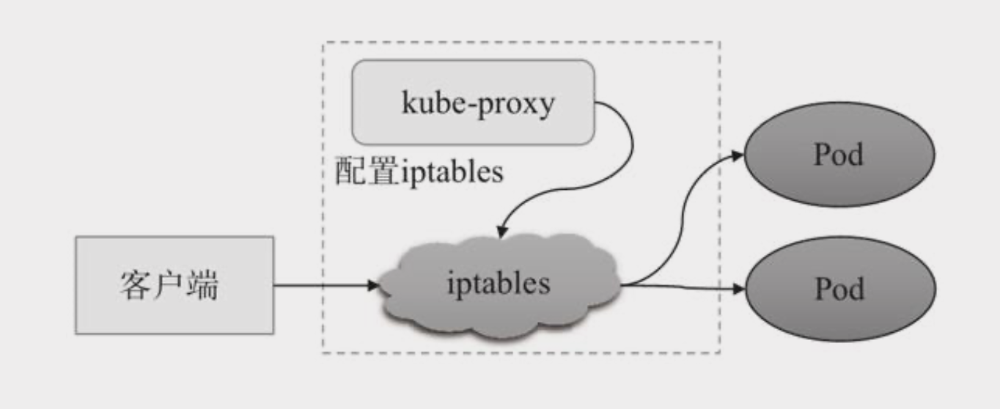

# kube-proxy

## 工作原理

以下是客户端、Service 以及 Pod 之间流量转发路径：


## 代理模式

\[^以下模式解释来自 ]: Kubernetes 实战进阶（第 2 版）

### userspace


Kubernetes v1.1 之前的默认代理模型。

kube-proxy 跟踪 API Server 上的 Service 和 Endpoints 的创建和移除，对于每个 Service 对象，它会随机打开一个本地端口（运行于用户空间的 kube-proxy 进程负责监听），任何到达此代理端口的连接请求都将被代理至当前 Service 资源后端的各 Pod 对象，至于哪个Pod 对象会被选中则取决于当前 Service 资源的调度方式，默认调度算法是轮询（round-robin）。另外，此类Service对象还会创建iptables 规则以捕获任何到达 ClusterIP 和端口的流量。

kube-proxy 在 userspace 模式下有两个功能：

* 监听 API Server 的 Service 对象，修改防本地的火墙规则（iptables），实现负载均衡的分发。
* 代理来自当前节点 Pod 的请求。

### iptables



Kubernetes v1.2 以后的默认代理模型。

创建Service对象的操作会触发集群中的每个 kube-proxy 并将其转换为定义在所属节点上的 iptables 规则（添加到 `KUBE-SERVICES` 链中），用于转发工作接口接收到的、与此 Service 资源 ClusterIP 和端口相关的流量。**客户端发来请求将直接由相关的 iptables 规则进行目标地址转换（DNAT）后根据算法调度并转发至集群内的 Pod 对象之上，而无须再经由 kube-proxy 进程进行处理**。

> 总结：
>
> kube-proxy 不再起到数据层面的 Proxy 作用，只承担控制层面的功能，即通过 API Server 的 Watch 接口实时跟踪 Service 与 Endpoint 的变更信息，并更新 Node 上相应的规则。与第一代 userspace 模式相比，iptables 模式完全工作在内核态，无需用户态的 kube-proxy 中转，性能更强。

对于每个 Endpoints 对象，Service 资源会为其创建 iptables 规则并指向其 iptables 地址和端口，而流量转发到多个 Endpoint 对象之上的默认调度机制是**随机算法**，iptables 使用 `statistic` 模块来实现基于概率的负载均衡。

在 iptables 代理模型中，Service 的服务发现和负载均衡功能都使用 iptables 规则实现（随机算法），而无须将流量在用户空间和内核空间来回切换，因此更为高效和可靠，但是性能一般，而且受规模影响较大，仅适用于少量的 Service 的集群。

#### ClusterIP

对于 Cluster 类的 Service 对象，kube-proxy 会基于 iptables 动态创建 `KUBE-SERVICES`、`KUBE-MARK-MASK` 和 `KUBE-POSTROUTING` 三个自定义链，来管理 Kubernetes 集群内的流量管理。

**KUBE-SERVICES**

`KUBE-SERVICES` 链用于实现服务代理（Service Proxy）的功能。它的主要任务是将流量从客户端 Pod 转发到目标 Pod，并且会做一定的负载均衡。包含所有 ClusterIP 类型的 Service 的流量匹配规则，由 `PREROUTING` 和 `OUTPUT` 链直接调用。

**配置与工作原理**：

* 每当 Kubernetes 创建新的 Service 时，kube-proxy 会在 **iptables** 中为该服务创建规则，这些规则会被添加到 `KUBE-SERVICES` 链中。
* 这些规则会将访问 Service 的流量（例如访问某个虚拟 IP 地址）转发到后端的一组 Pod 上，使用轮询等负载均衡策略。
* `KUBE-SERVICES` 链的规则将流量引导到 **ClusterIP** 或 **NodePort** 类型的服务中，以便让集群内部的流量能够找到并访问正确的 Pod。

> 转发到哪里去。

**KUBE-MARK-MASK**

`KUBE-MARK-MASK` 链用于标记流量，这些标记帮助 Kubernetes 系统决定如何**处理流量**。这个链通常用于实现 **源地址伪装**（Source NAT）和流量的标记。

**配置与工作原理**：

* 这个链的主要功能是 **流量标记**，以便在后续的链中能够根据标记来做不同的处理。
* 例如，kube-proxy 会在流量经过时，向流量中添加一个标记，这个标记表示这个流量是来自于一个服务（Service），而不是来自集群外部的直接访问。
* 这种标记通常在 **KUBE-SERVICES** 链的规则中应用，在某些情况下，流量被标记后，可以应用 NAT（网络地址转换）等策略。

> 标记流量。

**KUBE-POSTROUTING**

`KUBE-POSTROUTING` 链用于实现 **源地址转换（Source NAT，SNAT）**，并**处理离开集群的流量**。它确保离开集群的流量通过正确的出口地址，并能够返回到正确的 Pod。

**配置与工作原理**：

* 在 Kubernetes 集群中，Pod 可能会有私有 IP 地址，而外部通信需要使用节点的公共 IP 地址。
* `KUBE-POSTROUTING` 链的作用是 **源地址伪装（SNAT）**，将 Pod 的源 IP 地址替换为节点的公共 IP 地址，确保流量能够正确地通过防火墙和路由器进行转发。
* 在 Kubernetes 中，所有从 Pod 发出的外部流量都会经过这个链，它将流量的源地址替换成节点的外部 IP 地址。

> 处理源地址。

### IPVS


Kubernetes v1.9 引入，自 v1.11 成为默认代理模型。

#### IPVS 解释

IP Virtual Server 是 Linux 内核中实现传输层（四层）负载均衡的模块，专为高性能和高可用性设计。

使用虚拟服务（VS，一个 IP 地址和端口的组合，代表一个负载均衡服务）、真实服务器（RS，实际处理请求的后端服务器，如 Pod）和调度算法（轮询、加权轮询、最少连接、加权最少连接、原地址哈希等）来实现负载均衡。还有会话保持、健康检查功能。

IPVS 的流量转发支持一下三种模式：

* **NAT（Network Address Translation） 模式（默认）**：修改数据包的目标 IP 地址和端口。
  * 特点：在NAT模式下，负载均衡器（LB）对进入的数据包进行目的地址转换（DNAT），将目的IP改为后端RS(Real Server)的IP。对传出的数据包进行源地址转（SNAT），将源 IP 改为 LB 的 IP。这种方式隐藏了后端服务器的真实IP地址。
  * 使用场景：适用于客户端和服务器不在同一个网络子网，或者需要隐藏服务器真实IP地址的场景。例如，当需要对外提供一个统一的服务接口，同时后端有多个服务器处理请求时。
* **DR （Direct Routing）模式**：客户端的请求包到达负载均衡器的虚拟服务IP端口后，负载均衡器不会改写请求包的IP和端口，但是会改写请求包的MAC地址为后端RS(Real Server)的MAC地址，然后将数据包转发；真实服务器处理请求后，响应包直接回给客户端，不再经过负载均衡器。
  * 特点：在Direct Routing模式下，LB（负载均衡器）不修改数据包的IP地址，而是修改数据包的MAC地址，直接将数据包转发到后端服务器。响应数据包直接从后端服务器返回给客户端，不经过 LB。
  * 使用场景：适用于客户端和服务器在同一个子网，且服务器需要处理大量并发连接的场景。例如，大规模Web服务或应用，其中每个请求都是独立的，不需要维持持久连接。
* **Tunnel（IP Tunneling）/IPIP 模式**：通过 IP 隧道封装数据包。
  * 特点：IP Tunneling模式通过在IP数据包内封装另一个IP数据包来实现跨网络的负载均衡。LB将原始数据包封装在一个新的IP数据包中，源地址和目的地址分别为LB和后端服务器的IP，然后转发给后端服务器。后端服务器解封装后处理原始数据包。
  * 使用场景：适用于客户端和服务器不在同一个网络子网，需要跨子网进行负载均衡的场景。例如，当后端服务器分布在不同的子网或数据中心，而客户端需要访问统一的服务接口时

> \[!note]
>
> kube-proxy 采用 IPVS 的 NAT 模式，因为 NAT 模式是 IPVS 中最常用且最灵活的模式。NAT 模式能够处理 Kubernetes 中 Service 的 ClusterIP 和 NodePort 流量转发，同时支持 SNAT 和 DNAT，确保流量能够正确路由到后端 Pod。虽然 NAT 模式需要修改数据包的源或目标地址，但因为 Kubenetes 集群中每个节点的 Pod 的数量不会超过 300 个，性能影响较小。

在 IPVS 模型中，kube-proxy 跟踪 API Server上 Service 和 Endpoints 对象的变动，并据此来调用 netlink 接口创建或变更 IPVS（NAT）规则。它与iptables规则的不同之处仅在于客户端请求流量的调度功能由 ipvs 实现，余下的其他功能仍由 iptables 完成。

IPVS 代理模型中 Service 的服务发现和负载均衡功能均基于内核中的 Netfilter 实现，类似于 iptables，但有着本质差别：iptables 模式是为防火墙设计的；IPVS 模式专门用于高性能均衡负载，它使用哈希表 $O(1)$ 作为底层数据结构且工作于内核空间，因此具有流量转发速度快、规则同步性能好的特性，适用于存在大量Service 资源且对性能要求较高的场景。

由于 IPVS 模式无法提供包过滤、地址伪装、SNAT 等功能，因此在某些场景下（如 NodePort 的实现）下要与 iptables 模式搭配使用。在 IPVS 模式下 kube-proxy 又做了重要的更新，即使用 iptables 模式的扩展 ipset，而不是直接调用 iptables 模式来生成规则链。

iptables 规则链是一个线性的数据结构，ipset 则引入了带索引的数据结构，因此当规则很多时，ipset 也可以高效的查找和匹配。

## 查询 kube-proxy 当前模式

预设情况下，Kube-Proxy 运行在端口 10249，并暴露一组端点，可用于查询 Kube-Proxy 的相关信息。可以使用 /proxyMode 端点来检查 Kube-Proxy 的运行模式。 首先，通过 SSH 连接到集群中的一个节点，然后执行以下命令：

```bash
root@master:~# curl -v localhost:10249/proxyMode
* Host localhost:10249 was resolved.
* IPv6: ::1
* IPv4: 127.0.0.1
*   Trying [::1]:10249...
* connect to ::1 port 10249 from ::1 port 50264 failed: Connection refused
*   Trying 127.0.0.1:10249...
* Connected to localhost (127.0.0.1) port 10249
> GET /proxyMode HTTP/1.1
> Host: localhost:10249
> User-Agent: curl/8.5.0
> Accept: */*
> 
< HTTP/1.1 200 OK
< Content-Type: text/plain; charset=utf-8
< X-Content-Type-Options: nosniff
< Date: Tue, 18 Feb 2025 08:59:50 GMT
< Content-Length: 8
< 
* Connection #0 to host localhost left intact
iptables
```

## 修改 kube-proxy 模式

```bash
kuebctl edit configmap kube-proxy -n kube-system
```

将 `mode` 值改为 `ipvs` 或 `iptables`。

```bash
kuebctl get pod -n kube-system -l k8s-app=kube-proxy
```

将当前 kube-proxy Pod 删除。

```bash
kubectl delete pod -n kube-system -l k8s-app=kube=proxy
```

等待 kube-proxy Pod 删除并重建。

可以通过一下方式验证 kube-proxy 模式是否被修改：

```bash
ipvsadm -Ln
```

如果有规则为 IPVS 模式，没有则为 iptables 模式。
