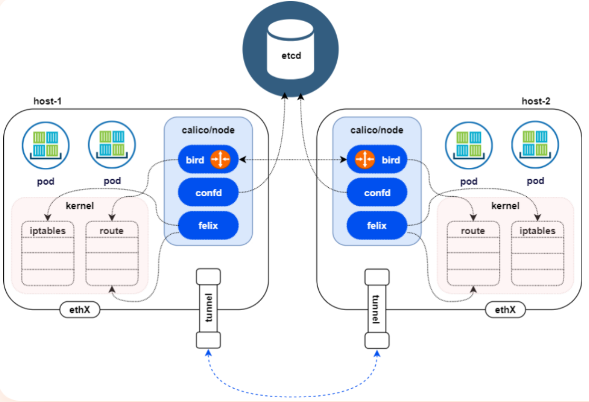

# 网络模型

## Underlay Network

底层网络，指物理网络基础设施，包括路由器、交换机、光纤、电缆等硬件设备，以及这些设备之间的连接和协议（如 IP、BGP、OSPF 等）。它是网络的底层基础，负责实际的数据传输。

**特点**：

- 物理性：由硬件设备和物理连接组成。
- 直接性：数据包在 Underlay Network 中直接通过物理设备传输，**没有额外的封装或解封装过程**。
- 性能：高性能、低延迟。

## Overlay Network

覆盖网络，指在 Underlay Network 之上构建的 **虚拟网络**，它利用 Underlay Network 的物理基础设施，通过封装技术实现虚拟化的网络通信，是虚拟网络，与物理网络解耦。

**特点**：

- 虚拟性：通过软件定义的方式构建。
- 封装性：数据包在 Overlay Network 中被封装在 Underlay Network 的数据包中传输，到达目的地后再解封装。
- 性能：有一定的性能开销。

# Kubernetes 网络模型

Kubernetes 集群内的网络模型定义了以下几点：

- 每个 Pod 都有一个唯一的 IP 地址：Pod 内的所有容器共享同一个网络命名空间，因此它们共享同一个 IP 地址和网络配置。
	- 容器之间可以通过 `localhost` 访问，
- 集群内的 Pod 处于一个扁平网络中：所有 Pod 可以直接互相通信，无论它们是否在同一个节点上，无需通过 NAT。
- Service 和 Cluster IP：Kubernetes 提供了 Service 和 Cluster IP 的概念，使得服务可以在集群内部被发现和访问。
- 外部访问：外部请求可以通过 NodePort、LoadBalancer 或 Ingress 等方式访问集群内的服务。

> 详见 [Kubenetes 网络模型官方解释](https://kubernetes.io/zh-cn/docs/concepts/services-networking/#the-kubernetes-network-model)。

# CNI

CNI（Container Network Interface），用于配置容器网络的规范和插件体系，旨在为容器运行时（如 Kubernetes、Docker、Podman 等）提供标准化的网络接口。通过 CNI，容器可以动态地连接到网络，并与其他容器或外部服务通信。

**CNI 不是具体的实现方式，是一种标准化的接口**，定义了容器运行时（CRI）与网络插件（Plugin）之间的交互方式，使得不同的容器运行时可以使用相同的网络插件，用于在容器创建和销毁时动态配置网络。

**作用**：

- 网络配置：在容器启动时，为其分配 IP 地址、配置网络接口和路由规则。
- 网络清理：在容器销毁时，释放网络资源（如 IP 地址）。
- 插件化设计：通过插件机制，支持多种网络实现（如 Bridge、VXLAN、IPVLAN 等）。

## CNI 插件

CNI 使用 JSON 格式配置文件来描述网络配置，当需要设置容器网络时，由容器运行时（CRI）负责执行 CNI 插件，并通过 CNI 插件的标准输入（stdin）来传递配置文件信息，通过标准输出（stdout）接收插件的执行结果。从**网络插件功能**可以分为五类：

- **main 插件**：创建集体网络设备。
	- Bridge：创建一个虚拟网桥，连接 container 和 host。
	- IPVLAN：基于宿主机的网络接口创建虚拟网络接口。
	- Loopback：为容器提供回环网络接口（`lo`）。
	- MACVLAN：为容器分配独立的 MAC 地址，直接连接到物理网络。
	- Host-Device：将宿主机的网络设备直接分配给容器。
	- PTP：创建一对 Veth Pair。
	- VLAN：分配一个 VLAN 设备。
- **IPAM 插件**：负责分配 IP 地址。
	- Host-local：基于本地文件记录 IP 地址分配。
	- DHCP：使用 DHCP 服务器分配 IP 地址，向 Pod 发放或收回 IP 地址。
	- Static：为容器分配一个静态 IPv4/IPv6 地址，主要用于 debug。
- **META 插件**：其他功能插件。
	- Tuning：通过 sysctl 调整网络设备参数。
	- Postmap：通过 iptables 配置端口映射。
	- Bandwidth：使用 Token Bucket Filter 来限流。
	- SBR：为网卡设置 source based routing。
	- Firewall：通过 iptables 规则限制容器流量的进出。
- **Windows 插件**：专门用于 Windows 平台的 CNI 插件（win-bridge 与 win-overlay 网络插件）。
- **第三方插件**：Flannel、[Calico](#calico)、Cilium、OVM 等等。

## CNI 工作流程

1. **CRI 创建网络命名空间**：当 Kubernetes 调度一个 Pod 到某个节点时，容器运行时（如 containerd 或 Docker）会为该 Pod 创建一个新的网络命名空间。
2. **CNI 插件进行网络配置**：容器运行时会调用 CNI 插件，执行网络配置操作。CNI 插件负责以下任务：
	- 为容器分配 IP 地址。
	- 设置网络接口（如虚拟网卡）。
	- 配置路由表和网络策略。
3. **IPAM 插件分配 IP 地址**：CNI 插件通常会使用 IPAM（IP Address Management）插件来为容器分配 IP 地址。IPAM 插件负责管理 IP 地址池，并为每个容器分配唯一的 IP 地址。
4. **启动容器**：网络配置完成后，容器运行时启动容器，并将其加入到已配置的网络命名空间中。

> [!TIP]
>
> [Kubernetes 网络模型官方解释](https://kubernetes.io/zh-cn/docs/concepts/services-networking/#the-kubernetes-network-model)

# Calico

Calico 是一个纯三层的虚拟网络，它没有复用 docker 的 docker0 网桥，而是自己是实现，Calico 网络支持不对数据包进行额外封装，不需要 NAT 和端口映射。

## 架构

> [Calico 架构官方文档参考](https://docs.tigera.io/calico/latest/reference/architecture/overview)

### Felix

**Felix** 是 Calico 的核心守护进程，运行在每个节点上，负责配置本地网络和路由规则，确保容器、虚拟机或 Pod 之间的网络连接和网络安全。Felix 的主要功能包括配置路由、管理网络接口、实施网络策略以及监控节点状态。

- **配置本地路由**：在节点上配置路由表，确保容器/Pod 的流量正确转发，为 Pod 分配 IP 地址并设置路由规则。
- **管理网络接口**：创建和管理 veth pair（虚拟以太网设备对），确保 Pod 的网络接口正确连接到宿主机的网络命名空间。
- **实施网络策略**：根据 Calico 的 NetworkPolicy 配置 iptables 或 eBPF 规则；对流量进行过滤和控制，确保符合策略的流量通过。
- **监控节点状态**：持续监控节点的网络接口、路由表和策略规则的健康状态，将状态信息报告给 Calico 的其他组件（如 Typha 或 etcd）。

### BIRD

**BIRD** Internet Routing Daemon，是一个开源的动态路由守护进程，主要用于实现动态路由协议（如 BGP、OSPF、RIP 等）。在 **Calico** 项目中，BIRD 被用作 BGP（Border Gateway Protocol）路由守护进程，负责在集群节点之间分发路由信息，确保 Pod 之间的跨节点通信。

- **路由信息分发**：在集群节点之间通过 BGP 协议分发路由信息，确保每个节点知道如何将流量转发到其他节点上的 Pod。
- **路由表管理**：维护本地路由表，并根据接收到的路由信息动态更新，支持多种路由协议（如 BGP、OSPF、RIP 等）。
- **跨节点通信**：通过 BGP 协议实现跨节点通信，确保 Pod 之间的流量能够正确路由。
- **路由策略控制**：支持基于策略的路由控制，例如过滤特定路由或调整路由优先级。

### Confd

**Confd** 是一个轻量级的配置管理工具，用于动态生成和管理配置文件。它通过监听外部数据源（如 etcd、Consul、环境变量等）的变化，自动更新配置文件，并触发服务重新加载配置。Confd 广泛应用于微服务、容器化和分布式系统中，用于实现配置的集中管理和动态更新。

- **动态配置生成**：根据模板和数据源动态生成配置文件，支持多种数据源，如 etcd、Consul、环境变量等。
- **配置更新触发**：当数据源发生变化时，自动更新配置文件，支持触发服务重新加载配置（如通过执行命令或发送信号）。
	- 直接连通 etcd 或通过 API Server 连接 etcd。
- **模板引擎**：使用 Go 模板语法，支持条件判断、循环、变量替换等功能。
- **多文件支持**：可以同时管理多个配置文件，每个文件使用独立的模板和数据源。

### Typha

**Typha** 主要用于优化大规模 Kubernetes 集群中 Calico 的性能和可扩展性。在大规模集群中，Calico 的默认架构可能会导致对 **etcd** 或 **Kubernetes API** 的访问压力过大，而 Typha 通过作为 **Calico 组件（如 Felix）** 和 **数据存储（如 etcd 或 Kubernetes API）**之间的代理这一中间层，来减少直接访问数据存储的压力。

- **数据缓存**：Typha 从 etcd 或 Kubernetes API 获取数据并缓存，减少 Felix 直接访问数据存储的次数。
- **数据分发**：Typha 将缓存的数据分发给多个 Felix 实例，避免每个 Felix 实例都直接访问数据存储。
- **连接管理**：Typha 管理 Felix 实例的连接，减少数据存储的连接数，提高系统稳定性。

## 网络模式

### VXLAN

**VXLAN**（Virtual Extensible LAN）虚拟可扩展局域网，是一种网络模式，通过在现有的三层网络（UDP）上创建虚拟的二层网络（VXLAN 封装的 MAC 地址），用于在跨子网或跨数据中心的场景中实现容器网络的连通性。

VXLAN 是一种 overlay 网络技术，通过在底层网络之上封装数据包（“隧道”机制），实现虚拟网络的扩展和隔离。

VXLAN 是 Linux 本身支持的一种网络虚拟化技术，可以完全在内核态实现封装和解封装工作。

#### 核心概念

- **Overlay 网络**：在底层网络（Underlay Network）之上构建的虚拟网络，提供逻辑上的网络隔离和扩展。
- **VTEP（VXLAN Tunnel Endpoint）**：VXLAN 隧道的端点，负责数据包的封装和解封装。每个 VTEP 都有一个唯一的 IP 地址。
- **VNI（VXLAN Network Identifier）**：24 位的标识符，用于区分不同的 VXLAN 网络（最多支持 1600 万个虚拟网络）。
- **原始数据包**：需要传输的原始二层帧（如以太网帧）。
- **封装后的数据包**：在原始数据包的基础上添加 VXLAN 头部、UDP 头部和 IP 头部。

#### VXLAN 封装

VXLAN 封装的是 **源 VTEP 的 MAC 地址** 和 **目标 VTEP 的 MAC 地址**。

#### 工作流程

> `eth0` 和 `cali...` 是 veth pair（虚拟网卡对），前者在容器空间中，后者在物理机空间中。
>
> 两个节点中的 `calico-vxlan` 就是 VTEP。

Pod1 给 Pod2 发送数据流程：

1. **Veth Pair 传输**：Pod1 的 `eth0` 先将数据包发送给容器外部的与其对应 veth pair `calie0906292e2`，再由其根据 “路由表 1” 发送给 VTEP 即`calico-vxlan` 。

2. **数据封装**：源 VTEP 接受到原始数据包，并在原始数据包的基础上添加一下头部再通过底层网络传输：

	- **VXLAN 头部**：包含 VNI，用于标识虚拟网络；目标 MAC 地址替换为本机的 VTEP 和对端节点 VTEP 的 MAC 地址。

	- **UDP 头部**：源端口和目标端口（默认目标端口为 4789）。外层 UDP 目的的 IP 地址根据路由和对端 VXLAN 的 MAC 查 FDB 表获取。

	- **IP 头部**：源 VTEP 的 IP 地址和目标 VTEP 的 IP 地址。

3. **VTEP 传输**：封装后的数据包通过底层网络（如 IP 网络）传输到目标 VTEP，底层网络只感知封装后的 IP 数据包，不感知内部的 VXLAN 数据。
	- 封装后的 VXLAN 数据包通过 Node1 VTEP 根据路由表发送给 Node2 VTEP
4. **数据包解封**：Node2 VTEP 接收到封装后的数据包，剥离外部的 IP 头部、UDP 头部和 VXLAN 头部，恢复原始数据包。
5. **Veth Pair 传输**：Node2 VTEP 根据 “路由表 2” 将数据发送给与 Pod2 的 `eth0` 对应的 veth pair `cali49778cadcf1`，再将数据包转发到 Pod2 中。

#### 优劣

**优点**：只要 kubernetes 节点间三层互通，可以跨网段，对主机网关路由没有特殊要求。各个 node 通过 VXLAN 设备实现基于三层的“二层”互通，三层即 VXLAN 包封装在 UDP 包中，要求 UDP 在 kubernetes 节点间三层可达；二层即 VXLAN 封包的源 MAC 地址和目的 MAC 地址是自己的 VXLAN 设备 MAC 和对端 VXLAN 设备 MAC。

**缺点**：需要进行 VXLAN 数据包的封包和解包，会存在一定的性能损耗。

### IPIP

**IPIP（IP in IP）** Linux 原生内核支持，用于在跨子网的场景中实现容器网络的连通性。IPIP 是一种隧道技术，通过在原始 IP 数据包上封装一个新的 IP 头部，实现跨子网的通信。

IPIP 隧道的工作原理是将源主机的 IP 数据包封装在一个新的 IP 数据包中，新的 IP 数据包的目的地址是隧道的另一端。在隧道的另一端，接收方将解封装原始 IP 数据包，并将其传递到目标主机。IPIP 隧道可以在不同的网络之间建立连接，例如在 IPv4 网络和 IPv6 网络之间建立连接。

#### IPIP 封装

#### 工作流程

> `tunl0` 为隧道的两端。

Pod1 给 Pod2 发送数据流程：

1. **Veth Pair 传输**：Pod1 发出的数据包经由 veth pair 发送到隧道端点。
2.  **隧道封装传输**：原始 IP 数据包被封装在一个新的 IP 头部中，封装后的数据包通过底层网络传输到目标节点。
3. **解封装**：目标节点收到数据包后，将 Pod1 发来数据包的 MAC 层去掉，留下原始 IP 数据包。
4. **Veth Pair 传输**：node2 根据解封装的信息将原始 IP 数据包发送到相应 veth pair 进入 pod2 中。

#### 优劣

**优点**：只要 kubernetes 节点间三层互通，可以跨网段，对主机网关路由没有要求；可以跨 IPv4 和 IPv6。

**缺点**：需要进行 IPIP 数据包的封包和解包，会存在一定的性能损耗。

### BGP

**BGP**（Border Gateway Protocol）边界网关协议，是互联网上一个去中心化自治路由协议。它通过维护 IP 路由表或 “前缀” 表来实现自治系统（AS，Autonomous System）之间的可达性，属于矢量路由协议。BGP不使用传统的内部网关协议（IGP）的指标，而使用基于路径、网络策略或规则集来决定路由。因此，它更适合被称为矢量性协议，而不是路由协议。

BGP，通俗的讲就是讲接入到机房的多条线路（如电信、联通、移动等）融合为一体，实现多线单 IP，BGP 机房的优点：服务器只需要设置一个 IP 地址，最佳访问路由是由网络上的骨干路由器根据路由跳数与其它技术指标来确定的，不会占用服务器的任何系统。

#### 工作流程

> BGP 模式为非封装网络。

Pod1 给 Pod2 发送数据流程：

1. **Veth Pair 传输**：略。
2. **数据传输**：node1 通过路由记录中 `192.168.66.12` 的 IP 地址找到 node2，传输数据。反之同理。
3. **Veth Pair 传输**：略。

#### 优劣

**数据包封包**：不需要数据包封包。

**优点**：不用封包解包，通过 BGP 协议可实现 Pod 网络在主机间的三层可达。

**缺点**：跨网段时，配置较为复杂网络环境要求较高需要打通整个 BGP 网络，主机网关路由也需要充当 BGP Speaker。	

